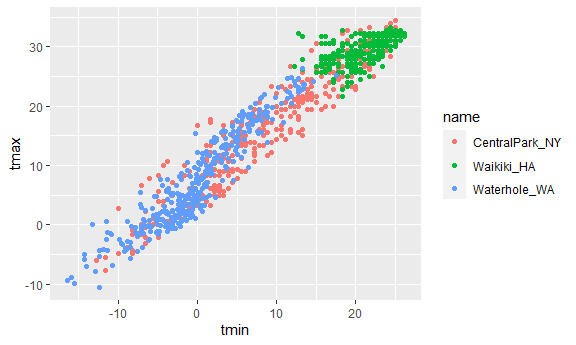
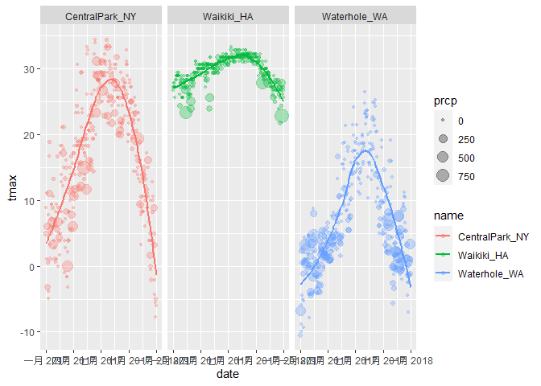
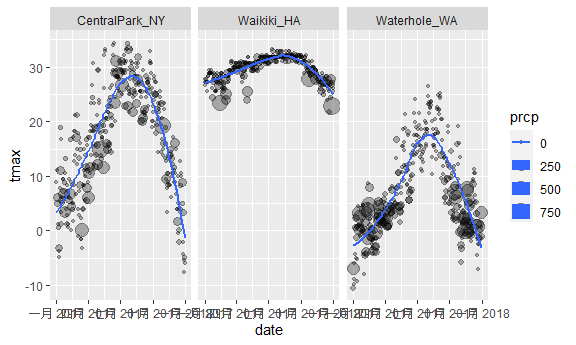
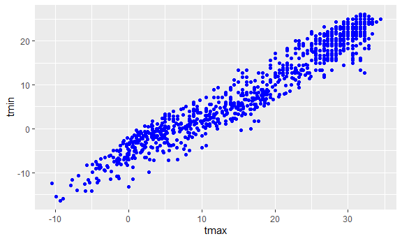
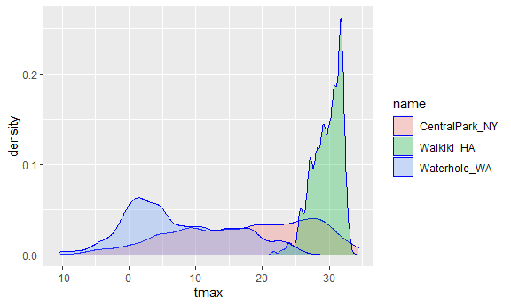
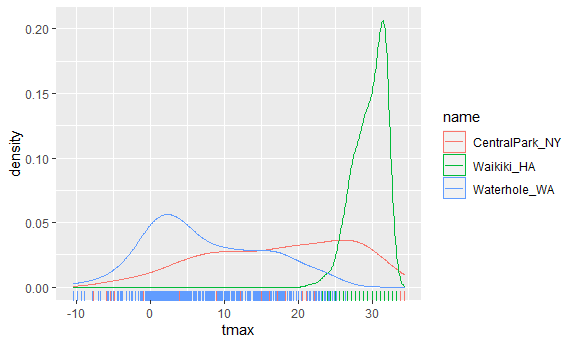
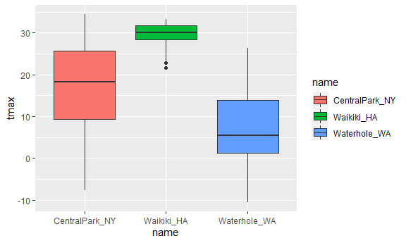
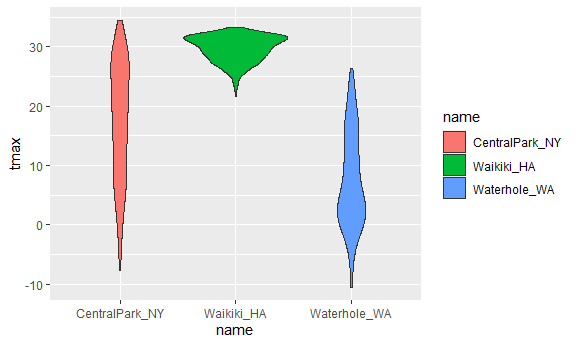

viz_part_01
================
Jasmine Niu

## Let’s import data

``` r
library(tidyverse)
```

    ## ── Attaching packages ─────────────────────────────────────── tidyverse 1.3.2 ──
    ## ✔ ggplot2 3.3.6      ✔ purrr   0.3.4 
    ## ✔ tibble  3.1.8      ✔ dplyr   1.0.10
    ## ✔ tidyr   1.2.0      ✔ stringr 1.4.1 
    ## ✔ readr   2.1.2      ✔ forcats 0.5.2 
    ## ── Conflicts ────────────────────────────────────────── tidyverse_conflicts() ──
    ## ✖ dplyr::filter() masks stats::filter()
    ## ✖ dplyr::lag()    masks stats::lag()

``` r
library(ggridges)
```

``` r
weather_df = 
  rnoaa::meteo_pull_monitors(
    c("USW00094728", "USC00519397", "USS0023B17S"),
    var = c("PRCP", "TMIN", "TMAX"), 
    date_min = "2017-01-01",
    date_max = "2017-12-31") %>%
  mutate(
    name = recode(
      id, 
      USW00094728 = "CentralPark_NY", 
      USC00519397 = "Waikiki_HA",
      USS0023B17S = "Waterhole_WA"),
    tmin = tmin / 10,
    tmax = tmax / 10) %>%
  select(name, id, everything())
```

    ## Registered S3 method overwritten by 'hoardr':
    ##   method           from
    ##   print.cache_info httr

    ## using cached file: C:\Users\finij\AppData\Local/Cache/R/noaa_ghcnd/USW00094728.dly

    ## date created (size, mb): 2022-09-29 10:35:09 (8.418)

    ## file min/max dates: 1869-01-01 / 2022-09-30

    ## using cached file: C:\Users\finij\AppData\Local/Cache/R/noaa_ghcnd/USC00519397.dly

    ## date created (size, mb): 2022-09-29 10:35:23 (1.703)

    ## file min/max dates: 1965-01-01 / 2020-03-31

    ## using cached file: C:\Users\finij\AppData\Local/Cache/R/noaa_ghcnd/USS0023B17S.dly

    ## date created (size, mb): 2022-09-29 10:35:29 (0.952)

    ## file min/max dates: 1999-09-01 / 2022-09-30

Let’s make a scatterplot.

``` r
ggplot(weather_df, aes(x = tmin, y = tmax)) +
  geom_point()
```

    ## Warning: Removed 15 rows containing missing values (geom_point).

<!-- -->

``` r
weather_df %>% 
  drop_na() %>% 
  filter(name == "CentralPark_NY") %>%
  ggplot(aes(x = tmin, y = tmax)) +
  geom_point()
```

<!-- -->

``` r
weather_scatterplot =
  weather_df %>% 
  drop_na() %>% 
  ggplot(aes(x = tmin, y = tmax)) +
  geom_point()

weather_scatterplot +
  geom_point()
```

<!-- -->

Fancy the plot.

``` r
weather_df %>% 
  ggplot(aes(x = tmin, y=tmax, color = name)) +
  geom_point()
```

    ## Warning: Removed 15 rows containing missing values (geom_point).

<!-- -->

``` r
weather_df %>% 
  ggplot(aes(x = tmin, y=tmax, color = name)) +
  geom_point() +
  geom_smooth()
```

    ## `geom_smooth()` using method = 'loess' and formula 'y ~ x'

    ## Warning: Removed 15 rows containing non-finite values (stat_smooth).

    ## Warning: Removed 15 rows containing missing values (geom_point).

<!-- -->

``` r
weather_df %>% 
  ggplot(aes(x = tmin, y=tmax)) +
  geom_point(aes(color = name)) +
  geom_smooth()
```

    ## `geom_smooth()` using method = 'gam' and formula 'y ~ s(x, bs = "cs")'

    ## Warning: Removed 15 rows containing non-finite values (stat_smooth).

    ## Warning: Removed 15 rows containing missing values (geom_point).

<!-- -->

``` r
weather_df %>% 
  ggplot(aes(x = tmin, y=tmax, color = name)) +
  geom_point(alpha = .3) + #alpha -> transparent
  geom_smooth(se = FALSE)
```

    ## `geom_smooth()` using method = 'loess' and formula 'y ~ x'

    ## Warning: Removed 15 rows containing non-finite values (stat_smooth).

    ## Warning: Removed 15 rows containing missing values (geom_point).

<!-- -->

Make separate panels.

``` r
weather_df %>% 
  ggplot(aes(x = tmin, y=tmax, color = name)) +
  geom_point(alpha = .3) +
  geom_smooth(se = FALSE) +
  facet_grid(. ~ name)
```

    ## `geom_smooth()` using method = 'loess' and formula 'y ~ x'

    ## Warning: Removed 15 rows containing non-finite values (stat_smooth).

    ## Warning: Removed 15 rows containing missing values (geom_point).

<!-- -->

``` r
# facet_grid(name ~ .)->橫向的圖
```

`tamx` vs `tmin`, split it up.

e.g. seasonal trend

``` r
weather_df %>% 
  ggplot(aes(x = date, y = tmax, color = name)) +
  geom_point(aes(size = prcp), alpha = .3) +
  geom_smooth(se = FALSE) +
  facet_grid(. ~name)
```

    ## `geom_smooth()` using method = 'loess' and formula 'y ~ x'

    ## Warning: Removed 3 rows containing non-finite values (stat_smooth).

    ## Warning: Removed 3 rows containing missing values (geom_point).

<!-- -->

``` r
weather_df %>% 
  ggplot(aes(x = date, y = tmax, size = prcp)) +
  geom_point(alpha = .3) +
  geom_smooth(se = FALSE) +
  facet_grid(. ~name)
```

    ## `geom_smooth()` using method = 'loess' and formula 'y ~ x'

    ## Warning: Removed 3 rows containing non-finite values (stat_smooth).

    ## Warning: Removed 3 rows containing missing values (geom_point).

<!-- -->

## Some quick stuff

Learning assessment!

``` r
weather_df %>% 
  ggplot(aes(x = tmax, y = tmin)) + 
  geom_hex()
```

    ## Warning: Removed 15 rows containing non-finite values (stat_binhex).

<!-- -->

## Univariate plots

Histogram

``` r
weather_df %>% 
  ggplot(aes(x = tmax, fill = name)) +
  geom_histogram() +
  facet_grid((. ~ name))
```

    ## `stat_bin()` using `bins = 30`. Pick better value with `binwidth`.

    ## Warning: Removed 3 rows containing non-finite values (stat_bin).

<!-- -->

density plots

``` r
weather_df %>% 
  ggplot(aes(x = tmax, fill = name)) + #color = name
  geom_density(alpha = .3)
```

    ## Warning: Removed 3 rows containing non-finite values (stat_density).

<!-- -->

boxplots

``` r
weather_df %>% 
  ggplot(aes(x = name, y = tmax, fill = name)) +
  geom_boxplot()
```

    ## Warning: Removed 3 rows containing non-finite values (stat_boxplot).

<!-- -->

violin plots

``` r
weather_df %>% 
  ggplot(aes(x = name, y = tmax, fill = name)) +
  geom_violin()
```

    ## Warning: Removed 3 rows containing non-finite values (stat_ydensity).

<!-- -->

ridge plots

``` r
weather_df %>% 
  ggplot(aes(x = tmax, y = name)) +
  geom_density_ridges()
```

    ## Picking joint bandwidth of 1.84

    ## Warning: Removed 3 rows containing non-finite values (stat_density_ridges).

<!-- -->

## Saving and embedding plots

``` r
weather_scatterplot = 
  weather_df %>% 
  ggplot(aes(x = date, y = tmax, color = name)) +
  geom_point(aes(size = prcp), alpha = .3) +
  geom_smooth(se = FALSE) +
  facet_grid(. ~name)

weather_scatterplot
```

    ## `geom_smooth()` using method = 'loess' and formula 'y ~ x'

    ## Warning: Removed 3 rows containing non-finite values (stat_smooth).

    ## Warning: Removed 3 rows containing missing values (geom_point).

<!-- -->

``` r
ggsave("results/weather_scatterplot.pdf", weather_scatterplot,
       width = 8, height = 5)
```

    ## `geom_smooth()` using method = 'loess' and formula 'y ~ x'

    ## Warning: Removed 3 rows containing non-finite values (stat_smooth).
    ## Removed 3 rows containing missing values (geom_point).

    ## Warning in grid.Call(C_textBounds, as.graphicsAnnot(x$label), x$x, x$y, :
    ## 'mbcsToSbcs' 裡轉換 '一月 2017' 發生錯誤：<e4>代替了 dot

    ## Warning in grid.Call(C_textBounds, as.graphicsAnnot(x$label), x$x, x$y, :
    ## 'mbcsToSbcs' 裡轉換 '一月 2017' 發生錯誤：<b8>代替了 dot

    ## Warning in grid.Call(C_textBounds, as.graphicsAnnot(x$label), x$x, x$y, :
    ## 'mbcsToSbcs' 裡轉換 '一月 2017' 發生錯誤：<80>代替了 dot

    ## Warning in grid.Call(C_textBounds, as.graphicsAnnot(x$label), x$x, x$y, :
    ## 'mbcsToSbcs' 裡轉換 '一月 2017' 發生錯誤：<e6>代替了 dot

    ## Warning in grid.Call(C_textBounds, as.graphicsAnnot(x$label), x$x, x$y, :
    ## 'mbcsToSbcs' 裡轉換 '一月 2017' 發生錯誤：<9c>代替了 dot

    ## Warning in grid.Call(C_textBounds, as.graphicsAnnot(x$label), x$x, x$y, :
    ## 'mbcsToSbcs' 裡轉換 '一月 2017' 發生錯誤：<88>代替了 dot

    ## Warning in grid.Call(C_textBounds, as.graphicsAnnot(x$label), x$x, x$y, :
    ## 'mbcsToSbcs' 裡轉換 '四月 2017' 發生錯誤：<e5>代替了 dot

    ## Warning in grid.Call(C_textBounds, as.graphicsAnnot(x$label), x$x, x$y, :
    ## 'mbcsToSbcs' 裡轉換 '四月 2017' 發生錯誤：<9b>代替了 dot

    ## Warning in grid.Call(C_textBounds, as.graphicsAnnot(x$label), x$x, x$y, :
    ## 'mbcsToSbcs' 裡轉換 '四月 2017' 發生錯誤：<9b>代替了 dot

    ## Warning in grid.Call(C_textBounds, as.graphicsAnnot(x$label), x$x, x$y, :
    ## 'mbcsToSbcs' 裡轉換 '四月 2017' 發生錯誤：<e6>代替了 dot

    ## Warning in grid.Call(C_textBounds, as.graphicsAnnot(x$label), x$x, x$y, :
    ## 'mbcsToSbcs' 裡轉換 '四月 2017' 發生錯誤：<9c>代替了 dot

    ## Warning in grid.Call(C_textBounds, as.graphicsAnnot(x$label), x$x, x$y, :
    ## 'mbcsToSbcs' 裡轉換 '四月 2017' 發生錯誤：<88>代替了 dot

    ## Warning in grid.Call(C_textBounds, as.graphicsAnnot(x$label), x$x, x$y, :
    ## 'mbcsToSbcs' 裡轉換 '七月 2017' 發生錯誤：<e4>代替了 dot

    ## Warning in grid.Call(C_textBounds, as.graphicsAnnot(x$label), x$x, x$y, :
    ## 'mbcsToSbcs' 裡轉換 '七月 2017' 發生錯誤：<b8>代替了 dot

    ## Warning in grid.Call(C_textBounds, as.graphicsAnnot(x$label), x$x, x$y, :
    ## 'mbcsToSbcs' 裡轉換 '七月 2017' 發生錯誤：<83>代替了 dot

    ## Warning in grid.Call(C_textBounds, as.graphicsAnnot(x$label), x$x, x$y, :
    ## 'mbcsToSbcs' 裡轉換 '七月 2017' 發生錯誤：<e6>代替了 dot

    ## Warning in grid.Call(C_textBounds, as.graphicsAnnot(x$label), x$x, x$y, :
    ## 'mbcsToSbcs' 裡轉換 '七月 2017' 發生錯誤：<9c>代替了 dot

    ## Warning in grid.Call(C_textBounds, as.graphicsAnnot(x$label), x$x, x$y, :
    ## 'mbcsToSbcs' 裡轉換 '七月 2017' 發生錯誤：<88>代替了 dot

    ## Warning in grid.Call(C_textBounds, as.graphicsAnnot(x$label), x$x, x$y, :
    ## 'mbcsToSbcs' 裡轉換 '十月 2017' 發生錯誤：<e5>代替了 dot

    ## Warning in grid.Call(C_textBounds, as.graphicsAnnot(x$label), x$x, x$y, :
    ## 'mbcsToSbcs' 裡轉換 '十月 2017' 發生錯誤：<8d>代替了 dot

    ## Warning in grid.Call(C_textBounds, as.graphicsAnnot(x$label), x$x, x$y, :
    ## 'mbcsToSbcs' 裡轉換 '十月 2017' 發生錯誤：<81>代替了 dot

    ## Warning in grid.Call(C_textBounds, as.graphicsAnnot(x$label), x$x, x$y, :
    ## 'mbcsToSbcs' 裡轉換 '十月 2017' 發生錯誤：<e6>代替了 dot

    ## Warning in grid.Call(C_textBounds, as.graphicsAnnot(x$label), x$x, x$y, :
    ## 'mbcsToSbcs' 裡轉換 '十月 2017' 發生錯誤：<9c>代替了 dot

    ## Warning in grid.Call(C_textBounds, as.graphicsAnnot(x$label), x$x, x$y, :
    ## 'mbcsToSbcs' 裡轉換 '十月 2017' 發生錯誤：<88>代替了 dot

    ## Warning in grid.Call(C_textBounds, as.graphicsAnnot(x$label), x$x, x$y, :
    ## 'mbcsToSbcs' 裡轉換 '一月 2018' 發生錯誤：<e4>代替了 dot

    ## Warning in grid.Call(C_textBounds, as.graphicsAnnot(x$label), x$x, x$y, :
    ## 'mbcsToSbcs' 裡轉換 '一月 2018' 發生錯誤：<b8>代替了 dot

    ## Warning in grid.Call(C_textBounds, as.graphicsAnnot(x$label), x$x, x$y, :
    ## 'mbcsToSbcs' 裡轉換 '一月 2018' 發生錯誤：<80>代替了 dot

    ## Warning in grid.Call(C_textBounds, as.graphicsAnnot(x$label), x$x, x$y, :
    ## 'mbcsToSbcs' 裡轉換 '一月 2018' 發生錯誤：<e6>代替了 dot

    ## Warning in grid.Call(C_textBounds, as.graphicsAnnot(x$label), x$x, x$y, :
    ## 'mbcsToSbcs' 裡轉換 '一月 2018' 發生錯誤：<9c>代替了 dot

    ## Warning in grid.Call(C_textBounds, as.graphicsAnnot(x$label), x$x, x$y, :
    ## 'mbcsToSbcs' 裡轉換 '一月 2018' 發生錯誤：<88>代替了 dot

    ## Warning in grid.Call(C_textBounds, as.graphicsAnnot(x$label), x$x, x$y, :
    ## 'mbcsToSbcs' 裡轉換 '一月 2017' 發生錯誤：<e4>代替了 dot

    ## Warning in grid.Call(C_textBounds, as.graphicsAnnot(x$label), x$x, x$y, :
    ## 'mbcsToSbcs' 裡轉換 '一月 2017' 發生錯誤：<b8>代替了 dot

    ## Warning in grid.Call(C_textBounds, as.graphicsAnnot(x$label), x$x, x$y, :
    ## 'mbcsToSbcs' 裡轉換 '一月 2017' 發生錯誤：<80>代替了 dot

    ## Warning in grid.Call(C_textBounds, as.graphicsAnnot(x$label), x$x, x$y, :
    ## 'mbcsToSbcs' 裡轉換 '一月 2017' 發生錯誤：<e6>代替了 dot

    ## Warning in grid.Call(C_textBounds, as.graphicsAnnot(x$label), x$x, x$y, :
    ## 'mbcsToSbcs' 裡轉換 '一月 2017' 發生錯誤：<9c>代替了 dot

    ## Warning in grid.Call(C_textBounds, as.graphicsAnnot(x$label), x$x, x$y, :
    ## 'mbcsToSbcs' 裡轉換 '一月 2017' 發生錯誤：<88>代替了 dot

    ## Warning in grid.Call(C_textBounds, as.graphicsAnnot(x$label), x$x, x$y, :
    ## 'mbcsToSbcs' 裡轉換 '四月 2017' 發生錯誤：<e5>代替了 dot

    ## Warning in grid.Call(C_textBounds, as.graphicsAnnot(x$label), x$x, x$y, :
    ## 'mbcsToSbcs' 裡轉換 '四月 2017' 發生錯誤：<9b>代替了 dot

    ## Warning in grid.Call(C_textBounds, as.graphicsAnnot(x$label), x$x, x$y, :
    ## 'mbcsToSbcs' 裡轉換 '四月 2017' 發生錯誤：<9b>代替了 dot

    ## Warning in grid.Call(C_textBounds, as.graphicsAnnot(x$label), x$x, x$y, :
    ## 'mbcsToSbcs' 裡轉換 '四月 2017' 發生錯誤：<e6>代替了 dot

    ## Warning in grid.Call(C_textBounds, as.graphicsAnnot(x$label), x$x, x$y, :
    ## 'mbcsToSbcs' 裡轉換 '四月 2017' 發生錯誤：<9c>代替了 dot

    ## Warning in grid.Call(C_textBounds, as.graphicsAnnot(x$label), x$x, x$y, :
    ## 'mbcsToSbcs' 裡轉換 '四月 2017' 發生錯誤：<88>代替了 dot

    ## Warning in grid.Call(C_textBounds, as.graphicsAnnot(x$label), x$x, x$y, :
    ## 'mbcsToSbcs' 裡轉換 '七月 2017' 發生錯誤：<e4>代替了 dot

    ## Warning in grid.Call(C_textBounds, as.graphicsAnnot(x$label), x$x, x$y, :
    ## 'mbcsToSbcs' 裡轉換 '七月 2017' 發生錯誤：<b8>代替了 dot

    ## Warning in grid.Call(C_textBounds, as.graphicsAnnot(x$label), x$x, x$y, :
    ## 'mbcsToSbcs' 裡轉換 '七月 2017' 發生錯誤：<83>代替了 dot

    ## Warning in grid.Call(C_textBounds, as.graphicsAnnot(x$label), x$x, x$y, :
    ## 'mbcsToSbcs' 裡轉換 '七月 2017' 發生錯誤：<e6>代替了 dot

    ## Warning in grid.Call(C_textBounds, as.graphicsAnnot(x$label), x$x, x$y, :
    ## 'mbcsToSbcs' 裡轉換 '七月 2017' 發生錯誤：<9c>代替了 dot

    ## Warning in grid.Call(C_textBounds, as.graphicsAnnot(x$label), x$x, x$y, :
    ## 'mbcsToSbcs' 裡轉換 '七月 2017' 發生錯誤：<88>代替了 dot

    ## Warning in grid.Call(C_textBounds, as.graphicsAnnot(x$label), x$x, x$y, :
    ## 'mbcsToSbcs' 裡轉換 '十月 2017' 發生錯誤：<e5>代替了 dot

    ## Warning in grid.Call(C_textBounds, as.graphicsAnnot(x$label), x$x, x$y, :
    ## 'mbcsToSbcs' 裡轉換 '十月 2017' 發生錯誤：<8d>代替了 dot

    ## Warning in grid.Call(C_textBounds, as.graphicsAnnot(x$label), x$x, x$y, :
    ## 'mbcsToSbcs' 裡轉換 '十月 2017' 發生錯誤：<81>代替了 dot

    ## Warning in grid.Call(C_textBounds, as.graphicsAnnot(x$label), x$x, x$y, :
    ## 'mbcsToSbcs' 裡轉換 '十月 2017' 發生錯誤：<e6>代替了 dot

    ## Warning in grid.Call(C_textBounds, as.graphicsAnnot(x$label), x$x, x$y, :
    ## 'mbcsToSbcs' 裡轉換 '十月 2017' 發生錯誤：<9c>代替了 dot

    ## Warning in grid.Call(C_textBounds, as.graphicsAnnot(x$label), x$x, x$y, :
    ## 'mbcsToSbcs' 裡轉換 '十月 2017' 發生錯誤：<88>代替了 dot

    ## Warning in grid.Call(C_textBounds, as.graphicsAnnot(x$label), x$x, x$y, :
    ## 'mbcsToSbcs' 裡轉換 '一月 2018' 發生錯誤：<e4>代替了 dot

    ## Warning in grid.Call(C_textBounds, as.graphicsAnnot(x$label), x$x, x$y, :
    ## 'mbcsToSbcs' 裡轉換 '一月 2018' 發生錯誤：<b8>代替了 dot

    ## Warning in grid.Call(C_textBounds, as.graphicsAnnot(x$label), x$x, x$y, :
    ## 'mbcsToSbcs' 裡轉換 '一月 2018' 發生錯誤：<80>代替了 dot

    ## Warning in grid.Call(C_textBounds, as.graphicsAnnot(x$label), x$x, x$y, :
    ## 'mbcsToSbcs' 裡轉換 '一月 2018' 發生錯誤：<e6>代替了 dot

    ## Warning in grid.Call(C_textBounds, as.graphicsAnnot(x$label), x$x, x$y, :
    ## 'mbcsToSbcs' 裡轉換 '一月 2018' 發生錯誤：<9c>代替了 dot

    ## Warning in grid.Call(C_textBounds, as.graphicsAnnot(x$label), x$x, x$y, :
    ## 'mbcsToSbcs' 裡轉換 '一月 2018' 發生錯誤：<88>代替了 dot

    ## Warning in grid.Call(C_textBounds, as.graphicsAnnot(x$label), x$x, x$y, :
    ## 'mbcsToSbcs' 裡轉換 '一月 2017' 發生錯誤：<e4>代替了 dot

    ## Warning in grid.Call(C_textBounds, as.graphicsAnnot(x$label), x$x, x$y, :
    ## 'mbcsToSbcs' 裡轉換 '一月 2017' 發生錯誤：<b8>代替了 dot

    ## Warning in grid.Call(C_textBounds, as.graphicsAnnot(x$label), x$x, x$y, :
    ## 'mbcsToSbcs' 裡轉換 '一月 2017' 發生錯誤：<80>代替了 dot

    ## Warning in grid.Call(C_textBounds, as.graphicsAnnot(x$label), x$x, x$y, :
    ## 'mbcsToSbcs' 裡轉換 '一月 2017' 發生錯誤：<e6>代替了 dot

    ## Warning in grid.Call(C_textBounds, as.graphicsAnnot(x$label), x$x, x$y, :
    ## 'mbcsToSbcs' 裡轉換 '一月 2017' 發生錯誤：<9c>代替了 dot

    ## Warning in grid.Call(C_textBounds, as.graphicsAnnot(x$label), x$x, x$y, :
    ## 'mbcsToSbcs' 裡轉換 '一月 2017' 發生錯誤：<88>代替了 dot

    ## Warning in grid.Call(C_textBounds, as.graphicsAnnot(x$label), x$x, x$y, :
    ## 'mbcsToSbcs' 裡轉換 '四月 2017' 發生錯誤：<e5>代替了 dot

    ## Warning in grid.Call(C_textBounds, as.graphicsAnnot(x$label), x$x, x$y, :
    ## 'mbcsToSbcs' 裡轉換 '四月 2017' 發生錯誤：<9b>代替了 dot

    ## Warning in grid.Call(C_textBounds, as.graphicsAnnot(x$label), x$x, x$y, :
    ## 'mbcsToSbcs' 裡轉換 '四月 2017' 發生錯誤：<9b>代替了 dot

    ## Warning in grid.Call(C_textBounds, as.graphicsAnnot(x$label), x$x, x$y, :
    ## 'mbcsToSbcs' 裡轉換 '四月 2017' 發生錯誤：<e6>代替了 dot

    ## Warning in grid.Call(C_textBounds, as.graphicsAnnot(x$label), x$x, x$y, :
    ## 'mbcsToSbcs' 裡轉換 '四月 2017' 發生錯誤：<9c>代替了 dot

    ## Warning in grid.Call(C_textBounds, as.graphicsAnnot(x$label), x$x, x$y, :
    ## 'mbcsToSbcs' 裡轉換 '四月 2017' 發生錯誤：<88>代替了 dot

    ## Warning in grid.Call(C_textBounds, as.graphicsAnnot(x$label), x$x, x$y, :
    ## 'mbcsToSbcs' 裡轉換 '七月 2017' 發生錯誤：<e4>代替了 dot

    ## Warning in grid.Call(C_textBounds, as.graphicsAnnot(x$label), x$x, x$y, :
    ## 'mbcsToSbcs' 裡轉換 '七月 2017' 發生錯誤：<b8>代替了 dot

    ## Warning in grid.Call(C_textBounds, as.graphicsAnnot(x$label), x$x, x$y, :
    ## 'mbcsToSbcs' 裡轉換 '七月 2017' 發生錯誤：<83>代替了 dot

    ## Warning in grid.Call(C_textBounds, as.graphicsAnnot(x$label), x$x, x$y, :
    ## 'mbcsToSbcs' 裡轉換 '七月 2017' 發生錯誤：<e6>代替了 dot

    ## Warning in grid.Call(C_textBounds, as.graphicsAnnot(x$label), x$x, x$y, :
    ## 'mbcsToSbcs' 裡轉換 '七月 2017' 發生錯誤：<9c>代替了 dot

    ## Warning in grid.Call(C_textBounds, as.graphicsAnnot(x$label), x$x, x$y, :
    ## 'mbcsToSbcs' 裡轉換 '七月 2017' 發生錯誤：<88>代替了 dot

    ## Warning in grid.Call(C_textBounds, as.graphicsAnnot(x$label), x$x, x$y, :
    ## 'mbcsToSbcs' 裡轉換 '十月 2017' 發生錯誤：<e5>代替了 dot

    ## Warning in grid.Call(C_textBounds, as.graphicsAnnot(x$label), x$x, x$y, :
    ## 'mbcsToSbcs' 裡轉換 '十月 2017' 發生錯誤：<8d>代替了 dot

    ## Warning in grid.Call(C_textBounds, as.graphicsAnnot(x$label), x$x, x$y, :
    ## 'mbcsToSbcs' 裡轉換 '十月 2017' 發生錯誤：<81>代替了 dot

    ## Warning in grid.Call(C_textBounds, as.graphicsAnnot(x$label), x$x, x$y, :
    ## 'mbcsToSbcs' 裡轉換 '十月 2017' 發生錯誤：<e6>代替了 dot

    ## Warning in grid.Call(C_textBounds, as.graphicsAnnot(x$label), x$x, x$y, :
    ## 'mbcsToSbcs' 裡轉換 '十月 2017' 發生錯誤：<9c>代替了 dot

    ## Warning in grid.Call(C_textBounds, as.graphicsAnnot(x$label), x$x, x$y, :
    ## 'mbcsToSbcs' 裡轉換 '十月 2017' 發生錯誤：<88>代替了 dot

    ## Warning in grid.Call(C_textBounds, as.graphicsAnnot(x$label), x$x, x$y, :
    ## 'mbcsToSbcs' 裡轉換 '一月 2018' 發生錯誤：<e4>代替了 dot

    ## Warning in grid.Call(C_textBounds, as.graphicsAnnot(x$label), x$x, x$y, :
    ## 'mbcsToSbcs' 裡轉換 '一月 2018' 發生錯誤：<b8>代替了 dot

    ## Warning in grid.Call(C_textBounds, as.graphicsAnnot(x$label), x$x, x$y, :
    ## 'mbcsToSbcs' 裡轉換 '一月 2018' 發生錯誤：<80>代替了 dot

    ## Warning in grid.Call(C_textBounds, as.graphicsAnnot(x$label), x$x, x$y, :
    ## 'mbcsToSbcs' 裡轉換 '一月 2018' 發生錯誤：<e6>代替了 dot

    ## Warning in grid.Call(C_textBounds, as.graphicsAnnot(x$label), x$x, x$y, :
    ## 'mbcsToSbcs' 裡轉換 '一月 2018' 發生錯誤：<9c>代替了 dot

    ## Warning in grid.Call(C_textBounds, as.graphicsAnnot(x$label), x$x, x$y, :
    ## 'mbcsToSbcs' 裡轉換 '一月 2018' 發生錯誤：<88>代替了 dot

    ## Warning in grid.Call(C_textBounds, as.graphicsAnnot(x$label), x$x, x$y, :
    ## 'mbcsToSbcs' 裡轉換 '一月 2017' 發生錯誤：<e4>代替了 dot

    ## Warning in grid.Call(C_textBounds, as.graphicsAnnot(x$label), x$x, x$y, :
    ## 'mbcsToSbcs' 裡轉換 '一月 2017' 發生錯誤：<b8>代替了 dot

    ## Warning in grid.Call(C_textBounds, as.graphicsAnnot(x$label), x$x, x$y, :
    ## 'mbcsToSbcs' 裡轉換 '一月 2017' 發生錯誤：<80>代替了 dot

    ## Warning in grid.Call(C_textBounds, as.graphicsAnnot(x$label), x$x, x$y, :
    ## 'mbcsToSbcs' 裡轉換 '一月 2017' 發生錯誤：<e6>代替了 dot

    ## Warning in grid.Call(C_textBounds, as.graphicsAnnot(x$label), x$x, x$y, :
    ## 'mbcsToSbcs' 裡轉換 '一月 2017' 發生錯誤：<9c>代替了 dot

    ## Warning in grid.Call(C_textBounds, as.graphicsAnnot(x$label), x$x, x$y, :
    ## 'mbcsToSbcs' 裡轉換 '一月 2017' 發生錯誤：<88>代替了 dot

    ## Warning in grid.Call(C_textBounds, as.graphicsAnnot(x$label), x$x, x$y, :
    ## 'mbcsToSbcs' 裡轉換 '四月 2017' 發生錯誤：<e5>代替了 dot

    ## Warning in grid.Call(C_textBounds, as.graphicsAnnot(x$label), x$x, x$y, :
    ## 'mbcsToSbcs' 裡轉換 '四月 2017' 發生錯誤：<9b>代替了 dot

    ## Warning in grid.Call(C_textBounds, as.graphicsAnnot(x$label), x$x, x$y, :
    ## 'mbcsToSbcs' 裡轉換 '四月 2017' 發生錯誤：<9b>代替了 dot

    ## Warning in grid.Call(C_textBounds, as.graphicsAnnot(x$label), x$x, x$y, :
    ## 'mbcsToSbcs' 裡轉換 '四月 2017' 發生錯誤：<e6>代替了 dot

    ## Warning in grid.Call(C_textBounds, as.graphicsAnnot(x$label), x$x, x$y, :
    ## 'mbcsToSbcs' 裡轉換 '四月 2017' 發生錯誤：<9c>代替了 dot

    ## Warning in grid.Call(C_textBounds, as.graphicsAnnot(x$label), x$x, x$y, :
    ## 'mbcsToSbcs' 裡轉換 '四月 2017' 發生錯誤：<88>代替了 dot

    ## Warning in grid.Call(C_textBounds, as.graphicsAnnot(x$label), x$x, x$y, :
    ## 'mbcsToSbcs' 裡轉換 '七月 2017' 發生錯誤：<e4>代替了 dot

    ## Warning in grid.Call(C_textBounds, as.graphicsAnnot(x$label), x$x, x$y, :
    ## 'mbcsToSbcs' 裡轉換 '七月 2017' 發生錯誤：<b8>代替了 dot

    ## Warning in grid.Call(C_textBounds, as.graphicsAnnot(x$label), x$x, x$y, :
    ## 'mbcsToSbcs' 裡轉換 '七月 2017' 發生錯誤：<83>代替了 dot

    ## Warning in grid.Call(C_textBounds, as.graphicsAnnot(x$label), x$x, x$y, :
    ## 'mbcsToSbcs' 裡轉換 '七月 2017' 發生錯誤：<e6>代替了 dot

    ## Warning in grid.Call(C_textBounds, as.graphicsAnnot(x$label), x$x, x$y, :
    ## 'mbcsToSbcs' 裡轉換 '七月 2017' 發生錯誤：<9c>代替了 dot

    ## Warning in grid.Call(C_textBounds, as.graphicsAnnot(x$label), x$x, x$y, :
    ## 'mbcsToSbcs' 裡轉換 '七月 2017' 發生錯誤：<88>代替了 dot

    ## Warning in grid.Call(C_textBounds, as.graphicsAnnot(x$label), x$x, x$y, :
    ## 'mbcsToSbcs' 裡轉換 '十月 2017' 發生錯誤：<e5>代替了 dot

    ## Warning in grid.Call(C_textBounds, as.graphicsAnnot(x$label), x$x, x$y, :
    ## 'mbcsToSbcs' 裡轉換 '十月 2017' 發生錯誤：<8d>代替了 dot

    ## Warning in grid.Call(C_textBounds, as.graphicsAnnot(x$label), x$x, x$y, :
    ## 'mbcsToSbcs' 裡轉換 '十月 2017' 發生錯誤：<81>代替了 dot

    ## Warning in grid.Call(C_textBounds, as.graphicsAnnot(x$label), x$x, x$y, :
    ## 'mbcsToSbcs' 裡轉換 '十月 2017' 發生錯誤：<e6>代替了 dot

    ## Warning in grid.Call(C_textBounds, as.graphicsAnnot(x$label), x$x, x$y, :
    ## 'mbcsToSbcs' 裡轉換 '十月 2017' 發生錯誤：<9c>代替了 dot

    ## Warning in grid.Call(C_textBounds, as.graphicsAnnot(x$label), x$x, x$y, :
    ## 'mbcsToSbcs' 裡轉換 '十月 2017' 發生錯誤：<88>代替了 dot

    ## Warning in grid.Call(C_textBounds, as.graphicsAnnot(x$label), x$x, x$y, :
    ## 'mbcsToSbcs' 裡轉換 '一月 2018' 發生錯誤：<e4>代替了 dot

    ## Warning in grid.Call(C_textBounds, as.graphicsAnnot(x$label), x$x, x$y, :
    ## 'mbcsToSbcs' 裡轉換 '一月 2018' 發生錯誤：<b8>代替了 dot

    ## Warning in grid.Call(C_textBounds, as.graphicsAnnot(x$label), x$x, x$y, :
    ## 'mbcsToSbcs' 裡轉換 '一月 2018' 發生錯誤：<80>代替了 dot

    ## Warning in grid.Call(C_textBounds, as.graphicsAnnot(x$label), x$x, x$y, :
    ## 'mbcsToSbcs' 裡轉換 '一月 2018' 發生錯誤：<e6>代替了 dot

    ## Warning in grid.Call(C_textBounds, as.graphicsAnnot(x$label), x$x, x$y, :
    ## 'mbcsToSbcs' 裡轉換 '一月 2018' 發生錯誤：<9c>代替了 dot

    ## Warning in grid.Call(C_textBounds, as.graphicsAnnot(x$label), x$x, x$y, :
    ## 'mbcsToSbcs' 裡轉換 '一月 2018' 發生錯誤：<88>代替了 dot

    ## Warning in grid.Call(C_textBounds, as.graphicsAnnot(x$label), x$x, x$y, :
    ## 'mbcsToSbcs' 裡轉換 '一月 2017' 發生錯誤：<e4>代替了 dot

    ## Warning in grid.Call(C_textBounds, as.graphicsAnnot(x$label), x$x, x$y, :
    ## 'mbcsToSbcs' 裡轉換 '一月 2017' 發生錯誤：<b8>代替了 dot

    ## Warning in grid.Call(C_textBounds, as.graphicsAnnot(x$label), x$x, x$y, :
    ## 'mbcsToSbcs' 裡轉換 '一月 2017' 發生錯誤：<80>代替了 dot

    ## Warning in grid.Call(C_textBounds, as.graphicsAnnot(x$label), x$x, x$y, :
    ## 'mbcsToSbcs' 裡轉換 '一月 2017' 發生錯誤：<e6>代替了 dot

    ## Warning in grid.Call(C_textBounds, as.graphicsAnnot(x$label), x$x, x$y, :
    ## 'mbcsToSbcs' 裡轉換 '一月 2017' 發生錯誤：<9c>代替了 dot

    ## Warning in grid.Call(C_textBounds, as.graphicsAnnot(x$label), x$x, x$y, :
    ## 'mbcsToSbcs' 裡轉換 '一月 2017' 發生錯誤：<88>代替了 dot

    ## Warning in grid.Call(C_textBounds, as.graphicsAnnot(x$label), x$x, x$y, :
    ## 'mbcsToSbcs' 裡轉換 '四月 2017' 發生錯誤：<e5>代替了 dot

    ## Warning in grid.Call(C_textBounds, as.graphicsAnnot(x$label), x$x, x$y, :
    ## 'mbcsToSbcs' 裡轉換 '四月 2017' 發生錯誤：<9b>代替了 dot

    ## Warning in grid.Call(C_textBounds, as.graphicsAnnot(x$label), x$x, x$y, :
    ## 'mbcsToSbcs' 裡轉換 '四月 2017' 發生錯誤：<9b>代替了 dot

    ## Warning in grid.Call(C_textBounds, as.graphicsAnnot(x$label), x$x, x$y, :
    ## 'mbcsToSbcs' 裡轉換 '四月 2017' 發生錯誤：<e6>代替了 dot

    ## Warning in grid.Call(C_textBounds, as.graphicsAnnot(x$label), x$x, x$y, :
    ## 'mbcsToSbcs' 裡轉換 '四月 2017' 發生錯誤：<9c>代替了 dot

    ## Warning in grid.Call(C_textBounds, as.graphicsAnnot(x$label), x$x, x$y, :
    ## 'mbcsToSbcs' 裡轉換 '四月 2017' 發生錯誤：<88>代替了 dot

    ## Warning in grid.Call(C_textBounds, as.graphicsAnnot(x$label), x$x, x$y, :
    ## 'mbcsToSbcs' 裡轉換 '七月 2017' 發生錯誤：<e4>代替了 dot

    ## Warning in grid.Call(C_textBounds, as.graphicsAnnot(x$label), x$x, x$y, :
    ## 'mbcsToSbcs' 裡轉換 '七月 2017' 發生錯誤：<b8>代替了 dot

    ## Warning in grid.Call(C_textBounds, as.graphicsAnnot(x$label), x$x, x$y, :
    ## 'mbcsToSbcs' 裡轉換 '七月 2017' 發生錯誤：<83>代替了 dot

    ## Warning in grid.Call(C_textBounds, as.graphicsAnnot(x$label), x$x, x$y, :
    ## 'mbcsToSbcs' 裡轉換 '七月 2017' 發生錯誤：<e6>代替了 dot

    ## Warning in grid.Call(C_textBounds, as.graphicsAnnot(x$label), x$x, x$y, :
    ## 'mbcsToSbcs' 裡轉換 '七月 2017' 發生錯誤：<9c>代替了 dot

    ## Warning in grid.Call(C_textBounds, as.graphicsAnnot(x$label), x$x, x$y, :
    ## 'mbcsToSbcs' 裡轉換 '七月 2017' 發生錯誤：<88>代替了 dot

    ## Warning in grid.Call(C_textBounds, as.graphicsAnnot(x$label), x$x, x$y, :
    ## 'mbcsToSbcs' 裡轉換 '十月 2017' 發生錯誤：<e5>代替了 dot

    ## Warning in grid.Call(C_textBounds, as.graphicsAnnot(x$label), x$x, x$y, :
    ## 'mbcsToSbcs' 裡轉換 '十月 2017' 發生錯誤：<8d>代替了 dot

    ## Warning in grid.Call(C_textBounds, as.graphicsAnnot(x$label), x$x, x$y, :
    ## 'mbcsToSbcs' 裡轉換 '十月 2017' 發生錯誤：<81>代替了 dot

    ## Warning in grid.Call(C_textBounds, as.graphicsAnnot(x$label), x$x, x$y, :
    ## 'mbcsToSbcs' 裡轉換 '十月 2017' 發生錯誤：<e6>代替了 dot

    ## Warning in grid.Call(C_textBounds, as.graphicsAnnot(x$label), x$x, x$y, :
    ## 'mbcsToSbcs' 裡轉換 '十月 2017' 發生錯誤：<9c>代替了 dot

    ## Warning in grid.Call(C_textBounds, as.graphicsAnnot(x$label), x$x, x$y, :
    ## 'mbcsToSbcs' 裡轉換 '十月 2017' 發生錯誤：<88>代替了 dot

    ## Warning in grid.Call(C_textBounds, as.graphicsAnnot(x$label), x$x, x$y, :
    ## 'mbcsToSbcs' 裡轉換 '一月 2018' 發生錯誤：<e4>代替了 dot

    ## Warning in grid.Call(C_textBounds, as.graphicsAnnot(x$label), x$x, x$y, :
    ## 'mbcsToSbcs' 裡轉換 '一月 2018' 發生錯誤：<b8>代替了 dot

    ## Warning in grid.Call(C_textBounds, as.graphicsAnnot(x$label), x$x, x$y, :
    ## 'mbcsToSbcs' 裡轉換 '一月 2018' 發生錯誤：<80>代替了 dot

    ## Warning in grid.Call(C_textBounds, as.graphicsAnnot(x$label), x$x, x$y, :
    ## 'mbcsToSbcs' 裡轉換 '一月 2018' 發生錯誤：<e6>代替了 dot

    ## Warning in grid.Call(C_textBounds, as.graphicsAnnot(x$label), x$x, x$y, :
    ## 'mbcsToSbcs' 裡轉換 '一月 2018' 發生錯誤：<9c>代替了 dot

    ## Warning in grid.Call(C_textBounds, as.graphicsAnnot(x$label), x$x, x$y, :
    ## 'mbcsToSbcs' 裡轉換 '一月 2018' 發生錯誤：<88>代替了 dot

    ## Warning in grid.Call(C_textBounds, as.graphicsAnnot(x$label), x$x, x$y, :
    ## 'mbcsToSbcs' 裡轉換 '一月 2017' 發生錯誤：<e4>代替了 dot

    ## Warning in grid.Call(C_textBounds, as.graphicsAnnot(x$label), x$x, x$y, :
    ## 'mbcsToSbcs' 裡轉換 '一月 2017' 發生錯誤：<b8>代替了 dot

    ## Warning in grid.Call(C_textBounds, as.graphicsAnnot(x$label), x$x, x$y, :
    ## 'mbcsToSbcs' 裡轉換 '一月 2017' 發生錯誤：<80>代替了 dot

    ## Warning in grid.Call(C_textBounds, as.graphicsAnnot(x$label), x$x, x$y, :
    ## 'mbcsToSbcs' 裡轉換 '一月 2017' 發生錯誤：<e6>代替了 dot

    ## Warning in grid.Call(C_textBounds, as.graphicsAnnot(x$label), x$x, x$y, :
    ## 'mbcsToSbcs' 裡轉換 '一月 2017' 發生錯誤：<9c>代替了 dot

    ## Warning in grid.Call(C_textBounds, as.graphicsAnnot(x$label), x$x, x$y, :
    ## 'mbcsToSbcs' 裡轉換 '一月 2017' 發生錯誤：<88>代替了 dot

    ## Warning in grid.Call(C_textBounds, as.graphicsAnnot(x$label), x$x, x$y, :
    ## 'mbcsToSbcs' 裡轉換 '四月 2017' 發生錯誤：<e5>代替了 dot

    ## Warning in grid.Call(C_textBounds, as.graphicsAnnot(x$label), x$x, x$y, :
    ## 'mbcsToSbcs' 裡轉換 '四月 2017' 發生錯誤：<9b>代替了 dot

    ## Warning in grid.Call(C_textBounds, as.graphicsAnnot(x$label), x$x, x$y, :
    ## 'mbcsToSbcs' 裡轉換 '四月 2017' 發生錯誤：<9b>代替了 dot

    ## Warning in grid.Call(C_textBounds, as.graphicsAnnot(x$label), x$x, x$y, :
    ## 'mbcsToSbcs' 裡轉換 '四月 2017' 發生錯誤：<e6>代替了 dot

    ## Warning in grid.Call(C_textBounds, as.graphicsAnnot(x$label), x$x, x$y, :
    ## 'mbcsToSbcs' 裡轉換 '四月 2017' 發生錯誤：<9c>代替了 dot

    ## Warning in grid.Call(C_textBounds, as.graphicsAnnot(x$label), x$x, x$y, :
    ## 'mbcsToSbcs' 裡轉換 '四月 2017' 發生錯誤：<88>代替了 dot

    ## Warning in grid.Call(C_textBounds, as.graphicsAnnot(x$label), x$x, x$y, :
    ## 'mbcsToSbcs' 裡轉換 '七月 2017' 發生錯誤：<e4>代替了 dot

    ## Warning in grid.Call(C_textBounds, as.graphicsAnnot(x$label), x$x, x$y, :
    ## 'mbcsToSbcs' 裡轉換 '七月 2017' 發生錯誤：<b8>代替了 dot

    ## Warning in grid.Call(C_textBounds, as.graphicsAnnot(x$label), x$x, x$y, :
    ## 'mbcsToSbcs' 裡轉換 '七月 2017' 發生錯誤：<83>代替了 dot

    ## Warning in grid.Call(C_textBounds, as.graphicsAnnot(x$label), x$x, x$y, :
    ## 'mbcsToSbcs' 裡轉換 '七月 2017' 發生錯誤：<e6>代替了 dot

    ## Warning in grid.Call(C_textBounds, as.graphicsAnnot(x$label), x$x, x$y, :
    ## 'mbcsToSbcs' 裡轉換 '七月 2017' 發生錯誤：<9c>代替了 dot

    ## Warning in grid.Call(C_textBounds, as.graphicsAnnot(x$label), x$x, x$y, :
    ## 'mbcsToSbcs' 裡轉換 '七月 2017' 發生錯誤：<88>代替了 dot

    ## Warning in grid.Call(C_textBounds, as.graphicsAnnot(x$label), x$x, x$y, :
    ## 'mbcsToSbcs' 裡轉換 '十月 2017' 發生錯誤：<e5>代替了 dot

    ## Warning in grid.Call(C_textBounds, as.graphicsAnnot(x$label), x$x, x$y, :
    ## 'mbcsToSbcs' 裡轉換 '十月 2017' 發生錯誤：<8d>代替了 dot

    ## Warning in grid.Call(C_textBounds, as.graphicsAnnot(x$label), x$x, x$y, :
    ## 'mbcsToSbcs' 裡轉換 '十月 2017' 發生錯誤：<81>代替了 dot

    ## Warning in grid.Call(C_textBounds, as.graphicsAnnot(x$label), x$x, x$y, :
    ## 'mbcsToSbcs' 裡轉換 '十月 2017' 發生錯誤：<e6>代替了 dot

    ## Warning in grid.Call(C_textBounds, as.graphicsAnnot(x$label), x$x, x$y, :
    ## 'mbcsToSbcs' 裡轉換 '十月 2017' 發生錯誤：<9c>代替了 dot

    ## Warning in grid.Call(C_textBounds, as.graphicsAnnot(x$label), x$x, x$y, :
    ## 'mbcsToSbcs' 裡轉換 '十月 2017' 發生錯誤：<88>代替了 dot

    ## Warning in grid.Call(C_textBounds, as.graphicsAnnot(x$label), x$x, x$y, :
    ## 'mbcsToSbcs' 裡轉換 '一月 2018' 發生錯誤：<e4>代替了 dot

    ## Warning in grid.Call(C_textBounds, as.graphicsAnnot(x$label), x$x, x$y, :
    ## 'mbcsToSbcs' 裡轉換 '一月 2018' 發生錯誤：<b8>代替了 dot

    ## Warning in grid.Call(C_textBounds, as.graphicsAnnot(x$label), x$x, x$y, :
    ## 'mbcsToSbcs' 裡轉換 '一月 2018' 發生錯誤：<80>代替了 dot

    ## Warning in grid.Call(C_textBounds, as.graphicsAnnot(x$label), x$x, x$y, :
    ## 'mbcsToSbcs' 裡轉換 '一月 2018' 發生錯誤：<e6>代替了 dot

    ## Warning in grid.Call(C_textBounds, as.graphicsAnnot(x$label), x$x, x$y, :
    ## 'mbcsToSbcs' 裡轉換 '一月 2018' 發生錯誤：<9c>代替了 dot

    ## Warning in grid.Call(C_textBounds, as.graphicsAnnot(x$label), x$x, x$y, :
    ## 'mbcsToSbcs' 裡轉換 '一月 2018' 發生錯誤：<88>代替了 dot

    ## Warning in grid.Call(C_textBounds, as.graphicsAnnot(x$label), x$x, x$y, :
    ## 'mbcsToSbcs' 裡轉換 '一月 2017' 發生錯誤：<e4>代替了 dot

    ## Warning in grid.Call(C_textBounds, as.graphicsAnnot(x$label), x$x, x$y, :
    ## 'mbcsToSbcs' 裡轉換 '一月 2017' 發生錯誤：<b8>代替了 dot

    ## Warning in grid.Call(C_textBounds, as.graphicsAnnot(x$label), x$x, x$y, :
    ## 'mbcsToSbcs' 裡轉換 '一月 2017' 發生錯誤：<80>代替了 dot

    ## Warning in grid.Call(C_textBounds, as.graphicsAnnot(x$label), x$x, x$y, :
    ## 'mbcsToSbcs' 裡轉換 '一月 2017' 發生錯誤：<e6>代替了 dot

    ## Warning in grid.Call(C_textBounds, as.graphicsAnnot(x$label), x$x, x$y, :
    ## 'mbcsToSbcs' 裡轉換 '一月 2017' 發生錯誤：<9c>代替了 dot

    ## Warning in grid.Call(C_textBounds, as.graphicsAnnot(x$label), x$x, x$y, :
    ## 'mbcsToSbcs' 裡轉換 '一月 2017' 發生錯誤：<88>代替了 dot

    ## Warning in grid.Call(C_textBounds, as.graphicsAnnot(x$label), x$x, x$y, :
    ## 'mbcsToSbcs' 裡轉換 '四月 2017' 發生錯誤：<e5>代替了 dot

    ## Warning in grid.Call(C_textBounds, as.graphicsAnnot(x$label), x$x, x$y, :
    ## 'mbcsToSbcs' 裡轉換 '四月 2017' 發生錯誤：<9b>代替了 dot

    ## Warning in grid.Call(C_textBounds, as.graphicsAnnot(x$label), x$x, x$y, :
    ## 'mbcsToSbcs' 裡轉換 '四月 2017' 發生錯誤：<9b>代替了 dot

    ## Warning in grid.Call(C_textBounds, as.graphicsAnnot(x$label), x$x, x$y, :
    ## 'mbcsToSbcs' 裡轉換 '四月 2017' 發生錯誤：<e6>代替了 dot

    ## Warning in grid.Call(C_textBounds, as.graphicsAnnot(x$label), x$x, x$y, :
    ## 'mbcsToSbcs' 裡轉換 '四月 2017' 發生錯誤：<9c>代替了 dot

    ## Warning in grid.Call(C_textBounds, as.graphicsAnnot(x$label), x$x, x$y, :
    ## 'mbcsToSbcs' 裡轉換 '四月 2017' 發生錯誤：<88>代替了 dot

    ## Warning in grid.Call(C_textBounds, as.graphicsAnnot(x$label), x$x, x$y, :
    ## 'mbcsToSbcs' 裡轉換 '七月 2017' 發生錯誤：<e4>代替了 dot

    ## Warning in grid.Call(C_textBounds, as.graphicsAnnot(x$label), x$x, x$y, :
    ## 'mbcsToSbcs' 裡轉換 '七月 2017' 發生錯誤：<b8>代替了 dot

    ## Warning in grid.Call(C_textBounds, as.graphicsAnnot(x$label), x$x, x$y, :
    ## 'mbcsToSbcs' 裡轉換 '七月 2017' 發生錯誤：<83>代替了 dot

    ## Warning in grid.Call(C_textBounds, as.graphicsAnnot(x$label), x$x, x$y, :
    ## 'mbcsToSbcs' 裡轉換 '七月 2017' 發生錯誤：<e6>代替了 dot

    ## Warning in grid.Call(C_textBounds, as.graphicsAnnot(x$label), x$x, x$y, :
    ## 'mbcsToSbcs' 裡轉換 '七月 2017' 發生錯誤：<9c>代替了 dot

    ## Warning in grid.Call(C_textBounds, as.graphicsAnnot(x$label), x$x, x$y, :
    ## 'mbcsToSbcs' 裡轉換 '七月 2017' 發生錯誤：<88>代替了 dot

    ## Warning in grid.Call(C_textBounds, as.graphicsAnnot(x$label), x$x, x$y, :
    ## 'mbcsToSbcs' 裡轉換 '十月 2017' 發生錯誤：<e5>代替了 dot

    ## Warning in grid.Call(C_textBounds, as.graphicsAnnot(x$label), x$x, x$y, :
    ## 'mbcsToSbcs' 裡轉換 '十月 2017' 發生錯誤：<8d>代替了 dot

    ## Warning in grid.Call(C_textBounds, as.graphicsAnnot(x$label), x$x, x$y, :
    ## 'mbcsToSbcs' 裡轉換 '十月 2017' 發生錯誤：<81>代替了 dot

    ## Warning in grid.Call(C_textBounds, as.graphicsAnnot(x$label), x$x, x$y, :
    ## 'mbcsToSbcs' 裡轉換 '十月 2017' 發生錯誤：<e6>代替了 dot

    ## Warning in grid.Call(C_textBounds, as.graphicsAnnot(x$label), x$x, x$y, :
    ## 'mbcsToSbcs' 裡轉換 '十月 2017' 發生錯誤：<9c>代替了 dot

    ## Warning in grid.Call(C_textBounds, as.graphicsAnnot(x$label), x$x, x$y, :
    ## 'mbcsToSbcs' 裡轉換 '十月 2017' 發生錯誤：<88>代替了 dot

    ## Warning in grid.Call(C_textBounds, as.graphicsAnnot(x$label), x$x, x$y, :
    ## 'mbcsToSbcs' 裡轉換 '一月 2018' 發生錯誤：<e4>代替了 dot

    ## Warning in grid.Call(C_textBounds, as.graphicsAnnot(x$label), x$x, x$y, :
    ## 'mbcsToSbcs' 裡轉換 '一月 2018' 發生錯誤：<b8>代替了 dot

    ## Warning in grid.Call(C_textBounds, as.graphicsAnnot(x$label), x$x, x$y, :
    ## 'mbcsToSbcs' 裡轉換 '一月 2018' 發生錯誤：<80>代替了 dot

    ## Warning in grid.Call(C_textBounds, as.graphicsAnnot(x$label), x$x, x$y, :
    ## 'mbcsToSbcs' 裡轉換 '一月 2018' 發生錯誤：<e6>代替了 dot

    ## Warning in grid.Call(C_textBounds, as.graphicsAnnot(x$label), x$x, x$y, :
    ## 'mbcsToSbcs' 裡轉換 '一月 2018' 發生錯誤：<9c>代替了 dot

    ## Warning in grid.Call(C_textBounds, as.graphicsAnnot(x$label), x$x, x$y, :
    ## 'mbcsToSbcs' 裡轉換 '一月 2018' 發生錯誤：<88>代替了 dot

    ## Warning in grid.Call(C_textBounds, as.graphicsAnnot(x$label), x$x, x$y, :
    ## 'mbcsToSbcs' 裡轉換 '一月 2017' 發生錯誤：<e4>代替了 dot

    ## Warning in grid.Call(C_textBounds, as.graphicsAnnot(x$label), x$x, x$y, :
    ## 'mbcsToSbcs' 裡轉換 '一月 2017' 發生錯誤：<b8>代替了 dot

    ## Warning in grid.Call(C_textBounds, as.graphicsAnnot(x$label), x$x, x$y, :
    ## 'mbcsToSbcs' 裡轉換 '一月 2017' 發生錯誤：<80>代替了 dot

    ## Warning in grid.Call(C_textBounds, as.graphicsAnnot(x$label), x$x, x$y, :
    ## 'mbcsToSbcs' 裡轉換 '一月 2017' 發生錯誤：<e6>代替了 dot

    ## Warning in grid.Call(C_textBounds, as.graphicsAnnot(x$label), x$x, x$y, :
    ## 'mbcsToSbcs' 裡轉換 '一月 2017' 發生錯誤：<9c>代替了 dot

    ## Warning in grid.Call(C_textBounds, as.graphicsAnnot(x$label), x$x, x$y, :
    ## 'mbcsToSbcs' 裡轉換 '一月 2017' 發生錯誤：<88>代替了 dot

    ## Warning in grid.Call(C_textBounds, as.graphicsAnnot(x$label), x$x, x$y, :
    ## 'mbcsToSbcs' 裡轉換 '四月 2017' 發生錯誤：<e5>代替了 dot

    ## Warning in grid.Call(C_textBounds, as.graphicsAnnot(x$label), x$x, x$y, :
    ## 'mbcsToSbcs' 裡轉換 '四月 2017' 發生錯誤：<9b>代替了 dot

    ## Warning in grid.Call(C_textBounds, as.graphicsAnnot(x$label), x$x, x$y, :
    ## 'mbcsToSbcs' 裡轉換 '四月 2017' 發生錯誤：<9b>代替了 dot

    ## Warning in grid.Call(C_textBounds, as.graphicsAnnot(x$label), x$x, x$y, :
    ## 'mbcsToSbcs' 裡轉換 '四月 2017' 發生錯誤：<e6>代替了 dot

    ## Warning in grid.Call(C_textBounds, as.graphicsAnnot(x$label), x$x, x$y, :
    ## 'mbcsToSbcs' 裡轉換 '四月 2017' 發生錯誤：<9c>代替了 dot

    ## Warning in grid.Call(C_textBounds, as.graphicsAnnot(x$label), x$x, x$y, :
    ## 'mbcsToSbcs' 裡轉換 '四月 2017' 發生錯誤：<88>代替了 dot

    ## Warning in grid.Call(C_textBounds, as.graphicsAnnot(x$label), x$x, x$y, :
    ## 'mbcsToSbcs' 裡轉換 '七月 2017' 發生錯誤：<e4>代替了 dot

    ## Warning in grid.Call(C_textBounds, as.graphicsAnnot(x$label), x$x, x$y, :
    ## 'mbcsToSbcs' 裡轉換 '七月 2017' 發生錯誤：<b8>代替了 dot

    ## Warning in grid.Call(C_textBounds, as.graphicsAnnot(x$label), x$x, x$y, :
    ## 'mbcsToSbcs' 裡轉換 '七月 2017' 發生錯誤：<83>代替了 dot

    ## Warning in grid.Call(C_textBounds, as.graphicsAnnot(x$label), x$x, x$y, :
    ## 'mbcsToSbcs' 裡轉換 '七月 2017' 發生錯誤：<e6>代替了 dot

    ## Warning in grid.Call(C_textBounds, as.graphicsAnnot(x$label), x$x, x$y, :
    ## 'mbcsToSbcs' 裡轉換 '七月 2017' 發生錯誤：<9c>代替了 dot

    ## Warning in grid.Call(C_textBounds, as.graphicsAnnot(x$label), x$x, x$y, :
    ## 'mbcsToSbcs' 裡轉換 '七月 2017' 發生錯誤：<88>代替了 dot

    ## Warning in grid.Call(C_textBounds, as.graphicsAnnot(x$label), x$x, x$y, :
    ## 'mbcsToSbcs' 裡轉換 '十月 2017' 發生錯誤：<e5>代替了 dot

    ## Warning in grid.Call(C_textBounds, as.graphicsAnnot(x$label), x$x, x$y, :
    ## 'mbcsToSbcs' 裡轉換 '十月 2017' 發生錯誤：<8d>代替了 dot

    ## Warning in grid.Call(C_textBounds, as.graphicsAnnot(x$label), x$x, x$y, :
    ## 'mbcsToSbcs' 裡轉換 '十月 2017' 發生錯誤：<81>代替了 dot

    ## Warning in grid.Call(C_textBounds, as.graphicsAnnot(x$label), x$x, x$y, :
    ## 'mbcsToSbcs' 裡轉換 '十月 2017' 發生錯誤：<e6>代替了 dot

    ## Warning in grid.Call(C_textBounds, as.graphicsAnnot(x$label), x$x, x$y, :
    ## 'mbcsToSbcs' 裡轉換 '十月 2017' 發生錯誤：<9c>代替了 dot

    ## Warning in grid.Call(C_textBounds, as.graphicsAnnot(x$label), x$x, x$y, :
    ## 'mbcsToSbcs' 裡轉換 '十月 2017' 發生錯誤：<88>代替了 dot

    ## Warning in grid.Call(C_textBounds, as.graphicsAnnot(x$label), x$x, x$y, :
    ## 'mbcsToSbcs' 裡轉換 '一月 2018' 發生錯誤：<e4>代替了 dot

    ## Warning in grid.Call(C_textBounds, as.graphicsAnnot(x$label), x$x, x$y, :
    ## 'mbcsToSbcs' 裡轉換 '一月 2018' 發生錯誤：<b8>代替了 dot

    ## Warning in grid.Call(C_textBounds, as.graphicsAnnot(x$label), x$x, x$y, :
    ## 'mbcsToSbcs' 裡轉換 '一月 2018' 發生錯誤：<80>代替了 dot

    ## Warning in grid.Call(C_textBounds, as.graphicsAnnot(x$label), x$x, x$y, :
    ## 'mbcsToSbcs' 裡轉換 '一月 2018' 發生錯誤：<e6>代替了 dot

    ## Warning in grid.Call(C_textBounds, as.graphicsAnnot(x$label), x$x, x$y, :
    ## 'mbcsToSbcs' 裡轉換 '一月 2018' 發生錯誤：<9c>代替了 dot

    ## Warning in grid.Call(C_textBounds, as.graphicsAnnot(x$label), x$x, x$y, :
    ## 'mbcsToSbcs' 裡轉換 '一月 2018' 發生錯誤：<88>代替了 dot

    ## Warning in grid.Call(C_textBounds, as.graphicsAnnot(x$label), x$x, x$y, :
    ## 'mbcsToSbcs' 裡轉換 '一月 2017' 發生錯誤：<e4>代替了 dot

    ## Warning in grid.Call(C_textBounds, as.graphicsAnnot(x$label), x$x, x$y, :
    ## 'mbcsToSbcs' 裡轉換 '一月 2017' 發生錯誤：<b8>代替了 dot

    ## Warning in grid.Call(C_textBounds, as.graphicsAnnot(x$label), x$x, x$y, :
    ## 'mbcsToSbcs' 裡轉換 '一月 2017' 發生錯誤：<80>代替了 dot

    ## Warning in grid.Call(C_textBounds, as.graphicsAnnot(x$label), x$x, x$y, :
    ## 'mbcsToSbcs' 裡轉換 '一月 2017' 發生錯誤：<e6>代替了 dot

    ## Warning in grid.Call(C_textBounds, as.graphicsAnnot(x$label), x$x, x$y, :
    ## 'mbcsToSbcs' 裡轉換 '一月 2017' 發生錯誤：<9c>代替了 dot

    ## Warning in grid.Call(C_textBounds, as.graphicsAnnot(x$label), x$x, x$y, :
    ## 'mbcsToSbcs' 裡轉換 '一月 2017' 發生錯誤：<88>代替了 dot

    ## Warning in grid.Call(C_textBounds, as.graphicsAnnot(x$label), x$x, x$y, :
    ## 'mbcsToSbcs' 裡轉換 '四月 2017' 發生錯誤：<e5>代替了 dot

    ## Warning in grid.Call(C_textBounds, as.graphicsAnnot(x$label), x$x, x$y, :
    ## 'mbcsToSbcs' 裡轉換 '四月 2017' 發生錯誤：<9b>代替了 dot

    ## Warning in grid.Call(C_textBounds, as.graphicsAnnot(x$label), x$x, x$y, :
    ## 'mbcsToSbcs' 裡轉換 '四月 2017' 發生錯誤：<9b>代替了 dot

    ## Warning in grid.Call(C_textBounds, as.graphicsAnnot(x$label), x$x, x$y, :
    ## 'mbcsToSbcs' 裡轉換 '四月 2017' 發生錯誤：<e6>代替了 dot

    ## Warning in grid.Call(C_textBounds, as.graphicsAnnot(x$label), x$x, x$y, :
    ## 'mbcsToSbcs' 裡轉換 '四月 2017' 發生錯誤：<9c>代替了 dot

    ## Warning in grid.Call(C_textBounds, as.graphicsAnnot(x$label), x$x, x$y, :
    ## 'mbcsToSbcs' 裡轉換 '四月 2017' 發生錯誤：<88>代替了 dot

    ## Warning in grid.Call(C_textBounds, as.graphicsAnnot(x$label), x$x, x$y, :
    ## 'mbcsToSbcs' 裡轉換 '七月 2017' 發生錯誤：<e4>代替了 dot

    ## Warning in grid.Call(C_textBounds, as.graphicsAnnot(x$label), x$x, x$y, :
    ## 'mbcsToSbcs' 裡轉換 '七月 2017' 發生錯誤：<b8>代替了 dot

    ## Warning in grid.Call(C_textBounds, as.graphicsAnnot(x$label), x$x, x$y, :
    ## 'mbcsToSbcs' 裡轉換 '七月 2017' 發生錯誤：<83>代替了 dot

    ## Warning in grid.Call(C_textBounds, as.graphicsAnnot(x$label), x$x, x$y, :
    ## 'mbcsToSbcs' 裡轉換 '七月 2017' 發生錯誤：<e6>代替了 dot

    ## Warning in grid.Call(C_textBounds, as.graphicsAnnot(x$label), x$x, x$y, :
    ## 'mbcsToSbcs' 裡轉換 '七月 2017' 發生錯誤：<9c>代替了 dot

    ## Warning in grid.Call(C_textBounds, as.graphicsAnnot(x$label), x$x, x$y, :
    ## 'mbcsToSbcs' 裡轉換 '七月 2017' 發生錯誤：<88>代替了 dot

    ## Warning in grid.Call(C_textBounds, as.graphicsAnnot(x$label), x$x, x$y, :
    ## 'mbcsToSbcs' 裡轉換 '十月 2017' 發生錯誤：<e5>代替了 dot

    ## Warning in grid.Call(C_textBounds, as.graphicsAnnot(x$label), x$x, x$y, :
    ## 'mbcsToSbcs' 裡轉換 '十月 2017' 發生錯誤：<8d>代替了 dot

    ## Warning in grid.Call(C_textBounds, as.graphicsAnnot(x$label), x$x, x$y, :
    ## 'mbcsToSbcs' 裡轉換 '十月 2017' 發生錯誤：<81>代替了 dot

    ## Warning in grid.Call(C_textBounds, as.graphicsAnnot(x$label), x$x, x$y, :
    ## 'mbcsToSbcs' 裡轉換 '十月 2017' 發生錯誤：<e6>代替了 dot

    ## Warning in grid.Call(C_textBounds, as.graphicsAnnot(x$label), x$x, x$y, :
    ## 'mbcsToSbcs' 裡轉換 '十月 2017' 發生錯誤：<9c>代替了 dot

    ## Warning in grid.Call(C_textBounds, as.graphicsAnnot(x$label), x$x, x$y, :
    ## 'mbcsToSbcs' 裡轉換 '十月 2017' 發生錯誤：<88>代替了 dot

    ## Warning in grid.Call(C_textBounds, as.graphicsAnnot(x$label), x$x, x$y, :
    ## 'mbcsToSbcs' 裡轉換 '一月 2018' 發生錯誤：<e4>代替了 dot

    ## Warning in grid.Call(C_textBounds, as.graphicsAnnot(x$label), x$x, x$y, :
    ## 'mbcsToSbcs' 裡轉換 '一月 2018' 發生錯誤：<b8>代替了 dot

    ## Warning in grid.Call(C_textBounds, as.graphicsAnnot(x$label), x$x, x$y, :
    ## 'mbcsToSbcs' 裡轉換 '一月 2018' 發生錯誤：<80>代替了 dot

    ## Warning in grid.Call(C_textBounds, as.graphicsAnnot(x$label), x$x, x$y, :
    ## 'mbcsToSbcs' 裡轉換 '一月 2018' 發生錯誤：<e6>代替了 dot

    ## Warning in grid.Call(C_textBounds, as.graphicsAnnot(x$label), x$x, x$y, :
    ## 'mbcsToSbcs' 裡轉換 '一月 2018' 發生錯誤：<9c>代替了 dot

    ## Warning in grid.Call(C_textBounds, as.graphicsAnnot(x$label), x$x, x$y, :
    ## 'mbcsToSbcs' 裡轉換 '一月 2018' 發生錯誤：<88>代替了 dot

    ## Warning in grid.Call(C_textBounds, as.graphicsAnnot(x$label), x$x, x$y, :
    ## 'mbcsToSbcs' 裡轉換 '一月 2017' 發生錯誤：<e4>代替了 dot

    ## Warning in grid.Call(C_textBounds, as.graphicsAnnot(x$label), x$x, x$y, :
    ## 'mbcsToSbcs' 裡轉換 '一月 2017' 發生錯誤：<b8>代替了 dot

    ## Warning in grid.Call(C_textBounds, as.graphicsAnnot(x$label), x$x, x$y, :
    ## 'mbcsToSbcs' 裡轉換 '一月 2017' 發生錯誤：<80>代替了 dot

    ## Warning in grid.Call(C_textBounds, as.graphicsAnnot(x$label), x$x, x$y, :
    ## 'mbcsToSbcs' 裡轉換 '一月 2017' 發生錯誤：<e6>代替了 dot

    ## Warning in grid.Call(C_textBounds, as.graphicsAnnot(x$label), x$x, x$y, :
    ## 'mbcsToSbcs' 裡轉換 '一月 2017' 發生錯誤：<9c>代替了 dot

    ## Warning in grid.Call(C_textBounds, as.graphicsAnnot(x$label), x$x, x$y, :
    ## 'mbcsToSbcs' 裡轉換 '一月 2017' 發生錯誤：<88>代替了 dot

    ## Warning in grid.Call(C_textBounds, as.graphicsAnnot(x$label), x$x, x$y, :
    ## 'mbcsToSbcs' 裡轉換 '四月 2017' 發生錯誤：<e5>代替了 dot

    ## Warning in grid.Call(C_textBounds, as.graphicsAnnot(x$label), x$x, x$y, :
    ## 'mbcsToSbcs' 裡轉換 '四月 2017' 發生錯誤：<9b>代替了 dot

    ## Warning in grid.Call(C_textBounds, as.graphicsAnnot(x$label), x$x, x$y, :
    ## 'mbcsToSbcs' 裡轉換 '四月 2017' 發生錯誤：<9b>代替了 dot

    ## Warning in grid.Call(C_textBounds, as.graphicsAnnot(x$label), x$x, x$y, :
    ## 'mbcsToSbcs' 裡轉換 '四月 2017' 發生錯誤：<e6>代替了 dot

    ## Warning in grid.Call(C_textBounds, as.graphicsAnnot(x$label), x$x, x$y, :
    ## 'mbcsToSbcs' 裡轉換 '四月 2017' 發生錯誤：<9c>代替了 dot

    ## Warning in grid.Call(C_textBounds, as.graphicsAnnot(x$label), x$x, x$y, :
    ## 'mbcsToSbcs' 裡轉換 '四月 2017' 發生錯誤：<88>代替了 dot

    ## Warning in grid.Call(C_textBounds, as.graphicsAnnot(x$label), x$x, x$y, :
    ## 'mbcsToSbcs' 裡轉換 '七月 2017' 發生錯誤：<e4>代替了 dot

    ## Warning in grid.Call(C_textBounds, as.graphicsAnnot(x$label), x$x, x$y, :
    ## 'mbcsToSbcs' 裡轉換 '七月 2017' 發生錯誤：<b8>代替了 dot

    ## Warning in grid.Call(C_textBounds, as.graphicsAnnot(x$label), x$x, x$y, :
    ## 'mbcsToSbcs' 裡轉換 '七月 2017' 發生錯誤：<83>代替了 dot

    ## Warning in grid.Call(C_textBounds, as.graphicsAnnot(x$label), x$x, x$y, :
    ## 'mbcsToSbcs' 裡轉換 '七月 2017' 發生錯誤：<e6>代替了 dot

    ## Warning in grid.Call(C_textBounds, as.graphicsAnnot(x$label), x$x, x$y, :
    ## 'mbcsToSbcs' 裡轉換 '七月 2017' 發生錯誤：<9c>代替了 dot

    ## Warning in grid.Call(C_textBounds, as.graphicsAnnot(x$label), x$x, x$y, :
    ## 'mbcsToSbcs' 裡轉換 '七月 2017' 發生錯誤：<88>代替了 dot

    ## Warning in grid.Call(C_textBounds, as.graphicsAnnot(x$label), x$x, x$y, :
    ## 'mbcsToSbcs' 裡轉換 '十月 2017' 發生錯誤：<e5>代替了 dot

    ## Warning in grid.Call(C_textBounds, as.graphicsAnnot(x$label), x$x, x$y, :
    ## 'mbcsToSbcs' 裡轉換 '十月 2017' 發生錯誤：<8d>代替了 dot

    ## Warning in grid.Call(C_textBounds, as.graphicsAnnot(x$label), x$x, x$y, :
    ## 'mbcsToSbcs' 裡轉換 '十月 2017' 發生錯誤：<81>代替了 dot

    ## Warning in grid.Call(C_textBounds, as.graphicsAnnot(x$label), x$x, x$y, :
    ## 'mbcsToSbcs' 裡轉換 '十月 2017' 發生錯誤：<e6>代替了 dot

    ## Warning in grid.Call(C_textBounds, as.graphicsAnnot(x$label), x$x, x$y, :
    ## 'mbcsToSbcs' 裡轉換 '十月 2017' 發生錯誤：<9c>代替了 dot

    ## Warning in grid.Call(C_textBounds, as.graphicsAnnot(x$label), x$x, x$y, :
    ## 'mbcsToSbcs' 裡轉換 '十月 2017' 發生錯誤：<88>代替了 dot

    ## Warning in grid.Call(C_textBounds, as.graphicsAnnot(x$label), x$x, x$y, :
    ## 'mbcsToSbcs' 裡轉換 '一月 2018' 發生錯誤：<e4>代替了 dot

    ## Warning in grid.Call(C_textBounds, as.graphicsAnnot(x$label), x$x, x$y, :
    ## 'mbcsToSbcs' 裡轉換 '一月 2018' 發生錯誤：<b8>代替了 dot

    ## Warning in grid.Call(C_textBounds, as.graphicsAnnot(x$label), x$x, x$y, :
    ## 'mbcsToSbcs' 裡轉換 '一月 2018' 發生錯誤：<80>代替了 dot

    ## Warning in grid.Call(C_textBounds, as.graphicsAnnot(x$label), x$x, x$y, :
    ## 'mbcsToSbcs' 裡轉換 '一月 2018' 發生錯誤：<e6>代替了 dot

    ## Warning in grid.Call(C_textBounds, as.graphicsAnnot(x$label), x$x, x$y, :
    ## 'mbcsToSbcs' 裡轉換 '一月 2018' 發生錯誤：<9c>代替了 dot

    ## Warning in grid.Call(C_textBounds, as.graphicsAnnot(x$label), x$x, x$y, :
    ## 'mbcsToSbcs' 裡轉換 '一月 2018' 發生錯誤：<88>代替了 dot

    ## Warning in grid.Call(C_textBounds, as.graphicsAnnot(x$label), x$x, x$y, :
    ## 'mbcsToSbcs' 裡轉換 '一月 2017' 發生錯誤：<e4>代替了 dot

    ## Warning in grid.Call(C_textBounds, as.graphicsAnnot(x$label), x$x, x$y, :
    ## 'mbcsToSbcs' 裡轉換 '一月 2017' 發生錯誤：<b8>代替了 dot

    ## Warning in grid.Call(C_textBounds, as.graphicsAnnot(x$label), x$x, x$y, :
    ## 'mbcsToSbcs' 裡轉換 '一月 2017' 發生錯誤：<80>代替了 dot

    ## Warning in grid.Call(C_textBounds, as.graphicsAnnot(x$label), x$x, x$y, :
    ## 'mbcsToSbcs' 裡轉換 '一月 2017' 發生錯誤：<e6>代替了 dot

    ## Warning in grid.Call(C_textBounds, as.graphicsAnnot(x$label), x$x, x$y, :
    ## 'mbcsToSbcs' 裡轉換 '一月 2017' 發生錯誤：<9c>代替了 dot

    ## Warning in grid.Call(C_textBounds, as.graphicsAnnot(x$label), x$x, x$y, :
    ## 'mbcsToSbcs' 裡轉換 '一月 2017' 發生錯誤：<88>代替了 dot

    ## Warning in grid.Call(C_textBounds, as.graphicsAnnot(x$label), x$x, x$y, :
    ## 'mbcsToSbcs' 裡轉換 '四月 2017' 發生錯誤：<e5>代替了 dot

    ## Warning in grid.Call(C_textBounds, as.graphicsAnnot(x$label), x$x, x$y, :
    ## 'mbcsToSbcs' 裡轉換 '四月 2017' 發生錯誤：<9b>代替了 dot

    ## Warning in grid.Call(C_textBounds, as.graphicsAnnot(x$label), x$x, x$y, :
    ## 'mbcsToSbcs' 裡轉換 '四月 2017' 發生錯誤：<9b>代替了 dot

    ## Warning in grid.Call(C_textBounds, as.graphicsAnnot(x$label), x$x, x$y, :
    ## 'mbcsToSbcs' 裡轉換 '四月 2017' 發生錯誤：<e6>代替了 dot

    ## Warning in grid.Call(C_textBounds, as.graphicsAnnot(x$label), x$x, x$y, :
    ## 'mbcsToSbcs' 裡轉換 '四月 2017' 發生錯誤：<9c>代替了 dot

    ## Warning in grid.Call(C_textBounds, as.graphicsAnnot(x$label), x$x, x$y, :
    ## 'mbcsToSbcs' 裡轉換 '四月 2017' 發生錯誤：<88>代替了 dot

    ## Warning in grid.Call(C_textBounds, as.graphicsAnnot(x$label), x$x, x$y, :
    ## 'mbcsToSbcs' 裡轉換 '七月 2017' 發生錯誤：<e4>代替了 dot

    ## Warning in grid.Call(C_textBounds, as.graphicsAnnot(x$label), x$x, x$y, :
    ## 'mbcsToSbcs' 裡轉換 '七月 2017' 發生錯誤：<b8>代替了 dot

    ## Warning in grid.Call(C_textBounds, as.graphicsAnnot(x$label), x$x, x$y, :
    ## 'mbcsToSbcs' 裡轉換 '七月 2017' 發生錯誤：<83>代替了 dot

    ## Warning in grid.Call(C_textBounds, as.graphicsAnnot(x$label), x$x, x$y, :
    ## 'mbcsToSbcs' 裡轉換 '七月 2017' 發生錯誤：<e6>代替了 dot

    ## Warning in grid.Call(C_textBounds, as.graphicsAnnot(x$label), x$x, x$y, :
    ## 'mbcsToSbcs' 裡轉換 '七月 2017' 發生錯誤：<9c>代替了 dot

    ## Warning in grid.Call(C_textBounds, as.graphicsAnnot(x$label), x$x, x$y, :
    ## 'mbcsToSbcs' 裡轉換 '七月 2017' 發生錯誤：<88>代替了 dot

    ## Warning in grid.Call(C_textBounds, as.graphicsAnnot(x$label), x$x, x$y, :
    ## 'mbcsToSbcs' 裡轉換 '十月 2017' 發生錯誤：<e5>代替了 dot

    ## Warning in grid.Call(C_textBounds, as.graphicsAnnot(x$label), x$x, x$y, :
    ## 'mbcsToSbcs' 裡轉換 '十月 2017' 發生錯誤：<8d>代替了 dot

    ## Warning in grid.Call(C_textBounds, as.graphicsAnnot(x$label), x$x, x$y, :
    ## 'mbcsToSbcs' 裡轉換 '十月 2017' 發生錯誤：<81>代替了 dot

    ## Warning in grid.Call(C_textBounds, as.graphicsAnnot(x$label), x$x, x$y, :
    ## 'mbcsToSbcs' 裡轉換 '十月 2017' 發生錯誤：<e6>代替了 dot

    ## Warning in grid.Call(C_textBounds, as.graphicsAnnot(x$label), x$x, x$y, :
    ## 'mbcsToSbcs' 裡轉換 '十月 2017' 發生錯誤：<9c>代替了 dot

    ## Warning in grid.Call(C_textBounds, as.graphicsAnnot(x$label), x$x, x$y, :
    ## 'mbcsToSbcs' 裡轉換 '十月 2017' 發生錯誤：<88>代替了 dot

    ## Warning in grid.Call(C_textBounds, as.graphicsAnnot(x$label), x$x, x$y, :
    ## 'mbcsToSbcs' 裡轉換 '一月 2018' 發生錯誤：<e4>代替了 dot

    ## Warning in grid.Call(C_textBounds, as.graphicsAnnot(x$label), x$x, x$y, :
    ## 'mbcsToSbcs' 裡轉換 '一月 2018' 發生錯誤：<b8>代替了 dot

    ## Warning in grid.Call(C_textBounds, as.graphicsAnnot(x$label), x$x, x$y, :
    ## 'mbcsToSbcs' 裡轉換 '一月 2018' 發生錯誤：<80>代替了 dot

    ## Warning in grid.Call(C_textBounds, as.graphicsAnnot(x$label), x$x, x$y, :
    ## 'mbcsToSbcs' 裡轉換 '一月 2018' 發生錯誤：<e6>代替了 dot

    ## Warning in grid.Call(C_textBounds, as.graphicsAnnot(x$label), x$x, x$y, :
    ## 'mbcsToSbcs' 裡轉換 '一月 2018' 發生錯誤：<9c>代替了 dot

    ## Warning in grid.Call(C_textBounds, as.graphicsAnnot(x$label), x$x, x$y, :
    ## 'mbcsToSbcs' 裡轉換 '一月 2018' 發生錯誤：<88>代替了 dot

    ## Warning in grid.Call(C_textBounds, as.graphicsAnnot(x$label), x$x, x$y, :
    ## 'mbcsToSbcs' 裡轉換 '一月 2017' 發生錯誤：<e4>代替了 dot

    ## Warning in grid.Call(C_textBounds, as.graphicsAnnot(x$label), x$x, x$y, :
    ## 'mbcsToSbcs' 裡轉換 '一月 2017' 發生錯誤：<b8>代替了 dot

    ## Warning in grid.Call(C_textBounds, as.graphicsAnnot(x$label), x$x, x$y, :
    ## 'mbcsToSbcs' 裡轉換 '一月 2017' 發生錯誤：<80>代替了 dot

    ## Warning in grid.Call(C_textBounds, as.graphicsAnnot(x$label), x$x, x$y, :
    ## 'mbcsToSbcs' 裡轉換 '一月 2017' 發生錯誤：<e6>代替了 dot

    ## Warning in grid.Call(C_textBounds, as.graphicsAnnot(x$label), x$x, x$y, :
    ## 'mbcsToSbcs' 裡轉換 '一月 2017' 發生錯誤：<9c>代替了 dot

    ## Warning in grid.Call(C_textBounds, as.graphicsAnnot(x$label), x$x, x$y, :
    ## 'mbcsToSbcs' 裡轉換 '一月 2017' 發生錯誤：<88>代替了 dot

    ## Warning in grid.Call(C_textBounds, as.graphicsAnnot(x$label), x$x, x$y, :
    ## 'mbcsToSbcs' 裡轉換 '四月 2017' 發生錯誤：<e5>代替了 dot

    ## Warning in grid.Call(C_textBounds, as.graphicsAnnot(x$label), x$x, x$y, :
    ## 'mbcsToSbcs' 裡轉換 '四月 2017' 發生錯誤：<9b>代替了 dot

    ## Warning in grid.Call(C_textBounds, as.graphicsAnnot(x$label), x$x, x$y, :
    ## 'mbcsToSbcs' 裡轉換 '四月 2017' 發生錯誤：<9b>代替了 dot

    ## Warning in grid.Call(C_textBounds, as.graphicsAnnot(x$label), x$x, x$y, :
    ## 'mbcsToSbcs' 裡轉換 '四月 2017' 發生錯誤：<e6>代替了 dot

    ## Warning in grid.Call(C_textBounds, as.graphicsAnnot(x$label), x$x, x$y, :
    ## 'mbcsToSbcs' 裡轉換 '四月 2017' 發生錯誤：<9c>代替了 dot

    ## Warning in grid.Call(C_textBounds, as.graphicsAnnot(x$label), x$x, x$y, :
    ## 'mbcsToSbcs' 裡轉換 '四月 2017' 發生錯誤：<88>代替了 dot

    ## Warning in grid.Call(C_textBounds, as.graphicsAnnot(x$label), x$x, x$y, :
    ## 'mbcsToSbcs' 裡轉換 '七月 2017' 發生錯誤：<e4>代替了 dot

    ## Warning in grid.Call(C_textBounds, as.graphicsAnnot(x$label), x$x, x$y, :
    ## 'mbcsToSbcs' 裡轉換 '七月 2017' 發生錯誤：<b8>代替了 dot

    ## Warning in grid.Call(C_textBounds, as.graphicsAnnot(x$label), x$x, x$y, :
    ## 'mbcsToSbcs' 裡轉換 '七月 2017' 發生錯誤：<83>代替了 dot

    ## Warning in grid.Call(C_textBounds, as.graphicsAnnot(x$label), x$x, x$y, :
    ## 'mbcsToSbcs' 裡轉換 '七月 2017' 發生錯誤：<e6>代替了 dot

    ## Warning in grid.Call(C_textBounds, as.graphicsAnnot(x$label), x$x, x$y, :
    ## 'mbcsToSbcs' 裡轉換 '七月 2017' 發生錯誤：<9c>代替了 dot

    ## Warning in grid.Call(C_textBounds, as.graphicsAnnot(x$label), x$x, x$y, :
    ## 'mbcsToSbcs' 裡轉換 '七月 2017' 發生錯誤：<88>代替了 dot

    ## Warning in grid.Call(C_textBounds, as.graphicsAnnot(x$label), x$x, x$y, :
    ## 'mbcsToSbcs' 裡轉換 '十月 2017' 發生錯誤：<e5>代替了 dot

    ## Warning in grid.Call(C_textBounds, as.graphicsAnnot(x$label), x$x, x$y, :
    ## 'mbcsToSbcs' 裡轉換 '十月 2017' 發生錯誤：<8d>代替了 dot

    ## Warning in grid.Call(C_textBounds, as.graphicsAnnot(x$label), x$x, x$y, :
    ## 'mbcsToSbcs' 裡轉換 '十月 2017' 發生錯誤：<81>代替了 dot

    ## Warning in grid.Call(C_textBounds, as.graphicsAnnot(x$label), x$x, x$y, :
    ## 'mbcsToSbcs' 裡轉換 '十月 2017' 發生錯誤：<e6>代替了 dot

    ## Warning in grid.Call(C_textBounds, as.graphicsAnnot(x$label), x$x, x$y, :
    ## 'mbcsToSbcs' 裡轉換 '十月 2017' 發生錯誤：<9c>代替了 dot

    ## Warning in grid.Call(C_textBounds, as.graphicsAnnot(x$label), x$x, x$y, :
    ## 'mbcsToSbcs' 裡轉換 '十月 2017' 發生錯誤：<88>代替了 dot

    ## Warning in grid.Call(C_textBounds, as.graphicsAnnot(x$label), x$x, x$y, :
    ## 'mbcsToSbcs' 裡轉換 '一月 2018' 發生錯誤：<e4>代替了 dot

    ## Warning in grid.Call(C_textBounds, as.graphicsAnnot(x$label), x$x, x$y, :
    ## 'mbcsToSbcs' 裡轉換 '一月 2018' 發生錯誤：<b8>代替了 dot

    ## Warning in grid.Call(C_textBounds, as.graphicsAnnot(x$label), x$x, x$y, :
    ## 'mbcsToSbcs' 裡轉換 '一月 2018' 發生錯誤：<80>代替了 dot

    ## Warning in grid.Call(C_textBounds, as.graphicsAnnot(x$label), x$x, x$y, :
    ## 'mbcsToSbcs' 裡轉換 '一月 2018' 發生錯誤：<e6>代替了 dot

    ## Warning in grid.Call(C_textBounds, as.graphicsAnnot(x$label), x$x, x$y, :
    ## 'mbcsToSbcs' 裡轉換 '一月 2018' 發生錯誤：<9c>代替了 dot

    ## Warning in grid.Call(C_textBounds, as.graphicsAnnot(x$label), x$x, x$y, :
    ## 'mbcsToSbcs' 裡轉換 '一月 2018' 發生錯誤：<88>代替了 dot

    ## Warning in grid.Call(C_textBounds, as.graphicsAnnot(x$label), x$x, x$y, :
    ## 'mbcsToSbcs' 裡轉換 '一月 2017' 發生錯誤：<e4>代替了 dot

    ## Warning in grid.Call(C_textBounds, as.graphicsAnnot(x$label), x$x, x$y, :
    ## 'mbcsToSbcs' 裡轉換 '一月 2017' 發生錯誤：<b8>代替了 dot

    ## Warning in grid.Call(C_textBounds, as.graphicsAnnot(x$label), x$x, x$y, :
    ## 'mbcsToSbcs' 裡轉換 '一月 2017' 發生錯誤：<80>代替了 dot

    ## Warning in grid.Call(C_textBounds, as.graphicsAnnot(x$label), x$x, x$y, :
    ## 'mbcsToSbcs' 裡轉換 '一月 2017' 發生錯誤：<e6>代替了 dot

    ## Warning in grid.Call(C_textBounds, as.graphicsAnnot(x$label), x$x, x$y, :
    ## 'mbcsToSbcs' 裡轉換 '一月 2017' 發生錯誤：<9c>代替了 dot

    ## Warning in grid.Call(C_textBounds, as.graphicsAnnot(x$label), x$x, x$y, :
    ## 'mbcsToSbcs' 裡轉換 '一月 2017' 發生錯誤：<88>代替了 dot

    ## Warning in grid.Call(C_textBounds, as.graphicsAnnot(x$label), x$x, x$y, :
    ## 'mbcsToSbcs' 裡轉換 '四月 2017' 發生錯誤：<e5>代替了 dot

    ## Warning in grid.Call(C_textBounds, as.graphicsAnnot(x$label), x$x, x$y, :
    ## 'mbcsToSbcs' 裡轉換 '四月 2017' 發生錯誤：<9b>代替了 dot

    ## Warning in grid.Call(C_textBounds, as.graphicsAnnot(x$label), x$x, x$y, :
    ## 'mbcsToSbcs' 裡轉換 '四月 2017' 發生錯誤：<9b>代替了 dot

    ## Warning in grid.Call(C_textBounds, as.graphicsAnnot(x$label), x$x, x$y, :
    ## 'mbcsToSbcs' 裡轉換 '四月 2017' 發生錯誤：<e6>代替了 dot

    ## Warning in grid.Call(C_textBounds, as.graphicsAnnot(x$label), x$x, x$y, :
    ## 'mbcsToSbcs' 裡轉換 '四月 2017' 發生錯誤：<9c>代替了 dot

    ## Warning in grid.Call(C_textBounds, as.graphicsAnnot(x$label), x$x, x$y, :
    ## 'mbcsToSbcs' 裡轉換 '四月 2017' 發生錯誤：<88>代替了 dot

    ## Warning in grid.Call(C_textBounds, as.graphicsAnnot(x$label), x$x, x$y, :
    ## 'mbcsToSbcs' 裡轉換 '七月 2017' 發生錯誤：<e4>代替了 dot

    ## Warning in grid.Call(C_textBounds, as.graphicsAnnot(x$label), x$x, x$y, :
    ## 'mbcsToSbcs' 裡轉換 '七月 2017' 發生錯誤：<b8>代替了 dot

    ## Warning in grid.Call(C_textBounds, as.graphicsAnnot(x$label), x$x, x$y, :
    ## 'mbcsToSbcs' 裡轉換 '七月 2017' 發生錯誤：<83>代替了 dot

    ## Warning in grid.Call(C_textBounds, as.graphicsAnnot(x$label), x$x, x$y, :
    ## 'mbcsToSbcs' 裡轉換 '七月 2017' 發生錯誤：<e6>代替了 dot

    ## Warning in grid.Call(C_textBounds, as.graphicsAnnot(x$label), x$x, x$y, :
    ## 'mbcsToSbcs' 裡轉換 '七月 2017' 發生錯誤：<9c>代替了 dot

    ## Warning in grid.Call(C_textBounds, as.graphicsAnnot(x$label), x$x, x$y, :
    ## 'mbcsToSbcs' 裡轉換 '七月 2017' 發生錯誤：<88>代替了 dot

    ## Warning in grid.Call(C_textBounds, as.graphicsAnnot(x$label), x$x, x$y, :
    ## 'mbcsToSbcs' 裡轉換 '十月 2017' 發生錯誤：<e5>代替了 dot

    ## Warning in grid.Call(C_textBounds, as.graphicsAnnot(x$label), x$x, x$y, :
    ## 'mbcsToSbcs' 裡轉換 '十月 2017' 發生錯誤：<8d>代替了 dot

    ## Warning in grid.Call(C_textBounds, as.graphicsAnnot(x$label), x$x, x$y, :
    ## 'mbcsToSbcs' 裡轉換 '十月 2017' 發生錯誤：<81>代替了 dot

    ## Warning in grid.Call(C_textBounds, as.graphicsAnnot(x$label), x$x, x$y, :
    ## 'mbcsToSbcs' 裡轉換 '十月 2017' 發生錯誤：<e6>代替了 dot

    ## Warning in grid.Call(C_textBounds, as.graphicsAnnot(x$label), x$x, x$y, :
    ## 'mbcsToSbcs' 裡轉換 '十月 2017' 發生錯誤：<9c>代替了 dot

    ## Warning in grid.Call(C_textBounds, as.graphicsAnnot(x$label), x$x, x$y, :
    ## 'mbcsToSbcs' 裡轉換 '十月 2017' 發生錯誤：<88>代替了 dot

    ## Warning in grid.Call(C_textBounds, as.graphicsAnnot(x$label), x$x, x$y, :
    ## 'mbcsToSbcs' 裡轉換 '一月 2018' 發生錯誤：<e4>代替了 dot

    ## Warning in grid.Call(C_textBounds, as.graphicsAnnot(x$label), x$x, x$y, :
    ## 'mbcsToSbcs' 裡轉換 '一月 2018' 發生錯誤：<b8>代替了 dot

    ## Warning in grid.Call(C_textBounds, as.graphicsAnnot(x$label), x$x, x$y, :
    ## 'mbcsToSbcs' 裡轉換 '一月 2018' 發生錯誤：<80>代替了 dot

    ## Warning in grid.Call(C_textBounds, as.graphicsAnnot(x$label), x$x, x$y, :
    ## 'mbcsToSbcs' 裡轉換 '一月 2018' 發生錯誤：<e6>代替了 dot

    ## Warning in grid.Call(C_textBounds, as.graphicsAnnot(x$label), x$x, x$y, :
    ## 'mbcsToSbcs' 裡轉換 '一月 2018' 發生錯誤：<9c>代替了 dot

    ## Warning in grid.Call(C_textBounds, as.graphicsAnnot(x$label), x$x, x$y, :
    ## 'mbcsToSbcs' 裡轉換 '一月 2018' 發生錯誤：<88>代替了 dot

    ## Warning in grid.Call(C_textBounds, as.graphicsAnnot(x$label), x$x, x$y, :
    ## 'mbcsToSbcs' 裡轉換 '一月 2017' 發生錯誤：<e4>代替了 dot

    ## Warning in grid.Call(C_textBounds, as.graphicsAnnot(x$label), x$x, x$y, :
    ## 'mbcsToSbcs' 裡轉換 '一月 2017' 發生錯誤：<b8>代替了 dot

    ## Warning in grid.Call(C_textBounds, as.graphicsAnnot(x$label), x$x, x$y, :
    ## 'mbcsToSbcs' 裡轉換 '一月 2017' 發生錯誤：<80>代替了 dot

    ## Warning in grid.Call(C_textBounds, as.graphicsAnnot(x$label), x$x, x$y, :
    ## 'mbcsToSbcs' 裡轉換 '一月 2017' 發生錯誤：<e6>代替了 dot

    ## Warning in grid.Call(C_textBounds, as.graphicsAnnot(x$label), x$x, x$y, :
    ## 'mbcsToSbcs' 裡轉換 '一月 2017' 發生錯誤：<9c>代替了 dot

    ## Warning in grid.Call(C_textBounds, as.graphicsAnnot(x$label), x$x, x$y, :
    ## 'mbcsToSbcs' 裡轉換 '一月 2017' 發生錯誤：<88>代替了 dot

    ## Warning in grid.Call(C_textBounds, as.graphicsAnnot(x$label), x$x, x$y, :
    ## 'mbcsToSbcs' 裡轉換 '四月 2017' 發生錯誤：<e5>代替了 dot

    ## Warning in grid.Call(C_textBounds, as.graphicsAnnot(x$label), x$x, x$y, :
    ## 'mbcsToSbcs' 裡轉換 '四月 2017' 發生錯誤：<9b>代替了 dot

    ## Warning in grid.Call(C_textBounds, as.graphicsAnnot(x$label), x$x, x$y, :
    ## 'mbcsToSbcs' 裡轉換 '四月 2017' 發生錯誤：<9b>代替了 dot

    ## Warning in grid.Call(C_textBounds, as.graphicsAnnot(x$label), x$x, x$y, :
    ## 'mbcsToSbcs' 裡轉換 '四月 2017' 發生錯誤：<e6>代替了 dot

    ## Warning in grid.Call(C_textBounds, as.graphicsAnnot(x$label), x$x, x$y, :
    ## 'mbcsToSbcs' 裡轉換 '四月 2017' 發生錯誤：<9c>代替了 dot

    ## Warning in grid.Call(C_textBounds, as.graphicsAnnot(x$label), x$x, x$y, :
    ## 'mbcsToSbcs' 裡轉換 '四月 2017' 發生錯誤：<88>代替了 dot

    ## Warning in grid.Call(C_textBounds, as.graphicsAnnot(x$label), x$x, x$y, :
    ## 'mbcsToSbcs' 裡轉換 '七月 2017' 發生錯誤：<e4>代替了 dot

    ## Warning in grid.Call(C_textBounds, as.graphicsAnnot(x$label), x$x, x$y, :
    ## 'mbcsToSbcs' 裡轉換 '七月 2017' 發生錯誤：<b8>代替了 dot

    ## Warning in grid.Call(C_textBounds, as.graphicsAnnot(x$label), x$x, x$y, :
    ## 'mbcsToSbcs' 裡轉換 '七月 2017' 發生錯誤：<83>代替了 dot

    ## Warning in grid.Call(C_textBounds, as.graphicsAnnot(x$label), x$x, x$y, :
    ## 'mbcsToSbcs' 裡轉換 '七月 2017' 發生錯誤：<e6>代替了 dot

    ## Warning in grid.Call(C_textBounds, as.graphicsAnnot(x$label), x$x, x$y, :
    ## 'mbcsToSbcs' 裡轉換 '七月 2017' 發生錯誤：<9c>代替了 dot

    ## Warning in grid.Call(C_textBounds, as.graphicsAnnot(x$label), x$x, x$y, :
    ## 'mbcsToSbcs' 裡轉換 '七月 2017' 發生錯誤：<88>代替了 dot

    ## Warning in grid.Call(C_textBounds, as.graphicsAnnot(x$label), x$x, x$y, :
    ## 'mbcsToSbcs' 裡轉換 '十月 2017' 發生錯誤：<e5>代替了 dot

    ## Warning in grid.Call(C_textBounds, as.graphicsAnnot(x$label), x$x, x$y, :
    ## 'mbcsToSbcs' 裡轉換 '十月 2017' 發生錯誤：<8d>代替了 dot

    ## Warning in grid.Call(C_textBounds, as.graphicsAnnot(x$label), x$x, x$y, :
    ## 'mbcsToSbcs' 裡轉換 '十月 2017' 發生錯誤：<81>代替了 dot

    ## Warning in grid.Call(C_textBounds, as.graphicsAnnot(x$label), x$x, x$y, :
    ## 'mbcsToSbcs' 裡轉換 '十月 2017' 發生錯誤：<e6>代替了 dot

    ## Warning in grid.Call(C_textBounds, as.graphicsAnnot(x$label), x$x, x$y, :
    ## 'mbcsToSbcs' 裡轉換 '十月 2017' 發生錯誤：<9c>代替了 dot

    ## Warning in grid.Call(C_textBounds, as.graphicsAnnot(x$label), x$x, x$y, :
    ## 'mbcsToSbcs' 裡轉換 '十月 2017' 發生錯誤：<88>代替了 dot

    ## Warning in grid.Call(C_textBounds, as.graphicsAnnot(x$label), x$x, x$y, :
    ## 'mbcsToSbcs' 裡轉換 '一月 2018' 發生錯誤：<e4>代替了 dot

    ## Warning in grid.Call(C_textBounds, as.graphicsAnnot(x$label), x$x, x$y, :
    ## 'mbcsToSbcs' 裡轉換 '一月 2018' 發生錯誤：<b8>代替了 dot

    ## Warning in grid.Call(C_textBounds, as.graphicsAnnot(x$label), x$x, x$y, :
    ## 'mbcsToSbcs' 裡轉換 '一月 2018' 發生錯誤：<80>代替了 dot

    ## Warning in grid.Call(C_textBounds, as.graphicsAnnot(x$label), x$x, x$y, :
    ## 'mbcsToSbcs' 裡轉換 '一月 2018' 發生錯誤：<e6>代替了 dot

    ## Warning in grid.Call(C_textBounds, as.graphicsAnnot(x$label), x$x, x$y, :
    ## 'mbcsToSbcs' 裡轉換 '一月 2018' 發生錯誤：<9c>代替了 dot

    ## Warning in grid.Call(C_textBounds, as.graphicsAnnot(x$label), x$x, x$y, :
    ## 'mbcsToSbcs' 裡轉換 '一月 2018' 發生錯誤：<88>代替了 dot

    ## Warning in grid.Call(C_textBounds, as.graphicsAnnot(x$label), x$x, x$y, :
    ## 'mbcsToSbcs' 裡轉換 '一月 2017' 發生錯誤：<e4>代替了 dot

    ## Warning in grid.Call(C_textBounds, as.graphicsAnnot(x$label), x$x, x$y, :
    ## 'mbcsToSbcs' 裡轉換 '一月 2017' 發生錯誤：<b8>代替了 dot

    ## Warning in grid.Call(C_textBounds, as.graphicsAnnot(x$label), x$x, x$y, :
    ## 'mbcsToSbcs' 裡轉換 '一月 2017' 發生錯誤：<80>代替了 dot

    ## Warning in grid.Call(C_textBounds, as.graphicsAnnot(x$label), x$x, x$y, :
    ## 'mbcsToSbcs' 裡轉換 '一月 2017' 發生錯誤：<e6>代替了 dot

    ## Warning in grid.Call(C_textBounds, as.graphicsAnnot(x$label), x$x, x$y, :
    ## 'mbcsToSbcs' 裡轉換 '一月 2017' 發生錯誤：<9c>代替了 dot

    ## Warning in grid.Call(C_textBounds, as.graphicsAnnot(x$label), x$x, x$y, :
    ## 'mbcsToSbcs' 裡轉換 '一月 2017' 發生錯誤：<88>代替了 dot

    ## Warning in grid.Call(C_textBounds, as.graphicsAnnot(x$label), x$x, x$y, :
    ## 'mbcsToSbcs' 裡轉換 '四月 2017' 發生錯誤：<e5>代替了 dot

    ## Warning in grid.Call(C_textBounds, as.graphicsAnnot(x$label), x$x, x$y, :
    ## 'mbcsToSbcs' 裡轉換 '四月 2017' 發生錯誤：<9b>代替了 dot

    ## Warning in grid.Call(C_textBounds, as.graphicsAnnot(x$label), x$x, x$y, :
    ## 'mbcsToSbcs' 裡轉換 '四月 2017' 發生錯誤：<9b>代替了 dot

    ## Warning in grid.Call(C_textBounds, as.graphicsAnnot(x$label), x$x, x$y, :
    ## 'mbcsToSbcs' 裡轉換 '四月 2017' 發生錯誤：<e6>代替了 dot

    ## Warning in grid.Call(C_textBounds, as.graphicsAnnot(x$label), x$x, x$y, :
    ## 'mbcsToSbcs' 裡轉換 '四月 2017' 發生錯誤：<9c>代替了 dot

    ## Warning in grid.Call(C_textBounds, as.graphicsAnnot(x$label), x$x, x$y, :
    ## 'mbcsToSbcs' 裡轉換 '四月 2017' 發生錯誤：<88>代替了 dot

    ## Warning in grid.Call(C_textBounds, as.graphicsAnnot(x$label), x$x, x$y, :
    ## 'mbcsToSbcs' 裡轉換 '七月 2017' 發生錯誤：<e4>代替了 dot

    ## Warning in grid.Call(C_textBounds, as.graphicsAnnot(x$label), x$x, x$y, :
    ## 'mbcsToSbcs' 裡轉換 '七月 2017' 發生錯誤：<b8>代替了 dot

    ## Warning in grid.Call(C_textBounds, as.graphicsAnnot(x$label), x$x, x$y, :
    ## 'mbcsToSbcs' 裡轉換 '七月 2017' 發生錯誤：<83>代替了 dot

    ## Warning in grid.Call(C_textBounds, as.graphicsAnnot(x$label), x$x, x$y, :
    ## 'mbcsToSbcs' 裡轉換 '七月 2017' 發生錯誤：<e6>代替了 dot

    ## Warning in grid.Call(C_textBounds, as.graphicsAnnot(x$label), x$x, x$y, :
    ## 'mbcsToSbcs' 裡轉換 '七月 2017' 發生錯誤：<9c>代替了 dot

    ## Warning in grid.Call(C_textBounds, as.graphicsAnnot(x$label), x$x, x$y, :
    ## 'mbcsToSbcs' 裡轉換 '七月 2017' 發生錯誤：<88>代替了 dot

    ## Warning in grid.Call(C_textBounds, as.graphicsAnnot(x$label), x$x, x$y, :
    ## 'mbcsToSbcs' 裡轉換 '十月 2017' 發生錯誤：<e5>代替了 dot

    ## Warning in grid.Call(C_textBounds, as.graphicsAnnot(x$label), x$x, x$y, :
    ## 'mbcsToSbcs' 裡轉換 '十月 2017' 發生錯誤：<8d>代替了 dot

    ## Warning in grid.Call(C_textBounds, as.graphicsAnnot(x$label), x$x, x$y, :
    ## 'mbcsToSbcs' 裡轉換 '十月 2017' 發生錯誤：<81>代替了 dot

    ## Warning in grid.Call(C_textBounds, as.graphicsAnnot(x$label), x$x, x$y, :
    ## 'mbcsToSbcs' 裡轉換 '十月 2017' 發生錯誤：<e6>代替了 dot

    ## Warning in grid.Call(C_textBounds, as.graphicsAnnot(x$label), x$x, x$y, :
    ## 'mbcsToSbcs' 裡轉換 '十月 2017' 發生錯誤：<9c>代替了 dot

    ## Warning in grid.Call(C_textBounds, as.graphicsAnnot(x$label), x$x, x$y, :
    ## 'mbcsToSbcs' 裡轉換 '十月 2017' 發生錯誤：<88>代替了 dot

    ## Warning in grid.Call(C_textBounds, as.graphicsAnnot(x$label), x$x, x$y, :
    ## 'mbcsToSbcs' 裡轉換 '一月 2018' 發生錯誤：<e4>代替了 dot

    ## Warning in grid.Call(C_textBounds, as.graphicsAnnot(x$label), x$x, x$y, :
    ## 'mbcsToSbcs' 裡轉換 '一月 2018' 發生錯誤：<b8>代替了 dot

    ## Warning in grid.Call(C_textBounds, as.graphicsAnnot(x$label), x$x, x$y, :
    ## 'mbcsToSbcs' 裡轉換 '一月 2018' 發生錯誤：<80>代替了 dot

    ## Warning in grid.Call(C_textBounds, as.graphicsAnnot(x$label), x$x, x$y, :
    ## 'mbcsToSbcs' 裡轉換 '一月 2018' 發生錯誤：<e6>代替了 dot

    ## Warning in grid.Call(C_textBounds, as.graphicsAnnot(x$label), x$x, x$y, :
    ## 'mbcsToSbcs' 裡轉換 '一月 2018' 發生錯誤：<9c>代替了 dot

    ## Warning in grid.Call(C_textBounds, as.graphicsAnnot(x$label), x$x, x$y, :
    ## 'mbcsToSbcs' 裡轉換 '一月 2018' 發生錯誤：<88>代替了 dot

    ## Warning in grid.Call(C_textBounds, as.graphicsAnnot(x$label), x$x, x$y, :
    ## 'mbcsToSbcs' 裡轉換 '一月 2017' 發生錯誤：<e4>代替了 dot

    ## Warning in grid.Call(C_textBounds, as.graphicsAnnot(x$label), x$x, x$y, :
    ## 'mbcsToSbcs' 裡轉換 '一月 2017' 發生錯誤：<b8>代替了 dot

    ## Warning in grid.Call(C_textBounds, as.graphicsAnnot(x$label), x$x, x$y, :
    ## 'mbcsToSbcs' 裡轉換 '一月 2017' 發生錯誤：<80>代替了 dot

    ## Warning in grid.Call(C_textBounds, as.graphicsAnnot(x$label), x$x, x$y, :
    ## 'mbcsToSbcs' 裡轉換 '一月 2017' 發生錯誤：<e6>代替了 dot

    ## Warning in grid.Call(C_textBounds, as.graphicsAnnot(x$label), x$x, x$y, :
    ## 'mbcsToSbcs' 裡轉換 '一月 2017' 發生錯誤：<9c>代替了 dot

    ## Warning in grid.Call(C_textBounds, as.graphicsAnnot(x$label), x$x, x$y, :
    ## 'mbcsToSbcs' 裡轉換 '一月 2017' 發生錯誤：<88>代替了 dot

    ## Warning in grid.Call(C_textBounds, as.graphicsAnnot(x$label), x$x, x$y, :
    ## 'mbcsToSbcs' 裡轉換 '四月 2017' 發生錯誤：<e5>代替了 dot

    ## Warning in grid.Call(C_textBounds, as.graphicsAnnot(x$label), x$x, x$y, :
    ## 'mbcsToSbcs' 裡轉換 '四月 2017' 發生錯誤：<9b>代替了 dot

    ## Warning in grid.Call(C_textBounds, as.graphicsAnnot(x$label), x$x, x$y, :
    ## 'mbcsToSbcs' 裡轉換 '四月 2017' 發生錯誤：<9b>代替了 dot

    ## Warning in grid.Call(C_textBounds, as.graphicsAnnot(x$label), x$x, x$y, :
    ## 'mbcsToSbcs' 裡轉換 '四月 2017' 發生錯誤：<e6>代替了 dot

    ## Warning in grid.Call(C_textBounds, as.graphicsAnnot(x$label), x$x, x$y, :
    ## 'mbcsToSbcs' 裡轉換 '四月 2017' 發生錯誤：<9c>代替了 dot

    ## Warning in grid.Call(C_textBounds, as.graphicsAnnot(x$label), x$x, x$y, :
    ## 'mbcsToSbcs' 裡轉換 '四月 2017' 發生錯誤：<88>代替了 dot

    ## Warning in grid.Call(C_textBounds, as.graphicsAnnot(x$label), x$x, x$y, :
    ## 'mbcsToSbcs' 裡轉換 '七月 2017' 發生錯誤：<e4>代替了 dot

    ## Warning in grid.Call(C_textBounds, as.graphicsAnnot(x$label), x$x, x$y, :
    ## 'mbcsToSbcs' 裡轉換 '七月 2017' 發生錯誤：<b8>代替了 dot

    ## Warning in grid.Call(C_textBounds, as.graphicsAnnot(x$label), x$x, x$y, :
    ## 'mbcsToSbcs' 裡轉換 '七月 2017' 發生錯誤：<83>代替了 dot

    ## Warning in grid.Call(C_textBounds, as.graphicsAnnot(x$label), x$x, x$y, :
    ## 'mbcsToSbcs' 裡轉換 '七月 2017' 發生錯誤：<e6>代替了 dot

    ## Warning in grid.Call(C_textBounds, as.graphicsAnnot(x$label), x$x, x$y, :
    ## 'mbcsToSbcs' 裡轉換 '七月 2017' 發生錯誤：<9c>代替了 dot

    ## Warning in grid.Call(C_textBounds, as.graphicsAnnot(x$label), x$x, x$y, :
    ## 'mbcsToSbcs' 裡轉換 '七月 2017' 發生錯誤：<88>代替了 dot

    ## Warning in grid.Call(C_textBounds, as.graphicsAnnot(x$label), x$x, x$y, :
    ## 'mbcsToSbcs' 裡轉換 '十月 2017' 發生錯誤：<e5>代替了 dot

    ## Warning in grid.Call(C_textBounds, as.graphicsAnnot(x$label), x$x, x$y, :
    ## 'mbcsToSbcs' 裡轉換 '十月 2017' 發生錯誤：<8d>代替了 dot

    ## Warning in grid.Call(C_textBounds, as.graphicsAnnot(x$label), x$x, x$y, :
    ## 'mbcsToSbcs' 裡轉換 '十月 2017' 發生錯誤：<81>代替了 dot

    ## Warning in grid.Call(C_textBounds, as.graphicsAnnot(x$label), x$x, x$y, :
    ## 'mbcsToSbcs' 裡轉換 '十月 2017' 發生錯誤：<e6>代替了 dot

    ## Warning in grid.Call(C_textBounds, as.graphicsAnnot(x$label), x$x, x$y, :
    ## 'mbcsToSbcs' 裡轉換 '十月 2017' 發生錯誤：<9c>代替了 dot

    ## Warning in grid.Call(C_textBounds, as.graphicsAnnot(x$label), x$x, x$y, :
    ## 'mbcsToSbcs' 裡轉換 '十月 2017' 發生錯誤：<88>代替了 dot

    ## Warning in grid.Call(C_textBounds, as.graphicsAnnot(x$label), x$x, x$y, :
    ## 'mbcsToSbcs' 裡轉換 '一月 2018' 發生錯誤：<e4>代替了 dot

    ## Warning in grid.Call(C_textBounds, as.graphicsAnnot(x$label), x$x, x$y, :
    ## 'mbcsToSbcs' 裡轉換 '一月 2018' 發生錯誤：<b8>代替了 dot

    ## Warning in grid.Call(C_textBounds, as.graphicsAnnot(x$label), x$x, x$y, :
    ## 'mbcsToSbcs' 裡轉換 '一月 2018' 發生錯誤：<80>代替了 dot

    ## Warning in grid.Call(C_textBounds, as.graphicsAnnot(x$label), x$x, x$y, :
    ## 'mbcsToSbcs' 裡轉換 '一月 2018' 發生錯誤：<e6>代替了 dot

    ## Warning in grid.Call(C_textBounds, as.graphicsAnnot(x$label), x$x, x$y, :
    ## 'mbcsToSbcs' 裡轉換 '一月 2018' 發生錯誤：<9c>代替了 dot

    ## Warning in grid.Call(C_textBounds, as.graphicsAnnot(x$label), x$x, x$y, :
    ## 'mbcsToSbcs' 裡轉換 '一月 2018' 發生錯誤：<88>代替了 dot

    ## Warning in grid.Call(C_textBounds, as.graphicsAnnot(x$label), x$x, x$y, :
    ## 'mbcsToSbcs' 裡轉換 '一月 2017' 發生錯誤：<e4>代替了 dot

    ## Warning in grid.Call(C_textBounds, as.graphicsAnnot(x$label), x$x, x$y, :
    ## 'mbcsToSbcs' 裡轉換 '一月 2017' 發生錯誤：<b8>代替了 dot

    ## Warning in grid.Call(C_textBounds, as.graphicsAnnot(x$label), x$x, x$y, :
    ## 'mbcsToSbcs' 裡轉換 '一月 2017' 發生錯誤：<80>代替了 dot

    ## Warning in grid.Call(C_textBounds, as.graphicsAnnot(x$label), x$x, x$y, :
    ## 'mbcsToSbcs' 裡轉換 '一月 2017' 發生錯誤：<e6>代替了 dot

    ## Warning in grid.Call(C_textBounds, as.graphicsAnnot(x$label), x$x, x$y, :
    ## 'mbcsToSbcs' 裡轉換 '一月 2017' 發生錯誤：<9c>代替了 dot

    ## Warning in grid.Call(C_textBounds, as.graphicsAnnot(x$label), x$x, x$y, :
    ## 'mbcsToSbcs' 裡轉換 '一月 2017' 發生錯誤：<88>代替了 dot

    ## Warning in grid.Call(C_textBounds, as.graphicsAnnot(x$label), x$x, x$y, :
    ## 'mbcsToSbcs' 裡轉換 '四月 2017' 發生錯誤：<e5>代替了 dot

    ## Warning in grid.Call(C_textBounds, as.graphicsAnnot(x$label), x$x, x$y, :
    ## 'mbcsToSbcs' 裡轉換 '四月 2017' 發生錯誤：<9b>代替了 dot

    ## Warning in grid.Call(C_textBounds, as.graphicsAnnot(x$label), x$x, x$y, :
    ## 'mbcsToSbcs' 裡轉換 '四月 2017' 發生錯誤：<9b>代替了 dot

    ## Warning in grid.Call(C_textBounds, as.graphicsAnnot(x$label), x$x, x$y, :
    ## 'mbcsToSbcs' 裡轉換 '四月 2017' 發生錯誤：<e6>代替了 dot

    ## Warning in grid.Call(C_textBounds, as.graphicsAnnot(x$label), x$x, x$y, :
    ## 'mbcsToSbcs' 裡轉換 '四月 2017' 發生錯誤：<9c>代替了 dot

    ## Warning in grid.Call(C_textBounds, as.graphicsAnnot(x$label), x$x, x$y, :
    ## 'mbcsToSbcs' 裡轉換 '四月 2017' 發生錯誤：<88>代替了 dot

    ## Warning in grid.Call(C_textBounds, as.graphicsAnnot(x$label), x$x, x$y, :
    ## 'mbcsToSbcs' 裡轉換 '七月 2017' 發生錯誤：<e4>代替了 dot

    ## Warning in grid.Call(C_textBounds, as.graphicsAnnot(x$label), x$x, x$y, :
    ## 'mbcsToSbcs' 裡轉換 '七月 2017' 發生錯誤：<b8>代替了 dot

    ## Warning in grid.Call(C_textBounds, as.graphicsAnnot(x$label), x$x, x$y, :
    ## 'mbcsToSbcs' 裡轉換 '七月 2017' 發生錯誤：<83>代替了 dot

    ## Warning in grid.Call(C_textBounds, as.graphicsAnnot(x$label), x$x, x$y, :
    ## 'mbcsToSbcs' 裡轉換 '七月 2017' 發生錯誤：<e6>代替了 dot

    ## Warning in grid.Call(C_textBounds, as.graphicsAnnot(x$label), x$x, x$y, :
    ## 'mbcsToSbcs' 裡轉換 '七月 2017' 發生錯誤：<9c>代替了 dot

    ## Warning in grid.Call(C_textBounds, as.graphicsAnnot(x$label), x$x, x$y, :
    ## 'mbcsToSbcs' 裡轉換 '七月 2017' 發生錯誤：<88>代替了 dot

    ## Warning in grid.Call(C_textBounds, as.graphicsAnnot(x$label), x$x, x$y, :
    ## 'mbcsToSbcs' 裡轉換 '十月 2017' 發生錯誤：<e5>代替了 dot

    ## Warning in grid.Call(C_textBounds, as.graphicsAnnot(x$label), x$x, x$y, :
    ## 'mbcsToSbcs' 裡轉換 '十月 2017' 發生錯誤：<8d>代替了 dot

    ## Warning in grid.Call(C_textBounds, as.graphicsAnnot(x$label), x$x, x$y, :
    ## 'mbcsToSbcs' 裡轉換 '十月 2017' 發生錯誤：<81>代替了 dot

    ## Warning in grid.Call(C_textBounds, as.graphicsAnnot(x$label), x$x, x$y, :
    ## 'mbcsToSbcs' 裡轉換 '十月 2017' 發生錯誤：<e6>代替了 dot

    ## Warning in grid.Call(C_textBounds, as.graphicsAnnot(x$label), x$x, x$y, :
    ## 'mbcsToSbcs' 裡轉換 '十月 2017' 發生錯誤：<9c>代替了 dot

    ## Warning in grid.Call(C_textBounds, as.graphicsAnnot(x$label), x$x, x$y, :
    ## 'mbcsToSbcs' 裡轉換 '十月 2017' 發生錯誤：<88>代替了 dot

    ## Warning in grid.Call(C_textBounds, as.graphicsAnnot(x$label), x$x, x$y, :
    ## 'mbcsToSbcs' 裡轉換 '一月 2018' 發生錯誤：<e4>代替了 dot

    ## Warning in grid.Call(C_textBounds, as.graphicsAnnot(x$label), x$x, x$y, :
    ## 'mbcsToSbcs' 裡轉換 '一月 2018' 發生錯誤：<b8>代替了 dot

    ## Warning in grid.Call(C_textBounds, as.graphicsAnnot(x$label), x$x, x$y, :
    ## 'mbcsToSbcs' 裡轉換 '一月 2018' 發生錯誤：<80>代替了 dot

    ## Warning in grid.Call(C_textBounds, as.graphicsAnnot(x$label), x$x, x$y, :
    ## 'mbcsToSbcs' 裡轉換 '一月 2018' 發生錯誤：<e6>代替了 dot

    ## Warning in grid.Call(C_textBounds, as.graphicsAnnot(x$label), x$x, x$y, :
    ## 'mbcsToSbcs' 裡轉換 '一月 2018' 發生錯誤：<9c>代替了 dot

    ## Warning in grid.Call(C_textBounds, as.graphicsAnnot(x$label), x$x, x$y, :
    ## 'mbcsToSbcs' 裡轉換 '一月 2018' 發生錯誤：<88>代替了 dot

    ## Warning in grid.Call(C_textBounds, as.graphicsAnnot(x$label), x$x, x$y, :
    ## 'mbcsToSbcs' 裡轉換 '一月 2017' 發生錯誤：<e4>代替了 dot

    ## Warning in grid.Call(C_textBounds, as.graphicsAnnot(x$label), x$x, x$y, :
    ## 'mbcsToSbcs' 裡轉換 '一月 2017' 發生錯誤：<b8>代替了 dot

    ## Warning in grid.Call(C_textBounds, as.graphicsAnnot(x$label), x$x, x$y, :
    ## 'mbcsToSbcs' 裡轉換 '一月 2017' 發生錯誤：<80>代替了 dot

    ## Warning in grid.Call(C_textBounds, as.graphicsAnnot(x$label), x$x, x$y, :
    ## 'mbcsToSbcs' 裡轉換 '一月 2017' 發生錯誤：<e6>代替了 dot

    ## Warning in grid.Call(C_textBounds, as.graphicsAnnot(x$label), x$x, x$y, :
    ## 'mbcsToSbcs' 裡轉換 '一月 2017' 發生錯誤：<9c>代替了 dot

    ## Warning in grid.Call(C_textBounds, as.graphicsAnnot(x$label), x$x, x$y, :
    ## 'mbcsToSbcs' 裡轉換 '一月 2017' 發生錯誤：<88>代替了 dot

    ## Warning in grid.Call(C_textBounds, as.graphicsAnnot(x$label), x$x, x$y, :
    ## 'mbcsToSbcs' 裡轉換 '四月 2017' 發生錯誤：<e5>代替了 dot

    ## Warning in grid.Call(C_textBounds, as.graphicsAnnot(x$label), x$x, x$y, :
    ## 'mbcsToSbcs' 裡轉換 '四月 2017' 發生錯誤：<9b>代替了 dot

    ## Warning in grid.Call(C_textBounds, as.graphicsAnnot(x$label), x$x, x$y, :
    ## 'mbcsToSbcs' 裡轉換 '四月 2017' 發生錯誤：<9b>代替了 dot

    ## Warning in grid.Call(C_textBounds, as.graphicsAnnot(x$label), x$x, x$y, :
    ## 'mbcsToSbcs' 裡轉換 '四月 2017' 發生錯誤：<e6>代替了 dot

    ## Warning in grid.Call(C_textBounds, as.graphicsAnnot(x$label), x$x, x$y, :
    ## 'mbcsToSbcs' 裡轉換 '四月 2017' 發生錯誤：<9c>代替了 dot

    ## Warning in grid.Call(C_textBounds, as.graphicsAnnot(x$label), x$x, x$y, :
    ## 'mbcsToSbcs' 裡轉換 '四月 2017' 發生錯誤：<88>代替了 dot

    ## Warning in grid.Call(C_textBounds, as.graphicsAnnot(x$label), x$x, x$y, :
    ## 'mbcsToSbcs' 裡轉換 '七月 2017' 發生錯誤：<e4>代替了 dot

    ## Warning in grid.Call(C_textBounds, as.graphicsAnnot(x$label), x$x, x$y, :
    ## 'mbcsToSbcs' 裡轉換 '七月 2017' 發生錯誤：<b8>代替了 dot

    ## Warning in grid.Call(C_textBounds, as.graphicsAnnot(x$label), x$x, x$y, :
    ## 'mbcsToSbcs' 裡轉換 '七月 2017' 發生錯誤：<83>代替了 dot

    ## Warning in grid.Call(C_textBounds, as.graphicsAnnot(x$label), x$x, x$y, :
    ## 'mbcsToSbcs' 裡轉換 '七月 2017' 發生錯誤：<e6>代替了 dot

    ## Warning in grid.Call(C_textBounds, as.graphicsAnnot(x$label), x$x, x$y, :
    ## 'mbcsToSbcs' 裡轉換 '七月 2017' 發生錯誤：<9c>代替了 dot

    ## Warning in grid.Call(C_textBounds, as.graphicsAnnot(x$label), x$x, x$y, :
    ## 'mbcsToSbcs' 裡轉換 '七月 2017' 發生錯誤：<88>代替了 dot

    ## Warning in grid.Call(C_textBounds, as.graphicsAnnot(x$label), x$x, x$y, :
    ## 'mbcsToSbcs' 裡轉換 '十月 2017' 發生錯誤：<e5>代替了 dot

    ## Warning in grid.Call(C_textBounds, as.graphicsAnnot(x$label), x$x, x$y, :
    ## 'mbcsToSbcs' 裡轉換 '十月 2017' 發生錯誤：<8d>代替了 dot

    ## Warning in grid.Call(C_textBounds, as.graphicsAnnot(x$label), x$x, x$y, :
    ## 'mbcsToSbcs' 裡轉換 '十月 2017' 發生錯誤：<81>代替了 dot

    ## Warning in grid.Call(C_textBounds, as.graphicsAnnot(x$label), x$x, x$y, :
    ## 'mbcsToSbcs' 裡轉換 '十月 2017' 發生錯誤：<e6>代替了 dot

    ## Warning in grid.Call(C_textBounds, as.graphicsAnnot(x$label), x$x, x$y, :
    ## 'mbcsToSbcs' 裡轉換 '十月 2017' 發生錯誤：<9c>代替了 dot

    ## Warning in grid.Call(C_textBounds, as.graphicsAnnot(x$label), x$x, x$y, :
    ## 'mbcsToSbcs' 裡轉換 '十月 2017' 發生錯誤：<88>代替了 dot

    ## Warning in grid.Call(C_textBounds, as.graphicsAnnot(x$label), x$x, x$y, :
    ## 'mbcsToSbcs' 裡轉換 '一月 2018' 發生錯誤：<e4>代替了 dot

    ## Warning in grid.Call(C_textBounds, as.graphicsAnnot(x$label), x$x, x$y, :
    ## 'mbcsToSbcs' 裡轉換 '一月 2018' 發生錯誤：<b8>代替了 dot

    ## Warning in grid.Call(C_textBounds, as.graphicsAnnot(x$label), x$x, x$y, :
    ## 'mbcsToSbcs' 裡轉換 '一月 2018' 發生錯誤：<80>代替了 dot

    ## Warning in grid.Call(C_textBounds, as.graphicsAnnot(x$label), x$x, x$y, :
    ## 'mbcsToSbcs' 裡轉換 '一月 2018' 發生錯誤：<e6>代替了 dot

    ## Warning in grid.Call(C_textBounds, as.graphicsAnnot(x$label), x$x, x$y, :
    ## 'mbcsToSbcs' 裡轉換 '一月 2018' 發生錯誤：<9c>代替了 dot

    ## Warning in grid.Call(C_textBounds, as.graphicsAnnot(x$label), x$x, x$y, :
    ## 'mbcsToSbcs' 裡轉換 '一月 2018' 發生錯誤：<88>代替了 dot

    ## Warning in grid.Call(C_textBounds, as.graphicsAnnot(x$label), x$x, x$y, :
    ## 'mbcsToSbcs' 裡轉換 '一月 2017' 發生錯誤：<e4>代替了 dot

    ## Warning in grid.Call(C_textBounds, as.graphicsAnnot(x$label), x$x, x$y, :
    ## 'mbcsToSbcs' 裡轉換 '一月 2017' 發生錯誤：<b8>代替了 dot

    ## Warning in grid.Call(C_textBounds, as.graphicsAnnot(x$label), x$x, x$y, :
    ## 'mbcsToSbcs' 裡轉換 '一月 2017' 發生錯誤：<80>代替了 dot

    ## Warning in grid.Call(C_textBounds, as.graphicsAnnot(x$label), x$x, x$y, :
    ## 'mbcsToSbcs' 裡轉換 '一月 2017' 發生錯誤：<e6>代替了 dot

    ## Warning in grid.Call(C_textBounds, as.graphicsAnnot(x$label), x$x, x$y, :
    ## 'mbcsToSbcs' 裡轉換 '一月 2017' 發生錯誤：<9c>代替了 dot

    ## Warning in grid.Call(C_textBounds, as.graphicsAnnot(x$label), x$x, x$y, :
    ## 'mbcsToSbcs' 裡轉換 '一月 2017' 發生錯誤：<88>代替了 dot

    ## Warning in grid.Call(C_textBounds, as.graphicsAnnot(x$label), x$x, x$y, :
    ## 'mbcsToSbcs' 裡轉換 '四月 2017' 發生錯誤：<e5>代替了 dot

    ## Warning in grid.Call(C_textBounds, as.graphicsAnnot(x$label), x$x, x$y, :
    ## 'mbcsToSbcs' 裡轉換 '四月 2017' 發生錯誤：<9b>代替了 dot

    ## Warning in grid.Call(C_textBounds, as.graphicsAnnot(x$label), x$x, x$y, :
    ## 'mbcsToSbcs' 裡轉換 '四月 2017' 發生錯誤：<9b>代替了 dot

    ## Warning in grid.Call(C_textBounds, as.graphicsAnnot(x$label), x$x, x$y, :
    ## 'mbcsToSbcs' 裡轉換 '四月 2017' 發生錯誤：<e6>代替了 dot

    ## Warning in grid.Call(C_textBounds, as.graphicsAnnot(x$label), x$x, x$y, :
    ## 'mbcsToSbcs' 裡轉換 '四月 2017' 發生錯誤：<9c>代替了 dot

    ## Warning in grid.Call(C_textBounds, as.graphicsAnnot(x$label), x$x, x$y, :
    ## 'mbcsToSbcs' 裡轉換 '四月 2017' 發生錯誤：<88>代替了 dot

    ## Warning in grid.Call(C_textBounds, as.graphicsAnnot(x$label), x$x, x$y, :
    ## 'mbcsToSbcs' 裡轉換 '七月 2017' 發生錯誤：<e4>代替了 dot

    ## Warning in grid.Call(C_textBounds, as.graphicsAnnot(x$label), x$x, x$y, :
    ## 'mbcsToSbcs' 裡轉換 '七月 2017' 發生錯誤：<b8>代替了 dot

    ## Warning in grid.Call(C_textBounds, as.graphicsAnnot(x$label), x$x, x$y, :
    ## 'mbcsToSbcs' 裡轉換 '七月 2017' 發生錯誤：<83>代替了 dot

    ## Warning in grid.Call(C_textBounds, as.graphicsAnnot(x$label), x$x, x$y, :
    ## 'mbcsToSbcs' 裡轉換 '七月 2017' 發生錯誤：<e6>代替了 dot

    ## Warning in grid.Call(C_textBounds, as.graphicsAnnot(x$label), x$x, x$y, :
    ## 'mbcsToSbcs' 裡轉換 '七月 2017' 發生錯誤：<9c>代替了 dot

    ## Warning in grid.Call(C_textBounds, as.graphicsAnnot(x$label), x$x, x$y, :
    ## 'mbcsToSbcs' 裡轉換 '七月 2017' 發生錯誤：<88>代替了 dot

    ## Warning in grid.Call(C_textBounds, as.graphicsAnnot(x$label), x$x, x$y, :
    ## 'mbcsToSbcs' 裡轉換 '十月 2017' 發生錯誤：<e5>代替了 dot

    ## Warning in grid.Call(C_textBounds, as.graphicsAnnot(x$label), x$x, x$y, :
    ## 'mbcsToSbcs' 裡轉換 '十月 2017' 發生錯誤：<8d>代替了 dot

    ## Warning in grid.Call(C_textBounds, as.graphicsAnnot(x$label), x$x, x$y, :
    ## 'mbcsToSbcs' 裡轉換 '十月 2017' 發生錯誤：<81>代替了 dot

    ## Warning in grid.Call(C_textBounds, as.graphicsAnnot(x$label), x$x, x$y, :
    ## 'mbcsToSbcs' 裡轉換 '十月 2017' 發生錯誤：<e6>代替了 dot

    ## Warning in grid.Call(C_textBounds, as.graphicsAnnot(x$label), x$x, x$y, :
    ## 'mbcsToSbcs' 裡轉換 '十月 2017' 發生錯誤：<9c>代替了 dot

    ## Warning in grid.Call(C_textBounds, as.graphicsAnnot(x$label), x$x, x$y, :
    ## 'mbcsToSbcs' 裡轉換 '十月 2017' 發生錯誤：<88>代替了 dot

    ## Warning in grid.Call(C_textBounds, as.graphicsAnnot(x$label), x$x, x$y, :
    ## 'mbcsToSbcs' 裡轉換 '一月 2018' 發生錯誤：<e4>代替了 dot

    ## Warning in grid.Call(C_textBounds, as.graphicsAnnot(x$label), x$x, x$y, :
    ## 'mbcsToSbcs' 裡轉換 '一月 2018' 發生錯誤：<b8>代替了 dot

    ## Warning in grid.Call(C_textBounds, as.graphicsAnnot(x$label), x$x, x$y, :
    ## 'mbcsToSbcs' 裡轉換 '一月 2018' 發生錯誤：<80>代替了 dot

    ## Warning in grid.Call(C_textBounds, as.graphicsAnnot(x$label), x$x, x$y, :
    ## 'mbcsToSbcs' 裡轉換 '一月 2018' 發生錯誤：<e6>代替了 dot

    ## Warning in grid.Call(C_textBounds, as.graphicsAnnot(x$label), x$x, x$y, :
    ## 'mbcsToSbcs' 裡轉換 '一月 2018' 發生錯誤：<9c>代替了 dot

    ## Warning in grid.Call(C_textBounds, as.graphicsAnnot(x$label), x$x, x$y, :
    ## 'mbcsToSbcs' 裡轉換 '一月 2018' 發生錯誤：<88>代替了 dot

    ## Warning in grid.Call.graphics(C_text, as.graphicsAnnot(x$label), x$x, x$y, :
    ## 'mbcsToSbcs' 裡轉換 '一月 2017' 發生錯誤：<e4>代替了 dot

    ## Warning in grid.Call.graphics(C_text, as.graphicsAnnot(x$label), x$x, x$y, :
    ## 'mbcsToSbcs' 裡轉換 '一月 2017' 發生錯誤：<b8>代替了 dot

    ## Warning in grid.Call.graphics(C_text, as.graphicsAnnot(x$label), x$x, x$y, :
    ## 'mbcsToSbcs' 裡轉換 '一月 2017' 發生錯誤：<80>代替了 dot

    ## Warning in grid.Call.graphics(C_text, as.graphicsAnnot(x$label), x$x, x$y, :
    ## 'mbcsToSbcs' 裡轉換 '一月 2017' 發生錯誤：<e6>代替了 dot

    ## Warning in grid.Call.graphics(C_text, as.graphicsAnnot(x$label), x$x, x$y, :
    ## 'mbcsToSbcs' 裡轉換 '一月 2017' 發生錯誤：<9c>代替了 dot

    ## Warning in grid.Call.graphics(C_text, as.graphicsAnnot(x$label), x$x, x$y, :
    ## 'mbcsToSbcs' 裡轉換 '一月 2017' 發生錯誤：<88>代替了 dot

    ## Warning in grid.Call.graphics(C_text, as.graphicsAnnot(x$label), x$x, x$y, :
    ## 'mbcsToSbcs' 裡轉換 '一月 2017' 發生錯誤：<e4>代替了 dot

    ## Warning in grid.Call.graphics(C_text, as.graphicsAnnot(x$label), x$x, x$y, :
    ## 'mbcsToSbcs' 裡轉換 '一月 2017' 發生錯誤：<b8>代替了 dot

    ## Warning in grid.Call.graphics(C_text, as.graphicsAnnot(x$label), x$x, x$y, :
    ## 'mbcsToSbcs' 裡轉換 '一月 2017' 發生錯誤：<80>代替了 dot

    ## Warning in grid.Call.graphics(C_text, as.graphicsAnnot(x$label), x$x, x$y, :
    ## 'mbcsToSbcs' 裡轉換 '一月 2017' 發生錯誤：<e6>代替了 dot

    ## Warning in grid.Call.graphics(C_text, as.graphicsAnnot(x$label), x$x, x$y, :
    ## 'mbcsToSbcs' 裡轉換 '一月 2017' 發生錯誤：<9c>代替了 dot

    ## Warning in grid.Call.graphics(C_text, as.graphicsAnnot(x$label), x$x, x$y, :
    ## 'mbcsToSbcs' 裡轉換 '一月 2017' 發生錯誤：<88>代替了 dot

    ## Warning in grid.Call.graphics(C_text, as.graphicsAnnot(x$label), x$x, x$y, :
    ## 'mbcsToSbcs' 裡轉換 '四月 2017' 發生錯誤：<e5>代替了 dot

    ## Warning in grid.Call.graphics(C_text, as.graphicsAnnot(x$label), x$x, x$y, :
    ## 'mbcsToSbcs' 裡轉換 '四月 2017' 發生錯誤：<9b>代替了 dot

    ## Warning in grid.Call.graphics(C_text, as.graphicsAnnot(x$label), x$x, x$y, :
    ## 'mbcsToSbcs' 裡轉換 '四月 2017' 發生錯誤：<9b>代替了 dot

    ## Warning in grid.Call.graphics(C_text, as.graphicsAnnot(x$label), x$x, x$y, :
    ## 'mbcsToSbcs' 裡轉換 '四月 2017' 發生錯誤：<e6>代替了 dot

    ## Warning in grid.Call.graphics(C_text, as.graphicsAnnot(x$label), x$x, x$y, :
    ## 'mbcsToSbcs' 裡轉換 '四月 2017' 發生錯誤：<9c>代替了 dot

    ## Warning in grid.Call.graphics(C_text, as.graphicsAnnot(x$label), x$x, x$y, :
    ## 'mbcsToSbcs' 裡轉換 '四月 2017' 發生錯誤：<88>代替了 dot

    ## Warning in grid.Call.graphics(C_text, as.graphicsAnnot(x$label), x$x, x$y, :
    ## 'mbcsToSbcs' 裡轉換 '四月 2017' 發生錯誤：<e5>代替了 dot

    ## Warning in grid.Call.graphics(C_text, as.graphicsAnnot(x$label), x$x, x$y, :
    ## 'mbcsToSbcs' 裡轉換 '四月 2017' 發生錯誤：<9b>代替了 dot

    ## Warning in grid.Call.graphics(C_text, as.graphicsAnnot(x$label), x$x, x$y, :
    ## 'mbcsToSbcs' 裡轉換 '四月 2017' 發生錯誤：<9b>代替了 dot

    ## Warning in grid.Call.graphics(C_text, as.graphicsAnnot(x$label), x$x, x$y, :
    ## 'mbcsToSbcs' 裡轉換 '四月 2017' 發生錯誤：<e6>代替了 dot

    ## Warning in grid.Call.graphics(C_text, as.graphicsAnnot(x$label), x$x, x$y, :
    ## 'mbcsToSbcs' 裡轉換 '四月 2017' 發生錯誤：<9c>代替了 dot

    ## Warning in grid.Call.graphics(C_text, as.graphicsAnnot(x$label), x$x, x$y, :
    ## 'mbcsToSbcs' 裡轉換 '四月 2017' 發生錯誤：<88>代替了 dot

    ## Warning in grid.Call.graphics(C_text, as.graphicsAnnot(x$label), x$x, x$y, :
    ## 'mbcsToSbcs' 裡轉換 '七月 2017' 發生錯誤：<e4>代替了 dot

    ## Warning in grid.Call.graphics(C_text, as.graphicsAnnot(x$label), x$x, x$y, :
    ## 'mbcsToSbcs' 裡轉換 '七月 2017' 發生錯誤：<b8>代替了 dot

    ## Warning in grid.Call.graphics(C_text, as.graphicsAnnot(x$label), x$x, x$y, :
    ## 'mbcsToSbcs' 裡轉換 '七月 2017' 發生錯誤：<83>代替了 dot

    ## Warning in grid.Call.graphics(C_text, as.graphicsAnnot(x$label), x$x, x$y, :
    ## 'mbcsToSbcs' 裡轉換 '七月 2017' 發生錯誤：<e6>代替了 dot

    ## Warning in grid.Call.graphics(C_text, as.graphicsAnnot(x$label), x$x, x$y, :
    ## 'mbcsToSbcs' 裡轉換 '七月 2017' 發生錯誤：<9c>代替了 dot

    ## Warning in grid.Call.graphics(C_text, as.graphicsAnnot(x$label), x$x, x$y, :
    ## 'mbcsToSbcs' 裡轉換 '七月 2017' 發生錯誤：<88>代替了 dot

    ## Warning in grid.Call.graphics(C_text, as.graphicsAnnot(x$label), x$x, x$y, :
    ## 'mbcsToSbcs' 裡轉換 '七月 2017' 發生錯誤：<e4>代替了 dot

    ## Warning in grid.Call.graphics(C_text, as.graphicsAnnot(x$label), x$x, x$y, :
    ## 'mbcsToSbcs' 裡轉換 '七月 2017' 發生錯誤：<b8>代替了 dot

    ## Warning in grid.Call.graphics(C_text, as.graphicsAnnot(x$label), x$x, x$y, :
    ## 'mbcsToSbcs' 裡轉換 '七月 2017' 發生錯誤：<83>代替了 dot

    ## Warning in grid.Call.graphics(C_text, as.graphicsAnnot(x$label), x$x, x$y, :
    ## 'mbcsToSbcs' 裡轉換 '七月 2017' 發生錯誤：<e6>代替了 dot

    ## Warning in grid.Call.graphics(C_text, as.graphicsAnnot(x$label), x$x, x$y, :
    ## 'mbcsToSbcs' 裡轉換 '七月 2017' 發生錯誤：<9c>代替了 dot

    ## Warning in grid.Call.graphics(C_text, as.graphicsAnnot(x$label), x$x, x$y, :
    ## 'mbcsToSbcs' 裡轉換 '七月 2017' 發生錯誤：<88>代替了 dot

    ## Warning in grid.Call.graphics(C_text, as.graphicsAnnot(x$label), x$x, x$y, :
    ## 'mbcsToSbcs' 裡轉換 '十月 2017' 發生錯誤：<e5>代替了 dot

    ## Warning in grid.Call.graphics(C_text, as.graphicsAnnot(x$label), x$x, x$y, :
    ## 'mbcsToSbcs' 裡轉換 '十月 2017' 發生錯誤：<8d>代替了 dot

    ## Warning in grid.Call.graphics(C_text, as.graphicsAnnot(x$label), x$x, x$y, :
    ## 'mbcsToSbcs' 裡轉換 '十月 2017' 發生錯誤：<81>代替了 dot

    ## Warning in grid.Call.graphics(C_text, as.graphicsAnnot(x$label), x$x, x$y, :
    ## 'mbcsToSbcs' 裡轉換 '十月 2017' 發生錯誤：<e6>代替了 dot

    ## Warning in grid.Call.graphics(C_text, as.graphicsAnnot(x$label), x$x, x$y, :
    ## 'mbcsToSbcs' 裡轉換 '十月 2017' 發生錯誤：<9c>代替了 dot

    ## Warning in grid.Call.graphics(C_text, as.graphicsAnnot(x$label), x$x, x$y, :
    ## 'mbcsToSbcs' 裡轉換 '十月 2017' 發生錯誤：<88>代替了 dot

    ## Warning in grid.Call.graphics(C_text, as.graphicsAnnot(x$label), x$x, x$y, :
    ## 'mbcsToSbcs' 裡轉換 '十月 2017' 發生錯誤：<e5>代替了 dot

    ## Warning in grid.Call.graphics(C_text, as.graphicsAnnot(x$label), x$x, x$y, :
    ## 'mbcsToSbcs' 裡轉換 '十月 2017' 發生錯誤：<8d>代替了 dot

    ## Warning in grid.Call.graphics(C_text, as.graphicsAnnot(x$label), x$x, x$y, :
    ## 'mbcsToSbcs' 裡轉換 '十月 2017' 發生錯誤：<81>代替了 dot

    ## Warning in grid.Call.graphics(C_text, as.graphicsAnnot(x$label), x$x, x$y, :
    ## 'mbcsToSbcs' 裡轉換 '十月 2017' 發生錯誤：<e6>代替了 dot

    ## Warning in grid.Call.graphics(C_text, as.graphicsAnnot(x$label), x$x, x$y, :
    ## 'mbcsToSbcs' 裡轉換 '十月 2017' 發生錯誤：<9c>代替了 dot

    ## Warning in grid.Call.graphics(C_text, as.graphicsAnnot(x$label), x$x, x$y, :
    ## 'mbcsToSbcs' 裡轉換 '十月 2017' 發生錯誤：<88>代替了 dot

    ## Warning in grid.Call.graphics(C_text, as.graphicsAnnot(x$label), x$x, x$y, :
    ## 'mbcsToSbcs' 裡轉換 '一月 2018' 發生錯誤：<e4>代替了 dot

    ## Warning in grid.Call.graphics(C_text, as.graphicsAnnot(x$label), x$x, x$y, :
    ## 'mbcsToSbcs' 裡轉換 '一月 2018' 發生錯誤：<b8>代替了 dot

    ## Warning in grid.Call.graphics(C_text, as.graphicsAnnot(x$label), x$x, x$y, :
    ## 'mbcsToSbcs' 裡轉換 '一月 2018' 發生錯誤：<80>代替了 dot

    ## Warning in grid.Call.graphics(C_text, as.graphicsAnnot(x$label), x$x, x$y, :
    ## 'mbcsToSbcs' 裡轉換 '一月 2018' 發生錯誤：<e6>代替了 dot

    ## Warning in grid.Call.graphics(C_text, as.graphicsAnnot(x$label), x$x, x$y, :
    ## 'mbcsToSbcs' 裡轉換 '一月 2018' 發生錯誤：<9c>代替了 dot

    ## Warning in grid.Call.graphics(C_text, as.graphicsAnnot(x$label), x$x, x$y, :
    ## 'mbcsToSbcs' 裡轉換 '一月 2018' 發生錯誤：<88>代替了 dot

    ## Warning in grid.Call.graphics(C_text, as.graphicsAnnot(x$label), x$x, x$y, :
    ## 'mbcsToSbcs' 裡轉換 '一月 2018' 發生錯誤：<e4>代替了 dot

    ## Warning in grid.Call.graphics(C_text, as.graphicsAnnot(x$label), x$x, x$y, :
    ## 'mbcsToSbcs' 裡轉換 '一月 2018' 發生錯誤：<b8>代替了 dot

    ## Warning in grid.Call.graphics(C_text, as.graphicsAnnot(x$label), x$x, x$y, :
    ## 'mbcsToSbcs' 裡轉換 '一月 2018' 發生錯誤：<80>代替了 dot

    ## Warning in grid.Call.graphics(C_text, as.graphicsAnnot(x$label), x$x, x$y, :
    ## 'mbcsToSbcs' 裡轉換 '一月 2018' 發生錯誤：<e6>代替了 dot

    ## Warning in grid.Call.graphics(C_text, as.graphicsAnnot(x$label), x$x, x$y, :
    ## 'mbcsToSbcs' 裡轉換 '一月 2018' 發生錯誤：<9c>代替了 dot

    ## Warning in grid.Call.graphics(C_text, as.graphicsAnnot(x$label), x$x, x$y, :
    ## 'mbcsToSbcs' 裡轉換 '一月 2018' 發生錯誤：<88>代替了 dot

    ## Warning in grid.Call(C_textBounds, as.graphicsAnnot(x$label), x$x, x$y, :
    ## 'mbcsToSbcs' 裡轉換 '一月 2017' 發生錯誤：<e4>代替了 dot

    ## Warning in grid.Call(C_textBounds, as.graphicsAnnot(x$label), x$x, x$y, :
    ## 'mbcsToSbcs' 裡轉換 '一月 2017' 發生錯誤：<b8>代替了 dot

    ## Warning in grid.Call(C_textBounds, as.graphicsAnnot(x$label), x$x, x$y, :
    ## 'mbcsToSbcs' 裡轉換 '一月 2017' 發生錯誤：<80>代替了 dot

    ## Warning in grid.Call(C_textBounds, as.graphicsAnnot(x$label), x$x, x$y, :
    ## 'mbcsToSbcs' 裡轉換 '一月 2017' 發生錯誤：<e6>代替了 dot

    ## Warning in grid.Call(C_textBounds, as.graphicsAnnot(x$label), x$x, x$y, :
    ## 'mbcsToSbcs' 裡轉換 '一月 2017' 發生錯誤：<9c>代替了 dot

    ## Warning in grid.Call(C_textBounds, as.graphicsAnnot(x$label), x$x, x$y, :
    ## 'mbcsToSbcs' 裡轉換 '一月 2017' 發生錯誤：<88>代替了 dot

    ## Warning in grid.Call(C_textBounds, as.graphicsAnnot(x$label), x$x, x$y, :
    ## 'mbcsToSbcs' 裡轉換 '四月 2017' 發生錯誤：<e5>代替了 dot

    ## Warning in grid.Call(C_textBounds, as.graphicsAnnot(x$label), x$x, x$y, :
    ## 'mbcsToSbcs' 裡轉換 '四月 2017' 發生錯誤：<9b>代替了 dot

    ## Warning in grid.Call(C_textBounds, as.graphicsAnnot(x$label), x$x, x$y, :
    ## 'mbcsToSbcs' 裡轉換 '四月 2017' 發生錯誤：<9b>代替了 dot

    ## Warning in grid.Call(C_textBounds, as.graphicsAnnot(x$label), x$x, x$y, :
    ## 'mbcsToSbcs' 裡轉換 '四月 2017' 發生錯誤：<e6>代替了 dot

    ## Warning in grid.Call(C_textBounds, as.graphicsAnnot(x$label), x$x, x$y, :
    ## 'mbcsToSbcs' 裡轉換 '四月 2017' 發生錯誤：<9c>代替了 dot

    ## Warning in grid.Call(C_textBounds, as.graphicsAnnot(x$label), x$x, x$y, :
    ## 'mbcsToSbcs' 裡轉換 '四月 2017' 發生錯誤：<88>代替了 dot

    ## Warning in grid.Call(C_textBounds, as.graphicsAnnot(x$label), x$x, x$y, :
    ## 'mbcsToSbcs' 裡轉換 '七月 2017' 發生錯誤：<e4>代替了 dot

    ## Warning in grid.Call(C_textBounds, as.graphicsAnnot(x$label), x$x, x$y, :
    ## 'mbcsToSbcs' 裡轉換 '七月 2017' 發生錯誤：<b8>代替了 dot

    ## Warning in grid.Call(C_textBounds, as.graphicsAnnot(x$label), x$x, x$y, :
    ## 'mbcsToSbcs' 裡轉換 '七月 2017' 發生錯誤：<83>代替了 dot

    ## Warning in grid.Call(C_textBounds, as.graphicsAnnot(x$label), x$x, x$y, :
    ## 'mbcsToSbcs' 裡轉換 '七月 2017' 發生錯誤：<e6>代替了 dot

    ## Warning in grid.Call(C_textBounds, as.graphicsAnnot(x$label), x$x, x$y, :
    ## 'mbcsToSbcs' 裡轉換 '七月 2017' 發生錯誤：<9c>代替了 dot

    ## Warning in grid.Call(C_textBounds, as.graphicsAnnot(x$label), x$x, x$y, :
    ## 'mbcsToSbcs' 裡轉換 '七月 2017' 發生錯誤：<88>代替了 dot

    ## Warning in grid.Call(C_textBounds, as.graphicsAnnot(x$label), x$x, x$y, :
    ## 'mbcsToSbcs' 裡轉換 '十月 2017' 發生錯誤：<e5>代替了 dot

    ## Warning in grid.Call(C_textBounds, as.graphicsAnnot(x$label), x$x, x$y, :
    ## 'mbcsToSbcs' 裡轉換 '十月 2017' 發生錯誤：<8d>代替了 dot

    ## Warning in grid.Call(C_textBounds, as.graphicsAnnot(x$label), x$x, x$y, :
    ## 'mbcsToSbcs' 裡轉換 '十月 2017' 發生錯誤：<81>代替了 dot

    ## Warning in grid.Call(C_textBounds, as.graphicsAnnot(x$label), x$x, x$y, :
    ## 'mbcsToSbcs' 裡轉換 '十月 2017' 發生錯誤：<e6>代替了 dot

    ## Warning in grid.Call(C_textBounds, as.graphicsAnnot(x$label), x$x, x$y, :
    ## 'mbcsToSbcs' 裡轉換 '十月 2017' 發生錯誤：<9c>代替了 dot

    ## Warning in grid.Call(C_textBounds, as.graphicsAnnot(x$label), x$x, x$y, :
    ## 'mbcsToSbcs' 裡轉換 '十月 2017' 發生錯誤：<88>代替了 dot

    ## Warning in grid.Call(C_textBounds, as.graphicsAnnot(x$label), x$x, x$y, :
    ## 'mbcsToSbcs' 裡轉換 '一月 2018' 發生錯誤：<e4>代替了 dot

    ## Warning in grid.Call(C_textBounds, as.graphicsAnnot(x$label), x$x, x$y, :
    ## 'mbcsToSbcs' 裡轉換 '一月 2018' 發生錯誤：<b8>代替了 dot

    ## Warning in grid.Call(C_textBounds, as.graphicsAnnot(x$label), x$x, x$y, :
    ## 'mbcsToSbcs' 裡轉換 '一月 2018' 發生錯誤：<80>代替了 dot

    ## Warning in grid.Call(C_textBounds, as.graphicsAnnot(x$label), x$x, x$y, :
    ## 'mbcsToSbcs' 裡轉換 '一月 2018' 發生錯誤：<e6>代替了 dot

    ## Warning in grid.Call(C_textBounds, as.graphicsAnnot(x$label), x$x, x$y, :
    ## 'mbcsToSbcs' 裡轉換 '一月 2018' 發生錯誤：<9c>代替了 dot

    ## Warning in grid.Call(C_textBounds, as.graphicsAnnot(x$label), x$x, x$y, :
    ## 'mbcsToSbcs' 裡轉換 '一月 2018' 發生錯誤：<88>代替了 dot

    ## Warning in grid.Call(C_textBounds, as.graphicsAnnot(x$label), x$x, x$y, :
    ## 'mbcsToSbcs' 裡轉換 '一月 2017' 發生錯誤：<e4>代替了 dot

    ## Warning in grid.Call(C_textBounds, as.graphicsAnnot(x$label), x$x, x$y, :
    ## 'mbcsToSbcs' 裡轉換 '一月 2017' 發生錯誤：<b8>代替了 dot

    ## Warning in grid.Call(C_textBounds, as.graphicsAnnot(x$label), x$x, x$y, :
    ## 'mbcsToSbcs' 裡轉換 '一月 2017' 發生錯誤：<80>代替了 dot

    ## Warning in grid.Call(C_textBounds, as.graphicsAnnot(x$label), x$x, x$y, :
    ## 'mbcsToSbcs' 裡轉換 '一月 2017' 發生錯誤：<e6>代替了 dot

    ## Warning in grid.Call(C_textBounds, as.graphicsAnnot(x$label), x$x, x$y, :
    ## 'mbcsToSbcs' 裡轉換 '一月 2017' 發生錯誤：<9c>代替了 dot

    ## Warning in grid.Call(C_textBounds, as.graphicsAnnot(x$label), x$x, x$y, :
    ## 'mbcsToSbcs' 裡轉換 '一月 2017' 發生錯誤：<88>代替了 dot

    ## Warning in grid.Call(C_textBounds, as.graphicsAnnot(x$label), x$x, x$y, :
    ## 'mbcsToSbcs' 裡轉換 '四月 2017' 發生錯誤：<e5>代替了 dot

    ## Warning in grid.Call(C_textBounds, as.graphicsAnnot(x$label), x$x, x$y, :
    ## 'mbcsToSbcs' 裡轉換 '四月 2017' 發生錯誤：<9b>代替了 dot

    ## Warning in grid.Call(C_textBounds, as.graphicsAnnot(x$label), x$x, x$y, :
    ## 'mbcsToSbcs' 裡轉換 '四月 2017' 發生錯誤：<9b>代替了 dot

    ## Warning in grid.Call(C_textBounds, as.graphicsAnnot(x$label), x$x, x$y, :
    ## 'mbcsToSbcs' 裡轉換 '四月 2017' 發生錯誤：<e6>代替了 dot

    ## Warning in grid.Call(C_textBounds, as.graphicsAnnot(x$label), x$x, x$y, :
    ## 'mbcsToSbcs' 裡轉換 '四月 2017' 發生錯誤：<9c>代替了 dot

    ## Warning in grid.Call(C_textBounds, as.graphicsAnnot(x$label), x$x, x$y, :
    ## 'mbcsToSbcs' 裡轉換 '四月 2017' 發生錯誤：<88>代替了 dot

    ## Warning in grid.Call(C_textBounds, as.graphicsAnnot(x$label), x$x, x$y, :
    ## 'mbcsToSbcs' 裡轉換 '七月 2017' 發生錯誤：<e4>代替了 dot

    ## Warning in grid.Call(C_textBounds, as.graphicsAnnot(x$label), x$x, x$y, :
    ## 'mbcsToSbcs' 裡轉換 '七月 2017' 發生錯誤：<b8>代替了 dot

    ## Warning in grid.Call(C_textBounds, as.graphicsAnnot(x$label), x$x, x$y, :
    ## 'mbcsToSbcs' 裡轉換 '七月 2017' 發生錯誤：<83>代替了 dot

    ## Warning in grid.Call(C_textBounds, as.graphicsAnnot(x$label), x$x, x$y, :
    ## 'mbcsToSbcs' 裡轉換 '七月 2017' 發生錯誤：<e6>代替了 dot

    ## Warning in grid.Call(C_textBounds, as.graphicsAnnot(x$label), x$x, x$y, :
    ## 'mbcsToSbcs' 裡轉換 '七月 2017' 發生錯誤：<9c>代替了 dot

    ## Warning in grid.Call(C_textBounds, as.graphicsAnnot(x$label), x$x, x$y, :
    ## 'mbcsToSbcs' 裡轉換 '七月 2017' 發生錯誤：<88>代替了 dot

    ## Warning in grid.Call(C_textBounds, as.graphicsAnnot(x$label), x$x, x$y, :
    ## 'mbcsToSbcs' 裡轉換 '十月 2017' 發生錯誤：<e5>代替了 dot

    ## Warning in grid.Call(C_textBounds, as.graphicsAnnot(x$label), x$x, x$y, :
    ## 'mbcsToSbcs' 裡轉換 '十月 2017' 發生錯誤：<8d>代替了 dot

    ## Warning in grid.Call(C_textBounds, as.graphicsAnnot(x$label), x$x, x$y, :
    ## 'mbcsToSbcs' 裡轉換 '十月 2017' 發生錯誤：<81>代替了 dot

    ## Warning in grid.Call(C_textBounds, as.graphicsAnnot(x$label), x$x, x$y, :
    ## 'mbcsToSbcs' 裡轉換 '十月 2017' 發生錯誤：<e6>代替了 dot

    ## Warning in grid.Call(C_textBounds, as.graphicsAnnot(x$label), x$x, x$y, :
    ## 'mbcsToSbcs' 裡轉換 '十月 2017' 發生錯誤：<9c>代替了 dot

    ## Warning in grid.Call(C_textBounds, as.graphicsAnnot(x$label), x$x, x$y, :
    ## 'mbcsToSbcs' 裡轉換 '十月 2017' 發生錯誤：<88>代替了 dot

    ## Warning in grid.Call(C_textBounds, as.graphicsAnnot(x$label), x$x, x$y, :
    ## 'mbcsToSbcs' 裡轉換 '一月 2018' 發生錯誤：<e4>代替了 dot

    ## Warning in grid.Call(C_textBounds, as.graphicsAnnot(x$label), x$x, x$y, :
    ## 'mbcsToSbcs' 裡轉換 '一月 2018' 發生錯誤：<b8>代替了 dot

    ## Warning in grid.Call(C_textBounds, as.graphicsAnnot(x$label), x$x, x$y, :
    ## 'mbcsToSbcs' 裡轉換 '一月 2018' 發生錯誤：<80>代替了 dot

    ## Warning in grid.Call(C_textBounds, as.graphicsAnnot(x$label), x$x, x$y, :
    ## 'mbcsToSbcs' 裡轉換 '一月 2018' 發生錯誤：<e6>代替了 dot

    ## Warning in grid.Call(C_textBounds, as.graphicsAnnot(x$label), x$x, x$y, :
    ## 'mbcsToSbcs' 裡轉換 '一月 2018' 發生錯誤：<9c>代替了 dot

    ## Warning in grid.Call(C_textBounds, as.graphicsAnnot(x$label), x$x, x$y, :
    ## 'mbcsToSbcs' 裡轉換 '一月 2018' 發生錯誤：<88>代替了 dot

    ## Warning in grid.Call(C_textBounds, as.graphicsAnnot(x$label), x$x, x$y, :
    ## 'mbcsToSbcs' 裡轉換 '一月 2017' 發生錯誤：<e4>代替了 dot

    ## Warning in grid.Call(C_textBounds, as.graphicsAnnot(x$label), x$x, x$y, :
    ## 'mbcsToSbcs' 裡轉換 '一月 2017' 發生錯誤：<b8>代替了 dot

    ## Warning in grid.Call(C_textBounds, as.graphicsAnnot(x$label), x$x, x$y, :
    ## 'mbcsToSbcs' 裡轉換 '一月 2017' 發生錯誤：<80>代替了 dot

    ## Warning in grid.Call(C_textBounds, as.graphicsAnnot(x$label), x$x, x$y, :
    ## 'mbcsToSbcs' 裡轉換 '一月 2017' 發生錯誤：<e6>代替了 dot

    ## Warning in grid.Call(C_textBounds, as.graphicsAnnot(x$label), x$x, x$y, :
    ## 'mbcsToSbcs' 裡轉換 '一月 2017' 發生錯誤：<9c>代替了 dot

    ## Warning in grid.Call(C_textBounds, as.graphicsAnnot(x$label), x$x, x$y, :
    ## 'mbcsToSbcs' 裡轉換 '一月 2017' 發生錯誤：<88>代替了 dot

    ## Warning in grid.Call(C_textBounds, as.graphicsAnnot(x$label), x$x, x$y, :
    ## 'mbcsToSbcs' 裡轉換 '四月 2017' 發生錯誤：<e5>代替了 dot

    ## Warning in grid.Call(C_textBounds, as.graphicsAnnot(x$label), x$x, x$y, :
    ## 'mbcsToSbcs' 裡轉換 '四月 2017' 發生錯誤：<9b>代替了 dot

    ## Warning in grid.Call(C_textBounds, as.graphicsAnnot(x$label), x$x, x$y, :
    ## 'mbcsToSbcs' 裡轉換 '四月 2017' 發生錯誤：<9b>代替了 dot

    ## Warning in grid.Call(C_textBounds, as.graphicsAnnot(x$label), x$x, x$y, :
    ## 'mbcsToSbcs' 裡轉換 '四月 2017' 發生錯誤：<e6>代替了 dot

    ## Warning in grid.Call(C_textBounds, as.graphicsAnnot(x$label), x$x, x$y, :
    ## 'mbcsToSbcs' 裡轉換 '四月 2017' 發生錯誤：<9c>代替了 dot

    ## Warning in grid.Call(C_textBounds, as.graphicsAnnot(x$label), x$x, x$y, :
    ## 'mbcsToSbcs' 裡轉換 '四月 2017' 發生錯誤：<88>代替了 dot

    ## Warning in grid.Call(C_textBounds, as.graphicsAnnot(x$label), x$x, x$y, :
    ## 'mbcsToSbcs' 裡轉換 '七月 2017' 發生錯誤：<e4>代替了 dot

    ## Warning in grid.Call(C_textBounds, as.graphicsAnnot(x$label), x$x, x$y, :
    ## 'mbcsToSbcs' 裡轉換 '七月 2017' 發生錯誤：<b8>代替了 dot

    ## Warning in grid.Call(C_textBounds, as.graphicsAnnot(x$label), x$x, x$y, :
    ## 'mbcsToSbcs' 裡轉換 '七月 2017' 發生錯誤：<83>代替了 dot

    ## Warning in grid.Call(C_textBounds, as.graphicsAnnot(x$label), x$x, x$y, :
    ## 'mbcsToSbcs' 裡轉換 '七月 2017' 發生錯誤：<e6>代替了 dot

    ## Warning in grid.Call(C_textBounds, as.graphicsAnnot(x$label), x$x, x$y, :
    ## 'mbcsToSbcs' 裡轉換 '七月 2017' 發生錯誤：<9c>代替了 dot

    ## Warning in grid.Call(C_textBounds, as.graphicsAnnot(x$label), x$x, x$y, :
    ## 'mbcsToSbcs' 裡轉換 '七月 2017' 發生錯誤：<88>代替了 dot

    ## Warning in grid.Call(C_textBounds, as.graphicsAnnot(x$label), x$x, x$y, :
    ## 'mbcsToSbcs' 裡轉換 '十月 2017' 發生錯誤：<e5>代替了 dot

    ## Warning in grid.Call(C_textBounds, as.graphicsAnnot(x$label), x$x, x$y, :
    ## 'mbcsToSbcs' 裡轉換 '十月 2017' 發生錯誤：<8d>代替了 dot

    ## Warning in grid.Call(C_textBounds, as.graphicsAnnot(x$label), x$x, x$y, :
    ## 'mbcsToSbcs' 裡轉換 '十月 2017' 發生錯誤：<81>代替了 dot

    ## Warning in grid.Call(C_textBounds, as.graphicsAnnot(x$label), x$x, x$y, :
    ## 'mbcsToSbcs' 裡轉換 '十月 2017' 發生錯誤：<e6>代替了 dot

    ## Warning in grid.Call(C_textBounds, as.graphicsAnnot(x$label), x$x, x$y, :
    ## 'mbcsToSbcs' 裡轉換 '十月 2017' 發生錯誤：<9c>代替了 dot

    ## Warning in grid.Call(C_textBounds, as.graphicsAnnot(x$label), x$x, x$y, :
    ## 'mbcsToSbcs' 裡轉換 '十月 2017' 發生錯誤：<88>代替了 dot

    ## Warning in grid.Call(C_textBounds, as.graphicsAnnot(x$label), x$x, x$y, :
    ## 'mbcsToSbcs' 裡轉換 '一月 2018' 發生錯誤：<e4>代替了 dot

    ## Warning in grid.Call(C_textBounds, as.graphicsAnnot(x$label), x$x, x$y, :
    ## 'mbcsToSbcs' 裡轉換 '一月 2018' 發生錯誤：<b8>代替了 dot

    ## Warning in grid.Call(C_textBounds, as.graphicsAnnot(x$label), x$x, x$y, :
    ## 'mbcsToSbcs' 裡轉換 '一月 2018' 發生錯誤：<80>代替了 dot

    ## Warning in grid.Call(C_textBounds, as.graphicsAnnot(x$label), x$x, x$y, :
    ## 'mbcsToSbcs' 裡轉換 '一月 2018' 發生錯誤：<e6>代替了 dot

    ## Warning in grid.Call(C_textBounds, as.graphicsAnnot(x$label), x$x, x$y, :
    ## 'mbcsToSbcs' 裡轉換 '一月 2018' 發生錯誤：<9c>代替了 dot

    ## Warning in grid.Call(C_textBounds, as.graphicsAnnot(x$label), x$x, x$y, :
    ## 'mbcsToSbcs' 裡轉換 '一月 2018' 發生錯誤：<88>代替了 dot

    ## Warning in grid.Call(C_textBounds, as.graphicsAnnot(x$label), x$x, x$y, :
    ## 'mbcsToSbcs' 裡轉換 '一月 2017' 發生錯誤：<e4>代替了 dot

    ## Warning in grid.Call(C_textBounds, as.graphicsAnnot(x$label), x$x, x$y, :
    ## 'mbcsToSbcs' 裡轉換 '一月 2017' 發生錯誤：<b8>代替了 dot

    ## Warning in grid.Call(C_textBounds, as.graphicsAnnot(x$label), x$x, x$y, :
    ## 'mbcsToSbcs' 裡轉換 '一月 2017' 發生錯誤：<80>代替了 dot

    ## Warning in grid.Call(C_textBounds, as.graphicsAnnot(x$label), x$x, x$y, :
    ## 'mbcsToSbcs' 裡轉換 '一月 2017' 發生錯誤：<e6>代替了 dot

    ## Warning in grid.Call(C_textBounds, as.graphicsAnnot(x$label), x$x, x$y, :
    ## 'mbcsToSbcs' 裡轉換 '一月 2017' 發生錯誤：<9c>代替了 dot

    ## Warning in grid.Call(C_textBounds, as.graphicsAnnot(x$label), x$x, x$y, :
    ## 'mbcsToSbcs' 裡轉換 '一月 2017' 發生錯誤：<88>代替了 dot

    ## Warning in grid.Call(C_textBounds, as.graphicsAnnot(x$label), x$x, x$y, :
    ## 'mbcsToSbcs' 裡轉換 '四月 2017' 發生錯誤：<e5>代替了 dot

    ## Warning in grid.Call(C_textBounds, as.graphicsAnnot(x$label), x$x, x$y, :
    ## 'mbcsToSbcs' 裡轉換 '四月 2017' 發生錯誤：<9b>代替了 dot

    ## Warning in grid.Call(C_textBounds, as.graphicsAnnot(x$label), x$x, x$y, :
    ## 'mbcsToSbcs' 裡轉換 '四月 2017' 發生錯誤：<9b>代替了 dot

    ## Warning in grid.Call(C_textBounds, as.graphicsAnnot(x$label), x$x, x$y, :
    ## 'mbcsToSbcs' 裡轉換 '四月 2017' 發生錯誤：<e6>代替了 dot

    ## Warning in grid.Call(C_textBounds, as.graphicsAnnot(x$label), x$x, x$y, :
    ## 'mbcsToSbcs' 裡轉換 '四月 2017' 發生錯誤：<9c>代替了 dot

    ## Warning in grid.Call(C_textBounds, as.graphicsAnnot(x$label), x$x, x$y, :
    ## 'mbcsToSbcs' 裡轉換 '四月 2017' 發生錯誤：<88>代替了 dot

    ## Warning in grid.Call(C_textBounds, as.graphicsAnnot(x$label), x$x, x$y, :
    ## 'mbcsToSbcs' 裡轉換 '七月 2017' 發生錯誤：<e4>代替了 dot

    ## Warning in grid.Call(C_textBounds, as.graphicsAnnot(x$label), x$x, x$y, :
    ## 'mbcsToSbcs' 裡轉換 '七月 2017' 發生錯誤：<b8>代替了 dot

    ## Warning in grid.Call(C_textBounds, as.graphicsAnnot(x$label), x$x, x$y, :
    ## 'mbcsToSbcs' 裡轉換 '七月 2017' 發生錯誤：<83>代替了 dot

    ## Warning in grid.Call(C_textBounds, as.graphicsAnnot(x$label), x$x, x$y, :
    ## 'mbcsToSbcs' 裡轉換 '七月 2017' 發生錯誤：<e6>代替了 dot

    ## Warning in grid.Call(C_textBounds, as.graphicsAnnot(x$label), x$x, x$y, :
    ## 'mbcsToSbcs' 裡轉換 '七月 2017' 發生錯誤：<9c>代替了 dot

    ## Warning in grid.Call(C_textBounds, as.graphicsAnnot(x$label), x$x, x$y, :
    ## 'mbcsToSbcs' 裡轉換 '七月 2017' 發生錯誤：<88>代替了 dot

    ## Warning in grid.Call(C_textBounds, as.graphicsAnnot(x$label), x$x, x$y, :
    ## 'mbcsToSbcs' 裡轉換 '十月 2017' 發生錯誤：<e5>代替了 dot

    ## Warning in grid.Call(C_textBounds, as.graphicsAnnot(x$label), x$x, x$y, :
    ## 'mbcsToSbcs' 裡轉換 '十月 2017' 發生錯誤：<8d>代替了 dot

    ## Warning in grid.Call(C_textBounds, as.graphicsAnnot(x$label), x$x, x$y, :
    ## 'mbcsToSbcs' 裡轉換 '十月 2017' 發生錯誤：<81>代替了 dot

    ## Warning in grid.Call(C_textBounds, as.graphicsAnnot(x$label), x$x, x$y, :
    ## 'mbcsToSbcs' 裡轉換 '十月 2017' 發生錯誤：<e6>代替了 dot

    ## Warning in grid.Call(C_textBounds, as.graphicsAnnot(x$label), x$x, x$y, :
    ## 'mbcsToSbcs' 裡轉換 '十月 2017' 發生錯誤：<9c>代替了 dot

    ## Warning in grid.Call(C_textBounds, as.graphicsAnnot(x$label), x$x, x$y, :
    ## 'mbcsToSbcs' 裡轉換 '十月 2017' 發生錯誤：<88>代替了 dot

    ## Warning in grid.Call(C_textBounds, as.graphicsAnnot(x$label), x$x, x$y, :
    ## 'mbcsToSbcs' 裡轉換 '一月 2018' 發生錯誤：<e4>代替了 dot

    ## Warning in grid.Call(C_textBounds, as.graphicsAnnot(x$label), x$x, x$y, :
    ## 'mbcsToSbcs' 裡轉換 '一月 2018' 發生錯誤：<b8>代替了 dot

    ## Warning in grid.Call(C_textBounds, as.graphicsAnnot(x$label), x$x, x$y, :
    ## 'mbcsToSbcs' 裡轉換 '一月 2018' 發生錯誤：<80>代替了 dot

    ## Warning in grid.Call(C_textBounds, as.graphicsAnnot(x$label), x$x, x$y, :
    ## 'mbcsToSbcs' 裡轉換 '一月 2018' 發生錯誤：<e6>代替了 dot

    ## Warning in grid.Call(C_textBounds, as.graphicsAnnot(x$label), x$x, x$y, :
    ## 'mbcsToSbcs' 裡轉換 '一月 2018' 發生錯誤：<9c>代替了 dot

    ## Warning in grid.Call(C_textBounds, as.graphicsAnnot(x$label), x$x, x$y, :
    ## 'mbcsToSbcs' 裡轉換 '一月 2018' 發生錯誤：<88>代替了 dot

    ## Warning in grid.Call(C_textBounds, as.graphicsAnnot(x$label), x$x, x$y, :
    ## 'mbcsToSbcs' 裡轉換 '一月 2017' 發生錯誤：<e4>代替了 dot

    ## Warning in grid.Call(C_textBounds, as.graphicsAnnot(x$label), x$x, x$y, :
    ## 'mbcsToSbcs' 裡轉換 '一月 2017' 發生錯誤：<b8>代替了 dot

    ## Warning in grid.Call(C_textBounds, as.graphicsAnnot(x$label), x$x, x$y, :
    ## 'mbcsToSbcs' 裡轉換 '一月 2017' 發生錯誤：<80>代替了 dot

    ## Warning in grid.Call(C_textBounds, as.graphicsAnnot(x$label), x$x, x$y, :
    ## 'mbcsToSbcs' 裡轉換 '一月 2017' 發生錯誤：<e6>代替了 dot

    ## Warning in grid.Call(C_textBounds, as.graphicsAnnot(x$label), x$x, x$y, :
    ## 'mbcsToSbcs' 裡轉換 '一月 2017' 發生錯誤：<9c>代替了 dot

    ## Warning in grid.Call(C_textBounds, as.graphicsAnnot(x$label), x$x, x$y, :
    ## 'mbcsToSbcs' 裡轉換 '一月 2017' 發生錯誤：<88>代替了 dot

    ## Warning in grid.Call(C_textBounds, as.graphicsAnnot(x$label), x$x, x$y, :
    ## 'mbcsToSbcs' 裡轉換 '四月 2017' 發生錯誤：<e5>代替了 dot

    ## Warning in grid.Call(C_textBounds, as.graphicsAnnot(x$label), x$x, x$y, :
    ## 'mbcsToSbcs' 裡轉換 '四月 2017' 發生錯誤：<9b>代替了 dot

    ## Warning in grid.Call(C_textBounds, as.graphicsAnnot(x$label), x$x, x$y, :
    ## 'mbcsToSbcs' 裡轉換 '四月 2017' 發生錯誤：<9b>代替了 dot

    ## Warning in grid.Call(C_textBounds, as.graphicsAnnot(x$label), x$x, x$y, :
    ## 'mbcsToSbcs' 裡轉換 '四月 2017' 發生錯誤：<e6>代替了 dot

    ## Warning in grid.Call(C_textBounds, as.graphicsAnnot(x$label), x$x, x$y, :
    ## 'mbcsToSbcs' 裡轉換 '四月 2017' 發生錯誤：<9c>代替了 dot

    ## Warning in grid.Call(C_textBounds, as.graphicsAnnot(x$label), x$x, x$y, :
    ## 'mbcsToSbcs' 裡轉換 '四月 2017' 發生錯誤：<88>代替了 dot

    ## Warning in grid.Call(C_textBounds, as.graphicsAnnot(x$label), x$x, x$y, :
    ## 'mbcsToSbcs' 裡轉換 '七月 2017' 發生錯誤：<e4>代替了 dot

    ## Warning in grid.Call(C_textBounds, as.graphicsAnnot(x$label), x$x, x$y, :
    ## 'mbcsToSbcs' 裡轉換 '七月 2017' 發生錯誤：<b8>代替了 dot

    ## Warning in grid.Call(C_textBounds, as.graphicsAnnot(x$label), x$x, x$y, :
    ## 'mbcsToSbcs' 裡轉換 '七月 2017' 發生錯誤：<83>代替了 dot

    ## Warning in grid.Call(C_textBounds, as.graphicsAnnot(x$label), x$x, x$y, :
    ## 'mbcsToSbcs' 裡轉換 '七月 2017' 發生錯誤：<e6>代替了 dot

    ## Warning in grid.Call(C_textBounds, as.graphicsAnnot(x$label), x$x, x$y, :
    ## 'mbcsToSbcs' 裡轉換 '七月 2017' 發生錯誤：<9c>代替了 dot

    ## Warning in grid.Call(C_textBounds, as.graphicsAnnot(x$label), x$x, x$y, :
    ## 'mbcsToSbcs' 裡轉換 '七月 2017' 發生錯誤：<88>代替了 dot

    ## Warning in grid.Call(C_textBounds, as.graphicsAnnot(x$label), x$x, x$y, :
    ## 'mbcsToSbcs' 裡轉換 '十月 2017' 發生錯誤：<e5>代替了 dot

    ## Warning in grid.Call(C_textBounds, as.graphicsAnnot(x$label), x$x, x$y, :
    ## 'mbcsToSbcs' 裡轉換 '十月 2017' 發生錯誤：<8d>代替了 dot

    ## Warning in grid.Call(C_textBounds, as.graphicsAnnot(x$label), x$x, x$y, :
    ## 'mbcsToSbcs' 裡轉換 '十月 2017' 發生錯誤：<81>代替了 dot

    ## Warning in grid.Call(C_textBounds, as.graphicsAnnot(x$label), x$x, x$y, :
    ## 'mbcsToSbcs' 裡轉換 '十月 2017' 發生錯誤：<e6>代替了 dot

    ## Warning in grid.Call(C_textBounds, as.graphicsAnnot(x$label), x$x, x$y, :
    ## 'mbcsToSbcs' 裡轉換 '十月 2017' 發生錯誤：<9c>代替了 dot

    ## Warning in grid.Call(C_textBounds, as.graphicsAnnot(x$label), x$x, x$y, :
    ## 'mbcsToSbcs' 裡轉換 '十月 2017' 發生錯誤：<88>代替了 dot

    ## Warning in grid.Call(C_textBounds, as.graphicsAnnot(x$label), x$x, x$y, :
    ## 'mbcsToSbcs' 裡轉換 '一月 2018' 發生錯誤：<e4>代替了 dot

    ## Warning in grid.Call(C_textBounds, as.graphicsAnnot(x$label), x$x, x$y, :
    ## 'mbcsToSbcs' 裡轉換 '一月 2018' 發生錯誤：<b8>代替了 dot

    ## Warning in grid.Call(C_textBounds, as.graphicsAnnot(x$label), x$x, x$y, :
    ## 'mbcsToSbcs' 裡轉換 '一月 2018' 發生錯誤：<80>代替了 dot

    ## Warning in grid.Call(C_textBounds, as.graphicsAnnot(x$label), x$x, x$y, :
    ## 'mbcsToSbcs' 裡轉換 '一月 2018' 發生錯誤：<e6>代替了 dot

    ## Warning in grid.Call(C_textBounds, as.graphicsAnnot(x$label), x$x, x$y, :
    ## 'mbcsToSbcs' 裡轉換 '一月 2018' 發生錯誤：<9c>代替了 dot

    ## Warning in grid.Call(C_textBounds, as.graphicsAnnot(x$label), x$x, x$y, :
    ## 'mbcsToSbcs' 裡轉換 '一月 2018' 發生錯誤：<88>代替了 dot

    ## Warning in grid.Call(C_textBounds, as.graphicsAnnot(x$label), x$x, x$y, :
    ## 'mbcsToSbcs' 裡轉換 '一月 2017' 發生錯誤：<e4>代替了 dot

    ## Warning in grid.Call(C_textBounds, as.graphicsAnnot(x$label), x$x, x$y, :
    ## 'mbcsToSbcs' 裡轉換 '一月 2017' 發生錯誤：<b8>代替了 dot

    ## Warning in grid.Call(C_textBounds, as.graphicsAnnot(x$label), x$x, x$y, :
    ## 'mbcsToSbcs' 裡轉換 '一月 2017' 發生錯誤：<80>代替了 dot

    ## Warning in grid.Call(C_textBounds, as.graphicsAnnot(x$label), x$x, x$y, :
    ## 'mbcsToSbcs' 裡轉換 '一月 2017' 發生錯誤：<e6>代替了 dot

    ## Warning in grid.Call(C_textBounds, as.graphicsAnnot(x$label), x$x, x$y, :
    ## 'mbcsToSbcs' 裡轉換 '一月 2017' 發生錯誤：<9c>代替了 dot

    ## Warning in grid.Call(C_textBounds, as.graphicsAnnot(x$label), x$x, x$y, :
    ## 'mbcsToSbcs' 裡轉換 '一月 2017' 發生錯誤：<88>代替了 dot

    ## Warning in grid.Call(C_textBounds, as.graphicsAnnot(x$label), x$x, x$y, :
    ## 'mbcsToSbcs' 裡轉換 '四月 2017' 發生錯誤：<e5>代替了 dot

    ## Warning in grid.Call(C_textBounds, as.graphicsAnnot(x$label), x$x, x$y, :
    ## 'mbcsToSbcs' 裡轉換 '四月 2017' 發生錯誤：<9b>代替了 dot

    ## Warning in grid.Call(C_textBounds, as.graphicsAnnot(x$label), x$x, x$y, :
    ## 'mbcsToSbcs' 裡轉換 '四月 2017' 發生錯誤：<9b>代替了 dot

    ## Warning in grid.Call(C_textBounds, as.graphicsAnnot(x$label), x$x, x$y, :
    ## 'mbcsToSbcs' 裡轉換 '四月 2017' 發生錯誤：<e6>代替了 dot

    ## Warning in grid.Call(C_textBounds, as.graphicsAnnot(x$label), x$x, x$y, :
    ## 'mbcsToSbcs' 裡轉換 '四月 2017' 發生錯誤：<9c>代替了 dot

    ## Warning in grid.Call(C_textBounds, as.graphicsAnnot(x$label), x$x, x$y, :
    ## 'mbcsToSbcs' 裡轉換 '四月 2017' 發生錯誤：<88>代替了 dot

    ## Warning in grid.Call(C_textBounds, as.graphicsAnnot(x$label), x$x, x$y, :
    ## 'mbcsToSbcs' 裡轉換 '七月 2017' 發生錯誤：<e4>代替了 dot

    ## Warning in grid.Call(C_textBounds, as.graphicsAnnot(x$label), x$x, x$y, :
    ## 'mbcsToSbcs' 裡轉換 '七月 2017' 發生錯誤：<b8>代替了 dot

    ## Warning in grid.Call(C_textBounds, as.graphicsAnnot(x$label), x$x, x$y, :
    ## 'mbcsToSbcs' 裡轉換 '七月 2017' 發生錯誤：<83>代替了 dot

    ## Warning in grid.Call(C_textBounds, as.graphicsAnnot(x$label), x$x, x$y, :
    ## 'mbcsToSbcs' 裡轉換 '七月 2017' 發生錯誤：<e6>代替了 dot

    ## Warning in grid.Call(C_textBounds, as.graphicsAnnot(x$label), x$x, x$y, :
    ## 'mbcsToSbcs' 裡轉換 '七月 2017' 發生錯誤：<9c>代替了 dot

    ## Warning in grid.Call(C_textBounds, as.graphicsAnnot(x$label), x$x, x$y, :
    ## 'mbcsToSbcs' 裡轉換 '七月 2017' 發生錯誤：<88>代替了 dot

    ## Warning in grid.Call(C_textBounds, as.graphicsAnnot(x$label), x$x, x$y, :
    ## 'mbcsToSbcs' 裡轉換 '十月 2017' 發生錯誤：<e5>代替了 dot

    ## Warning in grid.Call(C_textBounds, as.graphicsAnnot(x$label), x$x, x$y, :
    ## 'mbcsToSbcs' 裡轉換 '十月 2017' 發生錯誤：<8d>代替了 dot

    ## Warning in grid.Call(C_textBounds, as.graphicsAnnot(x$label), x$x, x$y, :
    ## 'mbcsToSbcs' 裡轉換 '十月 2017' 發生錯誤：<81>代替了 dot

    ## Warning in grid.Call(C_textBounds, as.graphicsAnnot(x$label), x$x, x$y, :
    ## 'mbcsToSbcs' 裡轉換 '十月 2017' 發生錯誤：<e6>代替了 dot

    ## Warning in grid.Call(C_textBounds, as.graphicsAnnot(x$label), x$x, x$y, :
    ## 'mbcsToSbcs' 裡轉換 '十月 2017' 發生錯誤：<9c>代替了 dot

    ## Warning in grid.Call(C_textBounds, as.graphicsAnnot(x$label), x$x, x$y, :
    ## 'mbcsToSbcs' 裡轉換 '十月 2017' 發生錯誤：<88>代替了 dot

    ## Warning in grid.Call(C_textBounds, as.graphicsAnnot(x$label), x$x, x$y, :
    ## 'mbcsToSbcs' 裡轉換 '一月 2018' 發生錯誤：<e4>代替了 dot

    ## Warning in grid.Call(C_textBounds, as.graphicsAnnot(x$label), x$x, x$y, :
    ## 'mbcsToSbcs' 裡轉換 '一月 2018' 發生錯誤：<b8>代替了 dot

    ## Warning in grid.Call(C_textBounds, as.graphicsAnnot(x$label), x$x, x$y, :
    ## 'mbcsToSbcs' 裡轉換 '一月 2018' 發生錯誤：<80>代替了 dot

    ## Warning in grid.Call(C_textBounds, as.graphicsAnnot(x$label), x$x, x$y, :
    ## 'mbcsToSbcs' 裡轉換 '一月 2018' 發生錯誤：<e6>代替了 dot

    ## Warning in grid.Call(C_textBounds, as.graphicsAnnot(x$label), x$x, x$y, :
    ## 'mbcsToSbcs' 裡轉換 '一月 2018' 發生錯誤：<9c>代替了 dot

    ## Warning in grid.Call(C_textBounds, as.graphicsAnnot(x$label), x$x, x$y, :
    ## 'mbcsToSbcs' 裡轉換 '一月 2018' 發生錯誤：<88>代替了 dot

    ## Warning in grid.Call(C_textBounds, as.graphicsAnnot(x$label), x$x, x$y, :
    ## 'mbcsToSbcs' 裡轉換 '一月 2017' 發生錯誤：<e4>代替了 dot

    ## Warning in grid.Call(C_textBounds, as.graphicsAnnot(x$label), x$x, x$y, :
    ## 'mbcsToSbcs' 裡轉換 '一月 2017' 發生錯誤：<b8>代替了 dot

    ## Warning in grid.Call(C_textBounds, as.graphicsAnnot(x$label), x$x, x$y, :
    ## 'mbcsToSbcs' 裡轉換 '一月 2017' 發生錯誤：<80>代替了 dot

    ## Warning in grid.Call(C_textBounds, as.graphicsAnnot(x$label), x$x, x$y, :
    ## 'mbcsToSbcs' 裡轉換 '一月 2017' 發生錯誤：<e6>代替了 dot

    ## Warning in grid.Call(C_textBounds, as.graphicsAnnot(x$label), x$x, x$y, :
    ## 'mbcsToSbcs' 裡轉換 '一月 2017' 發生錯誤：<9c>代替了 dot

    ## Warning in grid.Call(C_textBounds, as.graphicsAnnot(x$label), x$x, x$y, :
    ## 'mbcsToSbcs' 裡轉換 '一月 2017' 發生錯誤：<88>代替了 dot

    ## Warning in grid.Call(C_textBounds, as.graphicsAnnot(x$label), x$x, x$y, :
    ## 'mbcsToSbcs' 裡轉換 '四月 2017' 發生錯誤：<e5>代替了 dot

    ## Warning in grid.Call(C_textBounds, as.graphicsAnnot(x$label), x$x, x$y, :
    ## 'mbcsToSbcs' 裡轉換 '四月 2017' 發生錯誤：<9b>代替了 dot

    ## Warning in grid.Call(C_textBounds, as.graphicsAnnot(x$label), x$x, x$y, :
    ## 'mbcsToSbcs' 裡轉換 '四月 2017' 發生錯誤：<9b>代替了 dot

    ## Warning in grid.Call(C_textBounds, as.graphicsAnnot(x$label), x$x, x$y, :
    ## 'mbcsToSbcs' 裡轉換 '四月 2017' 發生錯誤：<e6>代替了 dot

    ## Warning in grid.Call(C_textBounds, as.graphicsAnnot(x$label), x$x, x$y, :
    ## 'mbcsToSbcs' 裡轉換 '四月 2017' 發生錯誤：<9c>代替了 dot

    ## Warning in grid.Call(C_textBounds, as.graphicsAnnot(x$label), x$x, x$y, :
    ## 'mbcsToSbcs' 裡轉換 '四月 2017' 發生錯誤：<88>代替了 dot

    ## Warning in grid.Call(C_textBounds, as.graphicsAnnot(x$label), x$x, x$y, :
    ## 'mbcsToSbcs' 裡轉換 '七月 2017' 發生錯誤：<e4>代替了 dot

    ## Warning in grid.Call(C_textBounds, as.graphicsAnnot(x$label), x$x, x$y, :
    ## 'mbcsToSbcs' 裡轉換 '七月 2017' 發生錯誤：<b8>代替了 dot

    ## Warning in grid.Call(C_textBounds, as.graphicsAnnot(x$label), x$x, x$y, :
    ## 'mbcsToSbcs' 裡轉換 '七月 2017' 發生錯誤：<83>代替了 dot

    ## Warning in grid.Call(C_textBounds, as.graphicsAnnot(x$label), x$x, x$y, :
    ## 'mbcsToSbcs' 裡轉換 '七月 2017' 發生錯誤：<e6>代替了 dot

    ## Warning in grid.Call(C_textBounds, as.graphicsAnnot(x$label), x$x, x$y, :
    ## 'mbcsToSbcs' 裡轉換 '七月 2017' 發生錯誤：<9c>代替了 dot

    ## Warning in grid.Call(C_textBounds, as.graphicsAnnot(x$label), x$x, x$y, :
    ## 'mbcsToSbcs' 裡轉換 '七月 2017' 發生錯誤：<88>代替了 dot

    ## Warning in grid.Call(C_textBounds, as.graphicsAnnot(x$label), x$x, x$y, :
    ## 'mbcsToSbcs' 裡轉換 '十月 2017' 發生錯誤：<e5>代替了 dot

    ## Warning in grid.Call(C_textBounds, as.graphicsAnnot(x$label), x$x, x$y, :
    ## 'mbcsToSbcs' 裡轉換 '十月 2017' 發生錯誤：<8d>代替了 dot

    ## Warning in grid.Call(C_textBounds, as.graphicsAnnot(x$label), x$x, x$y, :
    ## 'mbcsToSbcs' 裡轉換 '十月 2017' 發生錯誤：<81>代替了 dot

    ## Warning in grid.Call(C_textBounds, as.graphicsAnnot(x$label), x$x, x$y, :
    ## 'mbcsToSbcs' 裡轉換 '十月 2017' 發生錯誤：<e6>代替了 dot

    ## Warning in grid.Call(C_textBounds, as.graphicsAnnot(x$label), x$x, x$y, :
    ## 'mbcsToSbcs' 裡轉換 '十月 2017' 發生錯誤：<9c>代替了 dot

    ## Warning in grid.Call(C_textBounds, as.graphicsAnnot(x$label), x$x, x$y, :
    ## 'mbcsToSbcs' 裡轉換 '十月 2017' 發生錯誤：<88>代替了 dot

    ## Warning in grid.Call(C_textBounds, as.graphicsAnnot(x$label), x$x, x$y, :
    ## 'mbcsToSbcs' 裡轉換 '一月 2018' 發生錯誤：<e4>代替了 dot

    ## Warning in grid.Call(C_textBounds, as.graphicsAnnot(x$label), x$x, x$y, :
    ## 'mbcsToSbcs' 裡轉換 '一月 2018' 發生錯誤：<b8>代替了 dot

    ## Warning in grid.Call(C_textBounds, as.graphicsAnnot(x$label), x$x, x$y, :
    ## 'mbcsToSbcs' 裡轉換 '一月 2018' 發生錯誤：<80>代替了 dot

    ## Warning in grid.Call(C_textBounds, as.graphicsAnnot(x$label), x$x, x$y, :
    ## 'mbcsToSbcs' 裡轉換 '一月 2018' 發生錯誤：<e6>代替了 dot

    ## Warning in grid.Call(C_textBounds, as.graphicsAnnot(x$label), x$x, x$y, :
    ## 'mbcsToSbcs' 裡轉換 '一月 2018' 發生錯誤：<9c>代替了 dot

    ## Warning in grid.Call(C_textBounds, as.graphicsAnnot(x$label), x$x, x$y, :
    ## 'mbcsToSbcs' 裡轉換 '一月 2018' 發生錯誤：<88>代替了 dot

    ## Warning in grid.Call(C_textBounds, as.graphicsAnnot(x$label), x$x, x$y, :
    ## 'mbcsToSbcs' 裡轉換 '一月 2017' 發生錯誤：<e4>代替了 dot

    ## Warning in grid.Call(C_textBounds, as.graphicsAnnot(x$label), x$x, x$y, :
    ## 'mbcsToSbcs' 裡轉換 '一月 2017' 發生錯誤：<b8>代替了 dot

    ## Warning in grid.Call(C_textBounds, as.graphicsAnnot(x$label), x$x, x$y, :
    ## 'mbcsToSbcs' 裡轉換 '一月 2017' 發生錯誤：<80>代替了 dot

    ## Warning in grid.Call(C_textBounds, as.graphicsAnnot(x$label), x$x, x$y, :
    ## 'mbcsToSbcs' 裡轉換 '一月 2017' 發生錯誤：<e6>代替了 dot

    ## Warning in grid.Call(C_textBounds, as.graphicsAnnot(x$label), x$x, x$y, :
    ## 'mbcsToSbcs' 裡轉換 '一月 2017' 發生錯誤：<9c>代替了 dot

    ## Warning in grid.Call(C_textBounds, as.graphicsAnnot(x$label), x$x, x$y, :
    ## 'mbcsToSbcs' 裡轉換 '一月 2017' 發生錯誤：<88>代替了 dot

    ## Warning in grid.Call(C_textBounds, as.graphicsAnnot(x$label), x$x, x$y, :
    ## 'mbcsToSbcs' 裡轉換 '四月 2017' 發生錯誤：<e5>代替了 dot

    ## Warning in grid.Call(C_textBounds, as.graphicsAnnot(x$label), x$x, x$y, :
    ## 'mbcsToSbcs' 裡轉換 '四月 2017' 發生錯誤：<9b>代替了 dot

    ## Warning in grid.Call(C_textBounds, as.graphicsAnnot(x$label), x$x, x$y, :
    ## 'mbcsToSbcs' 裡轉換 '四月 2017' 發生錯誤：<9b>代替了 dot

    ## Warning in grid.Call(C_textBounds, as.graphicsAnnot(x$label), x$x, x$y, :
    ## 'mbcsToSbcs' 裡轉換 '四月 2017' 發生錯誤：<e6>代替了 dot

    ## Warning in grid.Call(C_textBounds, as.graphicsAnnot(x$label), x$x, x$y, :
    ## 'mbcsToSbcs' 裡轉換 '四月 2017' 發生錯誤：<9c>代替了 dot

    ## Warning in grid.Call(C_textBounds, as.graphicsAnnot(x$label), x$x, x$y, :
    ## 'mbcsToSbcs' 裡轉換 '四月 2017' 發生錯誤：<88>代替了 dot

    ## Warning in grid.Call(C_textBounds, as.graphicsAnnot(x$label), x$x, x$y, :
    ## 'mbcsToSbcs' 裡轉換 '七月 2017' 發生錯誤：<e4>代替了 dot

    ## Warning in grid.Call(C_textBounds, as.graphicsAnnot(x$label), x$x, x$y, :
    ## 'mbcsToSbcs' 裡轉換 '七月 2017' 發生錯誤：<b8>代替了 dot

    ## Warning in grid.Call(C_textBounds, as.graphicsAnnot(x$label), x$x, x$y, :
    ## 'mbcsToSbcs' 裡轉換 '七月 2017' 發生錯誤：<83>代替了 dot

    ## Warning in grid.Call(C_textBounds, as.graphicsAnnot(x$label), x$x, x$y, :
    ## 'mbcsToSbcs' 裡轉換 '七月 2017' 發生錯誤：<e6>代替了 dot

    ## Warning in grid.Call(C_textBounds, as.graphicsAnnot(x$label), x$x, x$y, :
    ## 'mbcsToSbcs' 裡轉換 '七月 2017' 發生錯誤：<9c>代替了 dot

    ## Warning in grid.Call(C_textBounds, as.graphicsAnnot(x$label), x$x, x$y, :
    ## 'mbcsToSbcs' 裡轉換 '七月 2017' 發生錯誤：<88>代替了 dot

    ## Warning in grid.Call(C_textBounds, as.graphicsAnnot(x$label), x$x, x$y, :
    ## 'mbcsToSbcs' 裡轉換 '十月 2017' 發生錯誤：<e5>代替了 dot

    ## Warning in grid.Call(C_textBounds, as.graphicsAnnot(x$label), x$x, x$y, :
    ## 'mbcsToSbcs' 裡轉換 '十月 2017' 發生錯誤：<8d>代替了 dot

    ## Warning in grid.Call(C_textBounds, as.graphicsAnnot(x$label), x$x, x$y, :
    ## 'mbcsToSbcs' 裡轉換 '十月 2017' 發生錯誤：<81>代替了 dot

    ## Warning in grid.Call(C_textBounds, as.graphicsAnnot(x$label), x$x, x$y, :
    ## 'mbcsToSbcs' 裡轉換 '十月 2017' 發生錯誤：<e6>代替了 dot

    ## Warning in grid.Call(C_textBounds, as.graphicsAnnot(x$label), x$x, x$y, :
    ## 'mbcsToSbcs' 裡轉換 '十月 2017' 發生錯誤：<9c>代替了 dot

    ## Warning in grid.Call(C_textBounds, as.graphicsAnnot(x$label), x$x, x$y, :
    ## 'mbcsToSbcs' 裡轉換 '十月 2017' 發生錯誤：<88>代替了 dot

    ## Warning in grid.Call(C_textBounds, as.graphicsAnnot(x$label), x$x, x$y, :
    ## 'mbcsToSbcs' 裡轉換 '一月 2018' 發生錯誤：<e4>代替了 dot

    ## Warning in grid.Call(C_textBounds, as.graphicsAnnot(x$label), x$x, x$y, :
    ## 'mbcsToSbcs' 裡轉換 '一月 2018' 發生錯誤：<b8>代替了 dot

    ## Warning in grid.Call(C_textBounds, as.graphicsAnnot(x$label), x$x, x$y, :
    ## 'mbcsToSbcs' 裡轉換 '一月 2018' 發生錯誤：<80>代替了 dot

    ## Warning in grid.Call(C_textBounds, as.graphicsAnnot(x$label), x$x, x$y, :
    ## 'mbcsToSbcs' 裡轉換 '一月 2018' 發生錯誤：<e6>代替了 dot

    ## Warning in grid.Call(C_textBounds, as.graphicsAnnot(x$label), x$x, x$y, :
    ## 'mbcsToSbcs' 裡轉換 '一月 2018' 發生錯誤：<9c>代替了 dot

    ## Warning in grid.Call(C_textBounds, as.graphicsAnnot(x$label), x$x, x$y, :
    ## 'mbcsToSbcs' 裡轉換 '一月 2018' 發生錯誤：<88>代替了 dot

    ## Warning in grid.Call(C_textBounds, as.graphicsAnnot(x$label), x$x, x$y, :
    ## 'mbcsToSbcs' 裡轉換 '一月 2017' 發生錯誤：<e4>代替了 dot

    ## Warning in grid.Call(C_textBounds, as.graphicsAnnot(x$label), x$x, x$y, :
    ## 'mbcsToSbcs' 裡轉換 '一月 2017' 發生錯誤：<b8>代替了 dot

    ## Warning in grid.Call(C_textBounds, as.graphicsAnnot(x$label), x$x, x$y, :
    ## 'mbcsToSbcs' 裡轉換 '一月 2017' 發生錯誤：<80>代替了 dot

    ## Warning in grid.Call(C_textBounds, as.graphicsAnnot(x$label), x$x, x$y, :
    ## 'mbcsToSbcs' 裡轉換 '一月 2017' 發生錯誤：<e6>代替了 dot

    ## Warning in grid.Call(C_textBounds, as.graphicsAnnot(x$label), x$x, x$y, :
    ## 'mbcsToSbcs' 裡轉換 '一月 2017' 發生錯誤：<9c>代替了 dot

    ## Warning in grid.Call(C_textBounds, as.graphicsAnnot(x$label), x$x, x$y, :
    ## 'mbcsToSbcs' 裡轉換 '一月 2017' 發生錯誤：<88>代替了 dot

    ## Warning in grid.Call(C_textBounds, as.graphicsAnnot(x$label), x$x, x$y, :
    ## 'mbcsToSbcs' 裡轉換 '四月 2017' 發生錯誤：<e5>代替了 dot

    ## Warning in grid.Call(C_textBounds, as.graphicsAnnot(x$label), x$x, x$y, :
    ## 'mbcsToSbcs' 裡轉換 '四月 2017' 發生錯誤：<9b>代替了 dot

    ## Warning in grid.Call(C_textBounds, as.graphicsAnnot(x$label), x$x, x$y, :
    ## 'mbcsToSbcs' 裡轉換 '四月 2017' 發生錯誤：<9b>代替了 dot

    ## Warning in grid.Call(C_textBounds, as.graphicsAnnot(x$label), x$x, x$y, :
    ## 'mbcsToSbcs' 裡轉換 '四月 2017' 發生錯誤：<e6>代替了 dot

    ## Warning in grid.Call(C_textBounds, as.graphicsAnnot(x$label), x$x, x$y, :
    ## 'mbcsToSbcs' 裡轉換 '四月 2017' 發生錯誤：<9c>代替了 dot

    ## Warning in grid.Call(C_textBounds, as.graphicsAnnot(x$label), x$x, x$y, :
    ## 'mbcsToSbcs' 裡轉換 '四月 2017' 發生錯誤：<88>代替了 dot

    ## Warning in grid.Call(C_textBounds, as.graphicsAnnot(x$label), x$x, x$y, :
    ## 'mbcsToSbcs' 裡轉換 '七月 2017' 發生錯誤：<e4>代替了 dot

    ## Warning in grid.Call(C_textBounds, as.graphicsAnnot(x$label), x$x, x$y, :
    ## 'mbcsToSbcs' 裡轉換 '七月 2017' 發生錯誤：<b8>代替了 dot

    ## Warning in grid.Call(C_textBounds, as.graphicsAnnot(x$label), x$x, x$y, :
    ## 'mbcsToSbcs' 裡轉換 '七月 2017' 發生錯誤：<83>代替了 dot

    ## Warning in grid.Call(C_textBounds, as.graphicsAnnot(x$label), x$x, x$y, :
    ## 'mbcsToSbcs' 裡轉換 '七月 2017' 發生錯誤：<e6>代替了 dot

    ## Warning in grid.Call(C_textBounds, as.graphicsAnnot(x$label), x$x, x$y, :
    ## 'mbcsToSbcs' 裡轉換 '七月 2017' 發生錯誤：<9c>代替了 dot

    ## Warning in grid.Call(C_textBounds, as.graphicsAnnot(x$label), x$x, x$y, :
    ## 'mbcsToSbcs' 裡轉換 '七月 2017' 發生錯誤：<88>代替了 dot

    ## Warning in grid.Call(C_textBounds, as.graphicsAnnot(x$label), x$x, x$y, :
    ## 'mbcsToSbcs' 裡轉換 '十月 2017' 發生錯誤：<e5>代替了 dot

    ## Warning in grid.Call(C_textBounds, as.graphicsAnnot(x$label), x$x, x$y, :
    ## 'mbcsToSbcs' 裡轉換 '十月 2017' 發生錯誤：<8d>代替了 dot

    ## Warning in grid.Call(C_textBounds, as.graphicsAnnot(x$label), x$x, x$y, :
    ## 'mbcsToSbcs' 裡轉換 '十月 2017' 發生錯誤：<81>代替了 dot

    ## Warning in grid.Call(C_textBounds, as.graphicsAnnot(x$label), x$x, x$y, :
    ## 'mbcsToSbcs' 裡轉換 '十月 2017' 發生錯誤：<e6>代替了 dot

    ## Warning in grid.Call(C_textBounds, as.graphicsAnnot(x$label), x$x, x$y, :
    ## 'mbcsToSbcs' 裡轉換 '十月 2017' 發生錯誤：<9c>代替了 dot

    ## Warning in grid.Call(C_textBounds, as.graphicsAnnot(x$label), x$x, x$y, :
    ## 'mbcsToSbcs' 裡轉換 '十月 2017' 發生錯誤：<88>代替了 dot

    ## Warning in grid.Call(C_textBounds, as.graphicsAnnot(x$label), x$x, x$y, :
    ## 'mbcsToSbcs' 裡轉換 '一月 2018' 發生錯誤：<e4>代替了 dot

    ## Warning in grid.Call(C_textBounds, as.graphicsAnnot(x$label), x$x, x$y, :
    ## 'mbcsToSbcs' 裡轉換 '一月 2018' 發生錯誤：<b8>代替了 dot

    ## Warning in grid.Call(C_textBounds, as.graphicsAnnot(x$label), x$x, x$y, :
    ## 'mbcsToSbcs' 裡轉換 '一月 2018' 發生錯誤：<80>代替了 dot

    ## Warning in grid.Call(C_textBounds, as.graphicsAnnot(x$label), x$x, x$y, :
    ## 'mbcsToSbcs' 裡轉換 '一月 2018' 發生錯誤：<e6>代替了 dot

    ## Warning in grid.Call(C_textBounds, as.graphicsAnnot(x$label), x$x, x$y, :
    ## 'mbcsToSbcs' 裡轉換 '一月 2018' 發生錯誤：<9c>代替了 dot

    ## Warning in grid.Call(C_textBounds, as.graphicsAnnot(x$label), x$x, x$y, :
    ## 'mbcsToSbcs' 裡轉換 '一月 2018' 發生錯誤：<88>代替了 dot

    ## Warning in grid.Call(C_textBounds, as.graphicsAnnot(x$label), x$x, x$y, :
    ## 'mbcsToSbcs' 裡轉換 '一月 2017' 發生錯誤：<e4>代替了 dot

    ## Warning in grid.Call(C_textBounds, as.graphicsAnnot(x$label), x$x, x$y, :
    ## 'mbcsToSbcs' 裡轉換 '一月 2017' 發生錯誤：<b8>代替了 dot

    ## Warning in grid.Call(C_textBounds, as.graphicsAnnot(x$label), x$x, x$y, :
    ## 'mbcsToSbcs' 裡轉換 '一月 2017' 發生錯誤：<80>代替了 dot

    ## Warning in grid.Call(C_textBounds, as.graphicsAnnot(x$label), x$x, x$y, :
    ## 'mbcsToSbcs' 裡轉換 '一月 2017' 發生錯誤：<e6>代替了 dot

    ## Warning in grid.Call(C_textBounds, as.graphicsAnnot(x$label), x$x, x$y, :
    ## 'mbcsToSbcs' 裡轉換 '一月 2017' 發生錯誤：<9c>代替了 dot

    ## Warning in grid.Call(C_textBounds, as.graphicsAnnot(x$label), x$x, x$y, :
    ## 'mbcsToSbcs' 裡轉換 '一月 2017' 發生錯誤：<88>代替了 dot

    ## Warning in grid.Call(C_textBounds, as.graphicsAnnot(x$label), x$x, x$y, :
    ## 'mbcsToSbcs' 裡轉換 '四月 2017' 發生錯誤：<e5>代替了 dot

    ## Warning in grid.Call(C_textBounds, as.graphicsAnnot(x$label), x$x, x$y, :
    ## 'mbcsToSbcs' 裡轉換 '四月 2017' 發生錯誤：<9b>代替了 dot

    ## Warning in grid.Call(C_textBounds, as.graphicsAnnot(x$label), x$x, x$y, :
    ## 'mbcsToSbcs' 裡轉換 '四月 2017' 發生錯誤：<9b>代替了 dot

    ## Warning in grid.Call(C_textBounds, as.graphicsAnnot(x$label), x$x, x$y, :
    ## 'mbcsToSbcs' 裡轉換 '四月 2017' 發生錯誤：<e6>代替了 dot

    ## Warning in grid.Call(C_textBounds, as.graphicsAnnot(x$label), x$x, x$y, :
    ## 'mbcsToSbcs' 裡轉換 '四月 2017' 發生錯誤：<9c>代替了 dot

    ## Warning in grid.Call(C_textBounds, as.graphicsAnnot(x$label), x$x, x$y, :
    ## 'mbcsToSbcs' 裡轉換 '四月 2017' 發生錯誤：<88>代替了 dot

    ## Warning in grid.Call(C_textBounds, as.graphicsAnnot(x$label), x$x, x$y, :
    ## 'mbcsToSbcs' 裡轉換 '七月 2017' 發生錯誤：<e4>代替了 dot

    ## Warning in grid.Call(C_textBounds, as.graphicsAnnot(x$label), x$x, x$y, :
    ## 'mbcsToSbcs' 裡轉換 '七月 2017' 發生錯誤：<b8>代替了 dot

    ## Warning in grid.Call(C_textBounds, as.graphicsAnnot(x$label), x$x, x$y, :
    ## 'mbcsToSbcs' 裡轉換 '七月 2017' 發生錯誤：<83>代替了 dot

    ## Warning in grid.Call(C_textBounds, as.graphicsAnnot(x$label), x$x, x$y, :
    ## 'mbcsToSbcs' 裡轉換 '七月 2017' 發生錯誤：<e6>代替了 dot

    ## Warning in grid.Call(C_textBounds, as.graphicsAnnot(x$label), x$x, x$y, :
    ## 'mbcsToSbcs' 裡轉換 '七月 2017' 發生錯誤：<9c>代替了 dot

    ## Warning in grid.Call(C_textBounds, as.graphicsAnnot(x$label), x$x, x$y, :
    ## 'mbcsToSbcs' 裡轉換 '七月 2017' 發生錯誤：<88>代替了 dot

    ## Warning in grid.Call(C_textBounds, as.graphicsAnnot(x$label), x$x, x$y, :
    ## 'mbcsToSbcs' 裡轉換 '十月 2017' 發生錯誤：<e5>代替了 dot

    ## Warning in grid.Call(C_textBounds, as.graphicsAnnot(x$label), x$x, x$y, :
    ## 'mbcsToSbcs' 裡轉換 '十月 2017' 發生錯誤：<8d>代替了 dot

    ## Warning in grid.Call(C_textBounds, as.graphicsAnnot(x$label), x$x, x$y, :
    ## 'mbcsToSbcs' 裡轉換 '十月 2017' 發生錯誤：<81>代替了 dot

    ## Warning in grid.Call(C_textBounds, as.graphicsAnnot(x$label), x$x, x$y, :
    ## 'mbcsToSbcs' 裡轉換 '十月 2017' 發生錯誤：<e6>代替了 dot

    ## Warning in grid.Call(C_textBounds, as.graphicsAnnot(x$label), x$x, x$y, :
    ## 'mbcsToSbcs' 裡轉換 '十月 2017' 發生錯誤：<9c>代替了 dot

    ## Warning in grid.Call(C_textBounds, as.graphicsAnnot(x$label), x$x, x$y, :
    ## 'mbcsToSbcs' 裡轉換 '十月 2017' 發生錯誤：<88>代替了 dot

    ## Warning in grid.Call(C_textBounds, as.graphicsAnnot(x$label), x$x, x$y, :
    ## 'mbcsToSbcs' 裡轉換 '一月 2018' 發生錯誤：<e4>代替了 dot

    ## Warning in grid.Call(C_textBounds, as.graphicsAnnot(x$label), x$x, x$y, :
    ## 'mbcsToSbcs' 裡轉換 '一月 2018' 發生錯誤：<b8>代替了 dot

    ## Warning in grid.Call(C_textBounds, as.graphicsAnnot(x$label), x$x, x$y, :
    ## 'mbcsToSbcs' 裡轉換 '一月 2018' 發生錯誤：<80>代替了 dot

    ## Warning in grid.Call(C_textBounds, as.graphicsAnnot(x$label), x$x, x$y, :
    ## 'mbcsToSbcs' 裡轉換 '一月 2018' 發生錯誤：<e6>代替了 dot

    ## Warning in grid.Call(C_textBounds, as.graphicsAnnot(x$label), x$x, x$y, :
    ## 'mbcsToSbcs' 裡轉換 '一月 2018' 發生錯誤：<9c>代替了 dot

    ## Warning in grid.Call(C_textBounds, as.graphicsAnnot(x$label), x$x, x$y, :
    ## 'mbcsToSbcs' 裡轉換 '一月 2018' 發生錯誤：<88>代替了 dot

    ## Warning in grid.Call.graphics(C_text, as.graphicsAnnot(x$label), x$x, x$y, :
    ## 'mbcsToSbcs' 裡轉換 '一月 2017' 發生錯誤：<e4>代替了 dot

    ## Warning in grid.Call.graphics(C_text, as.graphicsAnnot(x$label), x$x, x$y, :
    ## 'mbcsToSbcs' 裡轉換 '一月 2017' 發生錯誤：<b8>代替了 dot

    ## Warning in grid.Call.graphics(C_text, as.graphicsAnnot(x$label), x$x, x$y, :
    ## 'mbcsToSbcs' 裡轉換 '一月 2017' 發生錯誤：<80>代替了 dot

    ## Warning in grid.Call.graphics(C_text, as.graphicsAnnot(x$label), x$x, x$y, :
    ## 'mbcsToSbcs' 裡轉換 '一月 2017' 發生錯誤：<e6>代替了 dot

    ## Warning in grid.Call.graphics(C_text, as.graphicsAnnot(x$label), x$x, x$y, :
    ## 'mbcsToSbcs' 裡轉換 '一月 2017' 發生錯誤：<9c>代替了 dot

    ## Warning in grid.Call.graphics(C_text, as.graphicsAnnot(x$label), x$x, x$y, :
    ## 'mbcsToSbcs' 裡轉換 '一月 2017' 發生錯誤：<88>代替了 dot

    ## Warning in grid.Call.graphics(C_text, as.graphicsAnnot(x$label), x$x, x$y, :
    ## 'mbcsToSbcs' 裡轉換 '一月 2017' 發生錯誤：<e4>代替了 dot

    ## Warning in grid.Call.graphics(C_text, as.graphicsAnnot(x$label), x$x, x$y, :
    ## 'mbcsToSbcs' 裡轉換 '一月 2017' 發生錯誤：<b8>代替了 dot

    ## Warning in grid.Call.graphics(C_text, as.graphicsAnnot(x$label), x$x, x$y, :
    ## 'mbcsToSbcs' 裡轉換 '一月 2017' 發生錯誤：<80>代替了 dot

    ## Warning in grid.Call.graphics(C_text, as.graphicsAnnot(x$label), x$x, x$y, :
    ## 'mbcsToSbcs' 裡轉換 '一月 2017' 發生錯誤：<e6>代替了 dot

    ## Warning in grid.Call.graphics(C_text, as.graphicsAnnot(x$label), x$x, x$y, :
    ## 'mbcsToSbcs' 裡轉換 '一月 2017' 發生錯誤：<9c>代替了 dot

    ## Warning in grid.Call.graphics(C_text, as.graphicsAnnot(x$label), x$x, x$y, :
    ## 'mbcsToSbcs' 裡轉換 '一月 2017' 發生錯誤：<88>代替了 dot

    ## Warning in grid.Call.graphics(C_text, as.graphicsAnnot(x$label), x$x, x$y, :
    ## 'mbcsToSbcs' 裡轉換 '四月 2017' 發生錯誤：<e5>代替了 dot

    ## Warning in grid.Call.graphics(C_text, as.graphicsAnnot(x$label), x$x, x$y, :
    ## 'mbcsToSbcs' 裡轉換 '四月 2017' 發生錯誤：<9b>代替了 dot

    ## Warning in grid.Call.graphics(C_text, as.graphicsAnnot(x$label), x$x, x$y, :
    ## 'mbcsToSbcs' 裡轉換 '四月 2017' 發生錯誤：<9b>代替了 dot

    ## Warning in grid.Call.graphics(C_text, as.graphicsAnnot(x$label), x$x, x$y, :
    ## 'mbcsToSbcs' 裡轉換 '四月 2017' 發生錯誤：<e6>代替了 dot

    ## Warning in grid.Call.graphics(C_text, as.graphicsAnnot(x$label), x$x, x$y, :
    ## 'mbcsToSbcs' 裡轉換 '四月 2017' 發生錯誤：<9c>代替了 dot

    ## Warning in grid.Call.graphics(C_text, as.graphicsAnnot(x$label), x$x, x$y, :
    ## 'mbcsToSbcs' 裡轉換 '四月 2017' 發生錯誤：<88>代替了 dot

    ## Warning in grid.Call.graphics(C_text, as.graphicsAnnot(x$label), x$x, x$y, :
    ## 'mbcsToSbcs' 裡轉換 '四月 2017' 發生錯誤：<e5>代替了 dot

    ## Warning in grid.Call.graphics(C_text, as.graphicsAnnot(x$label), x$x, x$y, :
    ## 'mbcsToSbcs' 裡轉換 '四月 2017' 發生錯誤：<9b>代替了 dot

    ## Warning in grid.Call.graphics(C_text, as.graphicsAnnot(x$label), x$x, x$y, :
    ## 'mbcsToSbcs' 裡轉換 '四月 2017' 發生錯誤：<9b>代替了 dot

    ## Warning in grid.Call.graphics(C_text, as.graphicsAnnot(x$label), x$x, x$y, :
    ## 'mbcsToSbcs' 裡轉換 '四月 2017' 發生錯誤：<e6>代替了 dot

    ## Warning in grid.Call.graphics(C_text, as.graphicsAnnot(x$label), x$x, x$y, :
    ## 'mbcsToSbcs' 裡轉換 '四月 2017' 發生錯誤：<9c>代替了 dot

    ## Warning in grid.Call.graphics(C_text, as.graphicsAnnot(x$label), x$x, x$y, :
    ## 'mbcsToSbcs' 裡轉換 '四月 2017' 發生錯誤：<88>代替了 dot

    ## Warning in grid.Call.graphics(C_text, as.graphicsAnnot(x$label), x$x, x$y, :
    ## 'mbcsToSbcs' 裡轉換 '七月 2017' 發生錯誤：<e4>代替了 dot

    ## Warning in grid.Call.graphics(C_text, as.graphicsAnnot(x$label), x$x, x$y, :
    ## 'mbcsToSbcs' 裡轉換 '七月 2017' 發生錯誤：<b8>代替了 dot

    ## Warning in grid.Call.graphics(C_text, as.graphicsAnnot(x$label), x$x, x$y, :
    ## 'mbcsToSbcs' 裡轉換 '七月 2017' 發生錯誤：<83>代替了 dot

    ## Warning in grid.Call.graphics(C_text, as.graphicsAnnot(x$label), x$x, x$y, :
    ## 'mbcsToSbcs' 裡轉換 '七月 2017' 發生錯誤：<e6>代替了 dot

    ## Warning in grid.Call.graphics(C_text, as.graphicsAnnot(x$label), x$x, x$y, :
    ## 'mbcsToSbcs' 裡轉換 '七月 2017' 發生錯誤：<9c>代替了 dot

    ## Warning in grid.Call.graphics(C_text, as.graphicsAnnot(x$label), x$x, x$y, :
    ## 'mbcsToSbcs' 裡轉換 '七月 2017' 發生錯誤：<88>代替了 dot

    ## Warning in grid.Call.graphics(C_text, as.graphicsAnnot(x$label), x$x, x$y, :
    ## 'mbcsToSbcs' 裡轉換 '七月 2017' 發生錯誤：<e4>代替了 dot

    ## Warning in grid.Call.graphics(C_text, as.graphicsAnnot(x$label), x$x, x$y, :
    ## 'mbcsToSbcs' 裡轉換 '七月 2017' 發生錯誤：<b8>代替了 dot

    ## Warning in grid.Call.graphics(C_text, as.graphicsAnnot(x$label), x$x, x$y, :
    ## 'mbcsToSbcs' 裡轉換 '七月 2017' 發生錯誤：<83>代替了 dot

    ## Warning in grid.Call.graphics(C_text, as.graphicsAnnot(x$label), x$x, x$y, :
    ## 'mbcsToSbcs' 裡轉換 '七月 2017' 發生錯誤：<e6>代替了 dot

    ## Warning in grid.Call.graphics(C_text, as.graphicsAnnot(x$label), x$x, x$y, :
    ## 'mbcsToSbcs' 裡轉換 '七月 2017' 發生錯誤：<9c>代替了 dot

    ## Warning in grid.Call.graphics(C_text, as.graphicsAnnot(x$label), x$x, x$y, :
    ## 'mbcsToSbcs' 裡轉換 '七月 2017' 發生錯誤：<88>代替了 dot

    ## Warning in grid.Call.graphics(C_text, as.graphicsAnnot(x$label), x$x, x$y, :
    ## 'mbcsToSbcs' 裡轉換 '十月 2017' 發生錯誤：<e5>代替了 dot

    ## Warning in grid.Call.graphics(C_text, as.graphicsAnnot(x$label), x$x, x$y, :
    ## 'mbcsToSbcs' 裡轉換 '十月 2017' 發生錯誤：<8d>代替了 dot

    ## Warning in grid.Call.graphics(C_text, as.graphicsAnnot(x$label), x$x, x$y, :
    ## 'mbcsToSbcs' 裡轉換 '十月 2017' 發生錯誤：<81>代替了 dot

    ## Warning in grid.Call.graphics(C_text, as.graphicsAnnot(x$label), x$x, x$y, :
    ## 'mbcsToSbcs' 裡轉換 '十月 2017' 發生錯誤：<e6>代替了 dot

    ## Warning in grid.Call.graphics(C_text, as.graphicsAnnot(x$label), x$x, x$y, :
    ## 'mbcsToSbcs' 裡轉換 '十月 2017' 發生錯誤：<9c>代替了 dot

    ## Warning in grid.Call.graphics(C_text, as.graphicsAnnot(x$label), x$x, x$y, :
    ## 'mbcsToSbcs' 裡轉換 '十月 2017' 發生錯誤：<88>代替了 dot

    ## Warning in grid.Call.graphics(C_text, as.graphicsAnnot(x$label), x$x, x$y, :
    ## 'mbcsToSbcs' 裡轉換 '十月 2017' 發生錯誤：<e5>代替了 dot

    ## Warning in grid.Call.graphics(C_text, as.graphicsAnnot(x$label), x$x, x$y, :
    ## 'mbcsToSbcs' 裡轉換 '十月 2017' 發生錯誤：<8d>代替了 dot

    ## Warning in grid.Call.graphics(C_text, as.graphicsAnnot(x$label), x$x, x$y, :
    ## 'mbcsToSbcs' 裡轉換 '十月 2017' 發生錯誤：<81>代替了 dot

    ## Warning in grid.Call.graphics(C_text, as.graphicsAnnot(x$label), x$x, x$y, :
    ## 'mbcsToSbcs' 裡轉換 '十月 2017' 發生錯誤：<e6>代替了 dot

    ## Warning in grid.Call.graphics(C_text, as.graphicsAnnot(x$label), x$x, x$y, :
    ## 'mbcsToSbcs' 裡轉換 '十月 2017' 發生錯誤：<9c>代替了 dot

    ## Warning in grid.Call.graphics(C_text, as.graphicsAnnot(x$label), x$x, x$y, :
    ## 'mbcsToSbcs' 裡轉換 '十月 2017' 發生錯誤：<88>代替了 dot

    ## Warning in grid.Call.graphics(C_text, as.graphicsAnnot(x$label), x$x, x$y, :
    ## 'mbcsToSbcs' 裡轉換 '一月 2018' 發生錯誤：<e4>代替了 dot

    ## Warning in grid.Call.graphics(C_text, as.graphicsAnnot(x$label), x$x, x$y, :
    ## 'mbcsToSbcs' 裡轉換 '一月 2018' 發生錯誤：<b8>代替了 dot

    ## Warning in grid.Call.graphics(C_text, as.graphicsAnnot(x$label), x$x, x$y, :
    ## 'mbcsToSbcs' 裡轉換 '一月 2018' 發生錯誤：<80>代替了 dot

    ## Warning in grid.Call.graphics(C_text, as.graphicsAnnot(x$label), x$x, x$y, :
    ## 'mbcsToSbcs' 裡轉換 '一月 2018' 發生錯誤：<e6>代替了 dot

    ## Warning in grid.Call.graphics(C_text, as.graphicsAnnot(x$label), x$x, x$y, :
    ## 'mbcsToSbcs' 裡轉換 '一月 2018' 發生錯誤：<9c>代替了 dot

    ## Warning in grid.Call.graphics(C_text, as.graphicsAnnot(x$label), x$x, x$y, :
    ## 'mbcsToSbcs' 裡轉換 '一月 2018' 發生錯誤：<88>代替了 dot

    ## Warning in grid.Call.graphics(C_text, as.graphicsAnnot(x$label), x$x, x$y, :
    ## 'mbcsToSbcs' 裡轉換 '一月 2018' 發生錯誤：<e4>代替了 dot

    ## Warning in grid.Call.graphics(C_text, as.graphicsAnnot(x$label), x$x, x$y, :
    ## 'mbcsToSbcs' 裡轉換 '一月 2018' 發生錯誤：<b8>代替了 dot

    ## Warning in grid.Call.graphics(C_text, as.graphicsAnnot(x$label), x$x, x$y, :
    ## 'mbcsToSbcs' 裡轉換 '一月 2018' 發生錯誤：<80>代替了 dot

    ## Warning in grid.Call.graphics(C_text, as.graphicsAnnot(x$label), x$x, x$y, :
    ## 'mbcsToSbcs' 裡轉換 '一月 2018' 發生錯誤：<e6>代替了 dot

    ## Warning in grid.Call.graphics(C_text, as.graphicsAnnot(x$label), x$x, x$y, :
    ## 'mbcsToSbcs' 裡轉換 '一月 2018' 發生錯誤：<9c>代替了 dot

    ## Warning in grid.Call.graphics(C_text, as.graphicsAnnot(x$label), x$x, x$y, :
    ## 'mbcsToSbcs' 裡轉換 '一月 2018' 發生錯誤：<88>代替了 dot

    ## Warning in grid.Call(C_textBounds, as.graphicsAnnot(x$label), x$x, x$y, :
    ## 'mbcsToSbcs' 裡轉換 '一月 2017' 發生錯誤：<e4>代替了 dot

    ## Warning in grid.Call(C_textBounds, as.graphicsAnnot(x$label), x$x, x$y, :
    ## 'mbcsToSbcs' 裡轉換 '一月 2017' 發生錯誤：<b8>代替了 dot

    ## Warning in grid.Call(C_textBounds, as.graphicsAnnot(x$label), x$x, x$y, :
    ## 'mbcsToSbcs' 裡轉換 '一月 2017' 發生錯誤：<80>代替了 dot

    ## Warning in grid.Call(C_textBounds, as.graphicsAnnot(x$label), x$x, x$y, :
    ## 'mbcsToSbcs' 裡轉換 '一月 2017' 發生錯誤：<e6>代替了 dot

    ## Warning in grid.Call(C_textBounds, as.graphicsAnnot(x$label), x$x, x$y, :
    ## 'mbcsToSbcs' 裡轉換 '一月 2017' 發生錯誤：<9c>代替了 dot

    ## Warning in grid.Call(C_textBounds, as.graphicsAnnot(x$label), x$x, x$y, :
    ## 'mbcsToSbcs' 裡轉換 '一月 2017' 發生錯誤：<88>代替了 dot

    ## Warning in grid.Call(C_textBounds, as.graphicsAnnot(x$label), x$x, x$y, :
    ## 'mbcsToSbcs' 裡轉換 '四月 2017' 發生錯誤：<e5>代替了 dot

    ## Warning in grid.Call(C_textBounds, as.graphicsAnnot(x$label), x$x, x$y, :
    ## 'mbcsToSbcs' 裡轉換 '四月 2017' 發生錯誤：<9b>代替了 dot

    ## Warning in grid.Call(C_textBounds, as.graphicsAnnot(x$label), x$x, x$y, :
    ## 'mbcsToSbcs' 裡轉換 '四月 2017' 發生錯誤：<9b>代替了 dot

    ## Warning in grid.Call(C_textBounds, as.graphicsAnnot(x$label), x$x, x$y, :
    ## 'mbcsToSbcs' 裡轉換 '四月 2017' 發生錯誤：<e6>代替了 dot

    ## Warning in grid.Call(C_textBounds, as.graphicsAnnot(x$label), x$x, x$y, :
    ## 'mbcsToSbcs' 裡轉換 '四月 2017' 發生錯誤：<9c>代替了 dot

    ## Warning in grid.Call(C_textBounds, as.graphicsAnnot(x$label), x$x, x$y, :
    ## 'mbcsToSbcs' 裡轉換 '四月 2017' 發生錯誤：<88>代替了 dot

    ## Warning in grid.Call(C_textBounds, as.graphicsAnnot(x$label), x$x, x$y, :
    ## 'mbcsToSbcs' 裡轉換 '七月 2017' 發生錯誤：<e4>代替了 dot

    ## Warning in grid.Call(C_textBounds, as.graphicsAnnot(x$label), x$x, x$y, :
    ## 'mbcsToSbcs' 裡轉換 '七月 2017' 發生錯誤：<b8>代替了 dot

    ## Warning in grid.Call(C_textBounds, as.graphicsAnnot(x$label), x$x, x$y, :
    ## 'mbcsToSbcs' 裡轉換 '七月 2017' 發生錯誤：<83>代替了 dot

    ## Warning in grid.Call(C_textBounds, as.graphicsAnnot(x$label), x$x, x$y, :
    ## 'mbcsToSbcs' 裡轉換 '七月 2017' 發生錯誤：<e6>代替了 dot

    ## Warning in grid.Call(C_textBounds, as.graphicsAnnot(x$label), x$x, x$y, :
    ## 'mbcsToSbcs' 裡轉換 '七月 2017' 發生錯誤：<9c>代替了 dot

    ## Warning in grid.Call(C_textBounds, as.graphicsAnnot(x$label), x$x, x$y, :
    ## 'mbcsToSbcs' 裡轉換 '七月 2017' 發生錯誤：<88>代替了 dot

    ## Warning in grid.Call(C_textBounds, as.graphicsAnnot(x$label), x$x, x$y, :
    ## 'mbcsToSbcs' 裡轉換 '十月 2017' 發生錯誤：<e5>代替了 dot

    ## Warning in grid.Call(C_textBounds, as.graphicsAnnot(x$label), x$x, x$y, :
    ## 'mbcsToSbcs' 裡轉換 '十月 2017' 發生錯誤：<8d>代替了 dot

    ## Warning in grid.Call(C_textBounds, as.graphicsAnnot(x$label), x$x, x$y, :
    ## 'mbcsToSbcs' 裡轉換 '十月 2017' 發生錯誤：<81>代替了 dot

    ## Warning in grid.Call(C_textBounds, as.graphicsAnnot(x$label), x$x, x$y, :
    ## 'mbcsToSbcs' 裡轉換 '十月 2017' 發生錯誤：<e6>代替了 dot

    ## Warning in grid.Call(C_textBounds, as.graphicsAnnot(x$label), x$x, x$y, :
    ## 'mbcsToSbcs' 裡轉換 '十月 2017' 發生錯誤：<9c>代替了 dot

    ## Warning in grid.Call(C_textBounds, as.graphicsAnnot(x$label), x$x, x$y, :
    ## 'mbcsToSbcs' 裡轉換 '十月 2017' 發生錯誤：<88>代替了 dot

    ## Warning in grid.Call(C_textBounds, as.graphicsAnnot(x$label), x$x, x$y, :
    ## 'mbcsToSbcs' 裡轉換 '一月 2018' 發生錯誤：<e4>代替了 dot

    ## Warning in grid.Call(C_textBounds, as.graphicsAnnot(x$label), x$x, x$y, :
    ## 'mbcsToSbcs' 裡轉換 '一月 2018' 發生錯誤：<b8>代替了 dot

    ## Warning in grid.Call(C_textBounds, as.graphicsAnnot(x$label), x$x, x$y, :
    ## 'mbcsToSbcs' 裡轉換 '一月 2018' 發生錯誤：<80>代替了 dot

    ## Warning in grid.Call(C_textBounds, as.graphicsAnnot(x$label), x$x, x$y, :
    ## 'mbcsToSbcs' 裡轉換 '一月 2018' 發生錯誤：<e6>代替了 dot

    ## Warning in grid.Call(C_textBounds, as.graphicsAnnot(x$label), x$x, x$y, :
    ## 'mbcsToSbcs' 裡轉換 '一月 2018' 發生錯誤：<9c>代替了 dot

    ## Warning in grid.Call(C_textBounds, as.graphicsAnnot(x$label), x$x, x$y, :
    ## 'mbcsToSbcs' 裡轉換 '一月 2018' 發生錯誤：<88>代替了 dot

    ## Warning in grid.Call(C_textBounds, as.graphicsAnnot(x$label), x$x, x$y, :
    ## 'mbcsToSbcs' 裡轉換 '一月 2017' 發生錯誤：<e4>代替了 dot

    ## Warning in grid.Call(C_textBounds, as.graphicsAnnot(x$label), x$x, x$y, :
    ## 'mbcsToSbcs' 裡轉換 '一月 2017' 發生錯誤：<b8>代替了 dot

    ## Warning in grid.Call(C_textBounds, as.graphicsAnnot(x$label), x$x, x$y, :
    ## 'mbcsToSbcs' 裡轉換 '一月 2017' 發生錯誤：<80>代替了 dot

    ## Warning in grid.Call(C_textBounds, as.graphicsAnnot(x$label), x$x, x$y, :
    ## 'mbcsToSbcs' 裡轉換 '一月 2017' 發生錯誤：<e6>代替了 dot

    ## Warning in grid.Call(C_textBounds, as.graphicsAnnot(x$label), x$x, x$y, :
    ## 'mbcsToSbcs' 裡轉換 '一月 2017' 發生錯誤：<9c>代替了 dot

    ## Warning in grid.Call(C_textBounds, as.graphicsAnnot(x$label), x$x, x$y, :
    ## 'mbcsToSbcs' 裡轉換 '一月 2017' 發生錯誤：<88>代替了 dot

    ## Warning in grid.Call(C_textBounds, as.graphicsAnnot(x$label), x$x, x$y, :
    ## 'mbcsToSbcs' 裡轉換 '四月 2017' 發生錯誤：<e5>代替了 dot

    ## Warning in grid.Call(C_textBounds, as.graphicsAnnot(x$label), x$x, x$y, :
    ## 'mbcsToSbcs' 裡轉換 '四月 2017' 發生錯誤：<9b>代替了 dot

    ## Warning in grid.Call(C_textBounds, as.graphicsAnnot(x$label), x$x, x$y, :
    ## 'mbcsToSbcs' 裡轉換 '四月 2017' 發生錯誤：<9b>代替了 dot

    ## Warning in grid.Call(C_textBounds, as.graphicsAnnot(x$label), x$x, x$y, :
    ## 'mbcsToSbcs' 裡轉換 '四月 2017' 發生錯誤：<e6>代替了 dot

    ## Warning in grid.Call(C_textBounds, as.graphicsAnnot(x$label), x$x, x$y, :
    ## 'mbcsToSbcs' 裡轉換 '四月 2017' 發生錯誤：<9c>代替了 dot

    ## Warning in grid.Call(C_textBounds, as.graphicsAnnot(x$label), x$x, x$y, :
    ## 'mbcsToSbcs' 裡轉換 '四月 2017' 發生錯誤：<88>代替了 dot

    ## Warning in grid.Call(C_textBounds, as.graphicsAnnot(x$label), x$x, x$y, :
    ## 'mbcsToSbcs' 裡轉換 '七月 2017' 發生錯誤：<e4>代替了 dot

    ## Warning in grid.Call(C_textBounds, as.graphicsAnnot(x$label), x$x, x$y, :
    ## 'mbcsToSbcs' 裡轉換 '七月 2017' 發生錯誤：<b8>代替了 dot

    ## Warning in grid.Call(C_textBounds, as.graphicsAnnot(x$label), x$x, x$y, :
    ## 'mbcsToSbcs' 裡轉換 '七月 2017' 發生錯誤：<83>代替了 dot

    ## Warning in grid.Call(C_textBounds, as.graphicsAnnot(x$label), x$x, x$y, :
    ## 'mbcsToSbcs' 裡轉換 '七月 2017' 發生錯誤：<e6>代替了 dot

    ## Warning in grid.Call(C_textBounds, as.graphicsAnnot(x$label), x$x, x$y, :
    ## 'mbcsToSbcs' 裡轉換 '七月 2017' 發生錯誤：<9c>代替了 dot

    ## Warning in grid.Call(C_textBounds, as.graphicsAnnot(x$label), x$x, x$y, :
    ## 'mbcsToSbcs' 裡轉換 '七月 2017' 發生錯誤：<88>代替了 dot

    ## Warning in grid.Call(C_textBounds, as.graphicsAnnot(x$label), x$x, x$y, :
    ## 'mbcsToSbcs' 裡轉換 '十月 2017' 發生錯誤：<e5>代替了 dot

    ## Warning in grid.Call(C_textBounds, as.graphicsAnnot(x$label), x$x, x$y, :
    ## 'mbcsToSbcs' 裡轉換 '十月 2017' 發生錯誤：<8d>代替了 dot

    ## Warning in grid.Call(C_textBounds, as.graphicsAnnot(x$label), x$x, x$y, :
    ## 'mbcsToSbcs' 裡轉換 '十月 2017' 發生錯誤：<81>代替了 dot

    ## Warning in grid.Call(C_textBounds, as.graphicsAnnot(x$label), x$x, x$y, :
    ## 'mbcsToSbcs' 裡轉換 '十月 2017' 發生錯誤：<e6>代替了 dot

    ## Warning in grid.Call(C_textBounds, as.graphicsAnnot(x$label), x$x, x$y, :
    ## 'mbcsToSbcs' 裡轉換 '十月 2017' 發生錯誤：<9c>代替了 dot

    ## Warning in grid.Call(C_textBounds, as.graphicsAnnot(x$label), x$x, x$y, :
    ## 'mbcsToSbcs' 裡轉換 '十月 2017' 發生錯誤：<88>代替了 dot

    ## Warning in grid.Call(C_textBounds, as.graphicsAnnot(x$label), x$x, x$y, :
    ## 'mbcsToSbcs' 裡轉換 '一月 2018' 發生錯誤：<e4>代替了 dot

    ## Warning in grid.Call(C_textBounds, as.graphicsAnnot(x$label), x$x, x$y, :
    ## 'mbcsToSbcs' 裡轉換 '一月 2018' 發生錯誤：<b8>代替了 dot

    ## Warning in grid.Call(C_textBounds, as.graphicsAnnot(x$label), x$x, x$y, :
    ## 'mbcsToSbcs' 裡轉換 '一月 2018' 發生錯誤：<80>代替了 dot

    ## Warning in grid.Call(C_textBounds, as.graphicsAnnot(x$label), x$x, x$y, :
    ## 'mbcsToSbcs' 裡轉換 '一月 2018' 發生錯誤：<e6>代替了 dot

    ## Warning in grid.Call(C_textBounds, as.graphicsAnnot(x$label), x$x, x$y, :
    ## 'mbcsToSbcs' 裡轉換 '一月 2018' 發生錯誤：<9c>代替了 dot

    ## Warning in grid.Call(C_textBounds, as.graphicsAnnot(x$label), x$x, x$y, :
    ## 'mbcsToSbcs' 裡轉換 '一月 2018' 發生錯誤：<88>代替了 dot

    ## Warning in grid.Call(C_textBounds, as.graphicsAnnot(x$label), x$x, x$y, :
    ## 'mbcsToSbcs' 裡轉換 '一月 2017' 發生錯誤：<e4>代替了 dot

    ## Warning in grid.Call(C_textBounds, as.graphicsAnnot(x$label), x$x, x$y, :
    ## 'mbcsToSbcs' 裡轉換 '一月 2017' 發生錯誤：<b8>代替了 dot

    ## Warning in grid.Call(C_textBounds, as.graphicsAnnot(x$label), x$x, x$y, :
    ## 'mbcsToSbcs' 裡轉換 '一月 2017' 發生錯誤：<80>代替了 dot

    ## Warning in grid.Call(C_textBounds, as.graphicsAnnot(x$label), x$x, x$y, :
    ## 'mbcsToSbcs' 裡轉換 '一月 2017' 發生錯誤：<e6>代替了 dot

    ## Warning in grid.Call(C_textBounds, as.graphicsAnnot(x$label), x$x, x$y, :
    ## 'mbcsToSbcs' 裡轉換 '一月 2017' 發生錯誤：<9c>代替了 dot

    ## Warning in grid.Call(C_textBounds, as.graphicsAnnot(x$label), x$x, x$y, :
    ## 'mbcsToSbcs' 裡轉換 '一月 2017' 發生錯誤：<88>代替了 dot

    ## Warning in grid.Call(C_textBounds, as.graphicsAnnot(x$label), x$x, x$y, :
    ## 'mbcsToSbcs' 裡轉換 '四月 2017' 發生錯誤：<e5>代替了 dot

    ## Warning in grid.Call(C_textBounds, as.graphicsAnnot(x$label), x$x, x$y, :
    ## 'mbcsToSbcs' 裡轉換 '四月 2017' 發生錯誤：<9b>代替了 dot

    ## Warning in grid.Call(C_textBounds, as.graphicsAnnot(x$label), x$x, x$y, :
    ## 'mbcsToSbcs' 裡轉換 '四月 2017' 發生錯誤：<9b>代替了 dot

    ## Warning in grid.Call(C_textBounds, as.graphicsAnnot(x$label), x$x, x$y, :
    ## 'mbcsToSbcs' 裡轉換 '四月 2017' 發生錯誤：<e6>代替了 dot

    ## Warning in grid.Call(C_textBounds, as.graphicsAnnot(x$label), x$x, x$y, :
    ## 'mbcsToSbcs' 裡轉換 '四月 2017' 發生錯誤：<9c>代替了 dot

    ## Warning in grid.Call(C_textBounds, as.graphicsAnnot(x$label), x$x, x$y, :
    ## 'mbcsToSbcs' 裡轉換 '四月 2017' 發生錯誤：<88>代替了 dot

    ## Warning in grid.Call(C_textBounds, as.graphicsAnnot(x$label), x$x, x$y, :
    ## 'mbcsToSbcs' 裡轉換 '七月 2017' 發生錯誤：<e4>代替了 dot

    ## Warning in grid.Call(C_textBounds, as.graphicsAnnot(x$label), x$x, x$y, :
    ## 'mbcsToSbcs' 裡轉換 '七月 2017' 發生錯誤：<b8>代替了 dot

    ## Warning in grid.Call(C_textBounds, as.graphicsAnnot(x$label), x$x, x$y, :
    ## 'mbcsToSbcs' 裡轉換 '七月 2017' 發生錯誤：<83>代替了 dot

    ## Warning in grid.Call(C_textBounds, as.graphicsAnnot(x$label), x$x, x$y, :
    ## 'mbcsToSbcs' 裡轉換 '七月 2017' 發生錯誤：<e6>代替了 dot

    ## Warning in grid.Call(C_textBounds, as.graphicsAnnot(x$label), x$x, x$y, :
    ## 'mbcsToSbcs' 裡轉換 '七月 2017' 發生錯誤：<9c>代替了 dot

    ## Warning in grid.Call(C_textBounds, as.graphicsAnnot(x$label), x$x, x$y, :
    ## 'mbcsToSbcs' 裡轉換 '七月 2017' 發生錯誤：<88>代替了 dot

    ## Warning in grid.Call(C_textBounds, as.graphicsAnnot(x$label), x$x, x$y, :
    ## 'mbcsToSbcs' 裡轉換 '十月 2017' 發生錯誤：<e5>代替了 dot

    ## Warning in grid.Call(C_textBounds, as.graphicsAnnot(x$label), x$x, x$y, :
    ## 'mbcsToSbcs' 裡轉換 '十月 2017' 發生錯誤：<8d>代替了 dot

    ## Warning in grid.Call(C_textBounds, as.graphicsAnnot(x$label), x$x, x$y, :
    ## 'mbcsToSbcs' 裡轉換 '十月 2017' 發生錯誤：<81>代替了 dot

    ## Warning in grid.Call(C_textBounds, as.graphicsAnnot(x$label), x$x, x$y, :
    ## 'mbcsToSbcs' 裡轉換 '十月 2017' 發生錯誤：<e6>代替了 dot

    ## Warning in grid.Call(C_textBounds, as.graphicsAnnot(x$label), x$x, x$y, :
    ## 'mbcsToSbcs' 裡轉換 '十月 2017' 發生錯誤：<9c>代替了 dot

    ## Warning in grid.Call(C_textBounds, as.graphicsAnnot(x$label), x$x, x$y, :
    ## 'mbcsToSbcs' 裡轉換 '十月 2017' 發生錯誤：<88>代替了 dot

    ## Warning in grid.Call(C_textBounds, as.graphicsAnnot(x$label), x$x, x$y, :
    ## 'mbcsToSbcs' 裡轉換 '一月 2018' 發生錯誤：<e4>代替了 dot

    ## Warning in grid.Call(C_textBounds, as.graphicsAnnot(x$label), x$x, x$y, :
    ## 'mbcsToSbcs' 裡轉換 '一月 2018' 發生錯誤：<b8>代替了 dot

    ## Warning in grid.Call(C_textBounds, as.graphicsAnnot(x$label), x$x, x$y, :
    ## 'mbcsToSbcs' 裡轉換 '一月 2018' 發生錯誤：<80>代替了 dot

    ## Warning in grid.Call(C_textBounds, as.graphicsAnnot(x$label), x$x, x$y, :
    ## 'mbcsToSbcs' 裡轉換 '一月 2018' 發生錯誤：<e6>代替了 dot

    ## Warning in grid.Call(C_textBounds, as.graphicsAnnot(x$label), x$x, x$y, :
    ## 'mbcsToSbcs' 裡轉換 '一月 2018' 發生錯誤：<9c>代替了 dot

    ## Warning in grid.Call(C_textBounds, as.graphicsAnnot(x$label), x$x, x$y, :
    ## 'mbcsToSbcs' 裡轉換 '一月 2018' 發生錯誤：<88>代替了 dot

    ## Warning in grid.Call(C_textBounds, as.graphicsAnnot(x$label), x$x, x$y, :
    ## 'mbcsToSbcs' 裡轉換 '一月 2017' 發生錯誤：<e4>代替了 dot

    ## Warning in grid.Call(C_textBounds, as.graphicsAnnot(x$label), x$x, x$y, :
    ## 'mbcsToSbcs' 裡轉換 '一月 2017' 發生錯誤：<b8>代替了 dot

    ## Warning in grid.Call(C_textBounds, as.graphicsAnnot(x$label), x$x, x$y, :
    ## 'mbcsToSbcs' 裡轉換 '一月 2017' 發生錯誤：<80>代替了 dot

    ## Warning in grid.Call(C_textBounds, as.graphicsAnnot(x$label), x$x, x$y, :
    ## 'mbcsToSbcs' 裡轉換 '一月 2017' 發生錯誤：<e6>代替了 dot

    ## Warning in grid.Call(C_textBounds, as.graphicsAnnot(x$label), x$x, x$y, :
    ## 'mbcsToSbcs' 裡轉換 '一月 2017' 發生錯誤：<9c>代替了 dot

    ## Warning in grid.Call(C_textBounds, as.graphicsAnnot(x$label), x$x, x$y, :
    ## 'mbcsToSbcs' 裡轉換 '一月 2017' 發生錯誤：<88>代替了 dot

    ## Warning in grid.Call(C_textBounds, as.graphicsAnnot(x$label), x$x, x$y, :
    ## 'mbcsToSbcs' 裡轉換 '四月 2017' 發生錯誤：<e5>代替了 dot

    ## Warning in grid.Call(C_textBounds, as.graphicsAnnot(x$label), x$x, x$y, :
    ## 'mbcsToSbcs' 裡轉換 '四月 2017' 發生錯誤：<9b>代替了 dot

    ## Warning in grid.Call(C_textBounds, as.graphicsAnnot(x$label), x$x, x$y, :
    ## 'mbcsToSbcs' 裡轉換 '四月 2017' 發生錯誤：<9b>代替了 dot

    ## Warning in grid.Call(C_textBounds, as.graphicsAnnot(x$label), x$x, x$y, :
    ## 'mbcsToSbcs' 裡轉換 '四月 2017' 發生錯誤：<e6>代替了 dot

    ## Warning in grid.Call(C_textBounds, as.graphicsAnnot(x$label), x$x, x$y, :
    ## 'mbcsToSbcs' 裡轉換 '四月 2017' 發生錯誤：<9c>代替了 dot

    ## Warning in grid.Call(C_textBounds, as.graphicsAnnot(x$label), x$x, x$y, :
    ## 'mbcsToSbcs' 裡轉換 '四月 2017' 發生錯誤：<88>代替了 dot

    ## Warning in grid.Call(C_textBounds, as.graphicsAnnot(x$label), x$x, x$y, :
    ## 'mbcsToSbcs' 裡轉換 '七月 2017' 發生錯誤：<e4>代替了 dot

    ## Warning in grid.Call(C_textBounds, as.graphicsAnnot(x$label), x$x, x$y, :
    ## 'mbcsToSbcs' 裡轉換 '七月 2017' 發生錯誤：<b8>代替了 dot

    ## Warning in grid.Call(C_textBounds, as.graphicsAnnot(x$label), x$x, x$y, :
    ## 'mbcsToSbcs' 裡轉換 '七月 2017' 發生錯誤：<83>代替了 dot

    ## Warning in grid.Call(C_textBounds, as.graphicsAnnot(x$label), x$x, x$y, :
    ## 'mbcsToSbcs' 裡轉換 '七月 2017' 發生錯誤：<e6>代替了 dot

    ## Warning in grid.Call(C_textBounds, as.graphicsAnnot(x$label), x$x, x$y, :
    ## 'mbcsToSbcs' 裡轉換 '七月 2017' 發生錯誤：<9c>代替了 dot

    ## Warning in grid.Call(C_textBounds, as.graphicsAnnot(x$label), x$x, x$y, :
    ## 'mbcsToSbcs' 裡轉換 '七月 2017' 發生錯誤：<88>代替了 dot

    ## Warning in grid.Call(C_textBounds, as.graphicsAnnot(x$label), x$x, x$y, :
    ## 'mbcsToSbcs' 裡轉換 '十月 2017' 發生錯誤：<e5>代替了 dot

    ## Warning in grid.Call(C_textBounds, as.graphicsAnnot(x$label), x$x, x$y, :
    ## 'mbcsToSbcs' 裡轉換 '十月 2017' 發生錯誤：<8d>代替了 dot

    ## Warning in grid.Call(C_textBounds, as.graphicsAnnot(x$label), x$x, x$y, :
    ## 'mbcsToSbcs' 裡轉換 '十月 2017' 發生錯誤：<81>代替了 dot

    ## Warning in grid.Call(C_textBounds, as.graphicsAnnot(x$label), x$x, x$y, :
    ## 'mbcsToSbcs' 裡轉換 '十月 2017' 發生錯誤：<e6>代替了 dot

    ## Warning in grid.Call(C_textBounds, as.graphicsAnnot(x$label), x$x, x$y, :
    ## 'mbcsToSbcs' 裡轉換 '十月 2017' 發生錯誤：<9c>代替了 dot

    ## Warning in grid.Call(C_textBounds, as.graphicsAnnot(x$label), x$x, x$y, :
    ## 'mbcsToSbcs' 裡轉換 '十月 2017' 發生錯誤：<88>代替了 dot

    ## Warning in grid.Call(C_textBounds, as.graphicsAnnot(x$label), x$x, x$y, :
    ## 'mbcsToSbcs' 裡轉換 '一月 2018' 發生錯誤：<e4>代替了 dot

    ## Warning in grid.Call(C_textBounds, as.graphicsAnnot(x$label), x$x, x$y, :
    ## 'mbcsToSbcs' 裡轉換 '一月 2018' 發生錯誤：<b8>代替了 dot

    ## Warning in grid.Call(C_textBounds, as.graphicsAnnot(x$label), x$x, x$y, :
    ## 'mbcsToSbcs' 裡轉換 '一月 2018' 發生錯誤：<80>代替了 dot

    ## Warning in grid.Call(C_textBounds, as.graphicsAnnot(x$label), x$x, x$y, :
    ## 'mbcsToSbcs' 裡轉換 '一月 2018' 發生錯誤：<e6>代替了 dot

    ## Warning in grid.Call(C_textBounds, as.graphicsAnnot(x$label), x$x, x$y, :
    ## 'mbcsToSbcs' 裡轉換 '一月 2018' 發生錯誤：<9c>代替了 dot

    ## Warning in grid.Call(C_textBounds, as.graphicsAnnot(x$label), x$x, x$y, :
    ## 'mbcsToSbcs' 裡轉換 '一月 2018' 發生錯誤：<88>代替了 dot

    ## Warning in grid.Call(C_textBounds, as.graphicsAnnot(x$label), x$x, x$y, :
    ## 'mbcsToSbcs' 裡轉換 '一月 2017' 發生錯誤：<e4>代替了 dot

    ## Warning in grid.Call(C_textBounds, as.graphicsAnnot(x$label), x$x, x$y, :
    ## 'mbcsToSbcs' 裡轉換 '一月 2017' 發生錯誤：<b8>代替了 dot

    ## Warning in grid.Call(C_textBounds, as.graphicsAnnot(x$label), x$x, x$y, :
    ## 'mbcsToSbcs' 裡轉換 '一月 2017' 發生錯誤：<80>代替了 dot

    ## Warning in grid.Call(C_textBounds, as.graphicsAnnot(x$label), x$x, x$y, :
    ## 'mbcsToSbcs' 裡轉換 '一月 2017' 發生錯誤：<e6>代替了 dot

    ## Warning in grid.Call(C_textBounds, as.graphicsAnnot(x$label), x$x, x$y, :
    ## 'mbcsToSbcs' 裡轉換 '一月 2017' 發生錯誤：<9c>代替了 dot

    ## Warning in grid.Call(C_textBounds, as.graphicsAnnot(x$label), x$x, x$y, :
    ## 'mbcsToSbcs' 裡轉換 '一月 2017' 發生錯誤：<88>代替了 dot

    ## Warning in grid.Call(C_textBounds, as.graphicsAnnot(x$label), x$x, x$y, :
    ## 'mbcsToSbcs' 裡轉換 '四月 2017' 發生錯誤：<e5>代替了 dot

    ## Warning in grid.Call(C_textBounds, as.graphicsAnnot(x$label), x$x, x$y, :
    ## 'mbcsToSbcs' 裡轉換 '四月 2017' 發生錯誤：<9b>代替了 dot

    ## Warning in grid.Call(C_textBounds, as.graphicsAnnot(x$label), x$x, x$y, :
    ## 'mbcsToSbcs' 裡轉換 '四月 2017' 發生錯誤：<9b>代替了 dot

    ## Warning in grid.Call(C_textBounds, as.graphicsAnnot(x$label), x$x, x$y, :
    ## 'mbcsToSbcs' 裡轉換 '四月 2017' 發生錯誤：<e6>代替了 dot

    ## Warning in grid.Call(C_textBounds, as.graphicsAnnot(x$label), x$x, x$y, :
    ## 'mbcsToSbcs' 裡轉換 '四月 2017' 發生錯誤：<9c>代替了 dot

    ## Warning in grid.Call(C_textBounds, as.graphicsAnnot(x$label), x$x, x$y, :
    ## 'mbcsToSbcs' 裡轉換 '四月 2017' 發生錯誤：<88>代替了 dot

    ## Warning in grid.Call(C_textBounds, as.graphicsAnnot(x$label), x$x, x$y, :
    ## 'mbcsToSbcs' 裡轉換 '七月 2017' 發生錯誤：<e4>代替了 dot

    ## Warning in grid.Call(C_textBounds, as.graphicsAnnot(x$label), x$x, x$y, :
    ## 'mbcsToSbcs' 裡轉換 '七月 2017' 發生錯誤：<b8>代替了 dot

    ## Warning in grid.Call(C_textBounds, as.graphicsAnnot(x$label), x$x, x$y, :
    ## 'mbcsToSbcs' 裡轉換 '七月 2017' 發生錯誤：<83>代替了 dot

    ## Warning in grid.Call(C_textBounds, as.graphicsAnnot(x$label), x$x, x$y, :
    ## 'mbcsToSbcs' 裡轉換 '七月 2017' 發生錯誤：<e6>代替了 dot

    ## Warning in grid.Call(C_textBounds, as.graphicsAnnot(x$label), x$x, x$y, :
    ## 'mbcsToSbcs' 裡轉換 '七月 2017' 發生錯誤：<9c>代替了 dot

    ## Warning in grid.Call(C_textBounds, as.graphicsAnnot(x$label), x$x, x$y, :
    ## 'mbcsToSbcs' 裡轉換 '七月 2017' 發生錯誤：<88>代替了 dot

    ## Warning in grid.Call(C_textBounds, as.graphicsAnnot(x$label), x$x, x$y, :
    ## 'mbcsToSbcs' 裡轉換 '十月 2017' 發生錯誤：<e5>代替了 dot

    ## Warning in grid.Call(C_textBounds, as.graphicsAnnot(x$label), x$x, x$y, :
    ## 'mbcsToSbcs' 裡轉換 '十月 2017' 發生錯誤：<8d>代替了 dot

    ## Warning in grid.Call(C_textBounds, as.graphicsAnnot(x$label), x$x, x$y, :
    ## 'mbcsToSbcs' 裡轉換 '十月 2017' 發生錯誤：<81>代替了 dot

    ## Warning in grid.Call(C_textBounds, as.graphicsAnnot(x$label), x$x, x$y, :
    ## 'mbcsToSbcs' 裡轉換 '十月 2017' 發生錯誤：<e6>代替了 dot

    ## Warning in grid.Call(C_textBounds, as.graphicsAnnot(x$label), x$x, x$y, :
    ## 'mbcsToSbcs' 裡轉換 '十月 2017' 發生錯誤：<9c>代替了 dot

    ## Warning in grid.Call(C_textBounds, as.graphicsAnnot(x$label), x$x, x$y, :
    ## 'mbcsToSbcs' 裡轉換 '十月 2017' 發生錯誤：<88>代替了 dot

    ## Warning in grid.Call(C_textBounds, as.graphicsAnnot(x$label), x$x, x$y, :
    ## 'mbcsToSbcs' 裡轉換 '一月 2018' 發生錯誤：<e4>代替了 dot

    ## Warning in grid.Call(C_textBounds, as.graphicsAnnot(x$label), x$x, x$y, :
    ## 'mbcsToSbcs' 裡轉換 '一月 2018' 發生錯誤：<b8>代替了 dot

    ## Warning in grid.Call(C_textBounds, as.graphicsAnnot(x$label), x$x, x$y, :
    ## 'mbcsToSbcs' 裡轉換 '一月 2018' 發生錯誤：<80>代替了 dot

    ## Warning in grid.Call(C_textBounds, as.graphicsAnnot(x$label), x$x, x$y, :
    ## 'mbcsToSbcs' 裡轉換 '一月 2018' 發生錯誤：<e6>代替了 dot

    ## Warning in grid.Call(C_textBounds, as.graphicsAnnot(x$label), x$x, x$y, :
    ## 'mbcsToSbcs' 裡轉換 '一月 2018' 發生錯誤：<9c>代替了 dot

    ## Warning in grid.Call(C_textBounds, as.graphicsAnnot(x$label), x$x, x$y, :
    ## 'mbcsToSbcs' 裡轉換 '一月 2018' 發生錯誤：<88>代替了 dot

    ## Warning in grid.Call(C_textBounds, as.graphicsAnnot(x$label), x$x, x$y, :
    ## 'mbcsToSbcs' 裡轉換 '一月 2017' 發生錯誤：<e4>代替了 dot

    ## Warning in grid.Call(C_textBounds, as.graphicsAnnot(x$label), x$x, x$y, :
    ## 'mbcsToSbcs' 裡轉換 '一月 2017' 發生錯誤：<b8>代替了 dot

    ## Warning in grid.Call(C_textBounds, as.graphicsAnnot(x$label), x$x, x$y, :
    ## 'mbcsToSbcs' 裡轉換 '一月 2017' 發生錯誤：<80>代替了 dot

    ## Warning in grid.Call(C_textBounds, as.graphicsAnnot(x$label), x$x, x$y, :
    ## 'mbcsToSbcs' 裡轉換 '一月 2017' 發生錯誤：<e6>代替了 dot

    ## Warning in grid.Call(C_textBounds, as.graphicsAnnot(x$label), x$x, x$y, :
    ## 'mbcsToSbcs' 裡轉換 '一月 2017' 發生錯誤：<9c>代替了 dot

    ## Warning in grid.Call(C_textBounds, as.graphicsAnnot(x$label), x$x, x$y, :
    ## 'mbcsToSbcs' 裡轉換 '一月 2017' 發生錯誤：<88>代替了 dot

    ## Warning in grid.Call(C_textBounds, as.graphicsAnnot(x$label), x$x, x$y, :
    ## 'mbcsToSbcs' 裡轉換 '四月 2017' 發生錯誤：<e5>代替了 dot

    ## Warning in grid.Call(C_textBounds, as.graphicsAnnot(x$label), x$x, x$y, :
    ## 'mbcsToSbcs' 裡轉換 '四月 2017' 發生錯誤：<9b>代替了 dot

    ## Warning in grid.Call(C_textBounds, as.graphicsAnnot(x$label), x$x, x$y, :
    ## 'mbcsToSbcs' 裡轉換 '四月 2017' 發生錯誤：<9b>代替了 dot

    ## Warning in grid.Call(C_textBounds, as.graphicsAnnot(x$label), x$x, x$y, :
    ## 'mbcsToSbcs' 裡轉換 '四月 2017' 發生錯誤：<e6>代替了 dot

    ## Warning in grid.Call(C_textBounds, as.graphicsAnnot(x$label), x$x, x$y, :
    ## 'mbcsToSbcs' 裡轉換 '四月 2017' 發生錯誤：<9c>代替了 dot

    ## Warning in grid.Call(C_textBounds, as.graphicsAnnot(x$label), x$x, x$y, :
    ## 'mbcsToSbcs' 裡轉換 '四月 2017' 發生錯誤：<88>代替了 dot

    ## Warning in grid.Call(C_textBounds, as.graphicsAnnot(x$label), x$x, x$y, :
    ## 'mbcsToSbcs' 裡轉換 '七月 2017' 發生錯誤：<e4>代替了 dot

    ## Warning in grid.Call(C_textBounds, as.graphicsAnnot(x$label), x$x, x$y, :
    ## 'mbcsToSbcs' 裡轉換 '七月 2017' 發生錯誤：<b8>代替了 dot

    ## Warning in grid.Call(C_textBounds, as.graphicsAnnot(x$label), x$x, x$y, :
    ## 'mbcsToSbcs' 裡轉換 '七月 2017' 發生錯誤：<83>代替了 dot

    ## Warning in grid.Call(C_textBounds, as.graphicsAnnot(x$label), x$x, x$y, :
    ## 'mbcsToSbcs' 裡轉換 '七月 2017' 發生錯誤：<e6>代替了 dot

    ## Warning in grid.Call(C_textBounds, as.graphicsAnnot(x$label), x$x, x$y, :
    ## 'mbcsToSbcs' 裡轉換 '七月 2017' 發生錯誤：<9c>代替了 dot

    ## Warning in grid.Call(C_textBounds, as.graphicsAnnot(x$label), x$x, x$y, :
    ## 'mbcsToSbcs' 裡轉換 '七月 2017' 發生錯誤：<88>代替了 dot

    ## Warning in grid.Call(C_textBounds, as.graphicsAnnot(x$label), x$x, x$y, :
    ## 'mbcsToSbcs' 裡轉換 '十月 2017' 發生錯誤：<e5>代替了 dot

    ## Warning in grid.Call(C_textBounds, as.graphicsAnnot(x$label), x$x, x$y, :
    ## 'mbcsToSbcs' 裡轉換 '十月 2017' 發生錯誤：<8d>代替了 dot

    ## Warning in grid.Call(C_textBounds, as.graphicsAnnot(x$label), x$x, x$y, :
    ## 'mbcsToSbcs' 裡轉換 '十月 2017' 發生錯誤：<81>代替了 dot

    ## Warning in grid.Call(C_textBounds, as.graphicsAnnot(x$label), x$x, x$y, :
    ## 'mbcsToSbcs' 裡轉換 '十月 2017' 發生錯誤：<e6>代替了 dot

    ## Warning in grid.Call(C_textBounds, as.graphicsAnnot(x$label), x$x, x$y, :
    ## 'mbcsToSbcs' 裡轉換 '十月 2017' 發生錯誤：<9c>代替了 dot

    ## Warning in grid.Call(C_textBounds, as.graphicsAnnot(x$label), x$x, x$y, :
    ## 'mbcsToSbcs' 裡轉換 '十月 2017' 發生錯誤：<88>代替了 dot

    ## Warning in grid.Call(C_textBounds, as.graphicsAnnot(x$label), x$x, x$y, :
    ## 'mbcsToSbcs' 裡轉換 '一月 2018' 發生錯誤：<e4>代替了 dot

    ## Warning in grid.Call(C_textBounds, as.graphicsAnnot(x$label), x$x, x$y, :
    ## 'mbcsToSbcs' 裡轉換 '一月 2018' 發生錯誤：<b8>代替了 dot

    ## Warning in grid.Call(C_textBounds, as.graphicsAnnot(x$label), x$x, x$y, :
    ## 'mbcsToSbcs' 裡轉換 '一月 2018' 發生錯誤：<80>代替了 dot

    ## Warning in grid.Call(C_textBounds, as.graphicsAnnot(x$label), x$x, x$y, :
    ## 'mbcsToSbcs' 裡轉換 '一月 2018' 發生錯誤：<e6>代替了 dot

    ## Warning in grid.Call(C_textBounds, as.graphicsAnnot(x$label), x$x, x$y, :
    ## 'mbcsToSbcs' 裡轉換 '一月 2018' 發生錯誤：<9c>代替了 dot

    ## Warning in grid.Call(C_textBounds, as.graphicsAnnot(x$label), x$x, x$y, :
    ## 'mbcsToSbcs' 裡轉換 '一月 2018' 發生錯誤：<88>代替了 dot

    ## Warning in grid.Call(C_textBounds, as.graphicsAnnot(x$label), x$x, x$y, :
    ## 'mbcsToSbcs' 裡轉換 '一月 2017' 發生錯誤：<e4>代替了 dot

    ## Warning in grid.Call(C_textBounds, as.graphicsAnnot(x$label), x$x, x$y, :
    ## 'mbcsToSbcs' 裡轉換 '一月 2017' 發生錯誤：<b8>代替了 dot

    ## Warning in grid.Call(C_textBounds, as.graphicsAnnot(x$label), x$x, x$y, :
    ## 'mbcsToSbcs' 裡轉換 '一月 2017' 發生錯誤：<80>代替了 dot

    ## Warning in grid.Call(C_textBounds, as.graphicsAnnot(x$label), x$x, x$y, :
    ## 'mbcsToSbcs' 裡轉換 '一月 2017' 發生錯誤：<e6>代替了 dot

    ## Warning in grid.Call(C_textBounds, as.graphicsAnnot(x$label), x$x, x$y, :
    ## 'mbcsToSbcs' 裡轉換 '一月 2017' 發生錯誤：<9c>代替了 dot

    ## Warning in grid.Call(C_textBounds, as.graphicsAnnot(x$label), x$x, x$y, :
    ## 'mbcsToSbcs' 裡轉換 '一月 2017' 發生錯誤：<88>代替了 dot

    ## Warning in grid.Call(C_textBounds, as.graphicsAnnot(x$label), x$x, x$y, :
    ## 'mbcsToSbcs' 裡轉換 '四月 2017' 發生錯誤：<e5>代替了 dot

    ## Warning in grid.Call(C_textBounds, as.graphicsAnnot(x$label), x$x, x$y, :
    ## 'mbcsToSbcs' 裡轉換 '四月 2017' 發生錯誤：<9b>代替了 dot

    ## Warning in grid.Call(C_textBounds, as.graphicsAnnot(x$label), x$x, x$y, :
    ## 'mbcsToSbcs' 裡轉換 '四月 2017' 發生錯誤：<9b>代替了 dot

    ## Warning in grid.Call(C_textBounds, as.graphicsAnnot(x$label), x$x, x$y, :
    ## 'mbcsToSbcs' 裡轉換 '四月 2017' 發生錯誤：<e6>代替了 dot

    ## Warning in grid.Call(C_textBounds, as.graphicsAnnot(x$label), x$x, x$y, :
    ## 'mbcsToSbcs' 裡轉換 '四月 2017' 發生錯誤：<9c>代替了 dot

    ## Warning in grid.Call(C_textBounds, as.graphicsAnnot(x$label), x$x, x$y, :
    ## 'mbcsToSbcs' 裡轉換 '四月 2017' 發生錯誤：<88>代替了 dot

    ## Warning in grid.Call(C_textBounds, as.graphicsAnnot(x$label), x$x, x$y, :
    ## 'mbcsToSbcs' 裡轉換 '七月 2017' 發生錯誤：<e4>代替了 dot

    ## Warning in grid.Call(C_textBounds, as.graphicsAnnot(x$label), x$x, x$y, :
    ## 'mbcsToSbcs' 裡轉換 '七月 2017' 發生錯誤：<b8>代替了 dot

    ## Warning in grid.Call(C_textBounds, as.graphicsAnnot(x$label), x$x, x$y, :
    ## 'mbcsToSbcs' 裡轉換 '七月 2017' 發生錯誤：<83>代替了 dot

    ## Warning in grid.Call(C_textBounds, as.graphicsAnnot(x$label), x$x, x$y, :
    ## 'mbcsToSbcs' 裡轉換 '七月 2017' 發生錯誤：<e6>代替了 dot

    ## Warning in grid.Call(C_textBounds, as.graphicsAnnot(x$label), x$x, x$y, :
    ## 'mbcsToSbcs' 裡轉換 '七月 2017' 發生錯誤：<9c>代替了 dot

    ## Warning in grid.Call(C_textBounds, as.graphicsAnnot(x$label), x$x, x$y, :
    ## 'mbcsToSbcs' 裡轉換 '七月 2017' 發生錯誤：<88>代替了 dot

    ## Warning in grid.Call(C_textBounds, as.graphicsAnnot(x$label), x$x, x$y, :
    ## 'mbcsToSbcs' 裡轉換 '十月 2017' 發生錯誤：<e5>代替了 dot

    ## Warning in grid.Call(C_textBounds, as.graphicsAnnot(x$label), x$x, x$y, :
    ## 'mbcsToSbcs' 裡轉換 '十月 2017' 發生錯誤：<8d>代替了 dot

    ## Warning in grid.Call(C_textBounds, as.graphicsAnnot(x$label), x$x, x$y, :
    ## 'mbcsToSbcs' 裡轉換 '十月 2017' 發生錯誤：<81>代替了 dot

    ## Warning in grid.Call(C_textBounds, as.graphicsAnnot(x$label), x$x, x$y, :
    ## 'mbcsToSbcs' 裡轉換 '十月 2017' 發生錯誤：<e6>代替了 dot

    ## Warning in grid.Call(C_textBounds, as.graphicsAnnot(x$label), x$x, x$y, :
    ## 'mbcsToSbcs' 裡轉換 '十月 2017' 發生錯誤：<9c>代替了 dot

    ## Warning in grid.Call(C_textBounds, as.graphicsAnnot(x$label), x$x, x$y, :
    ## 'mbcsToSbcs' 裡轉換 '十月 2017' 發生錯誤：<88>代替了 dot

    ## Warning in grid.Call(C_textBounds, as.graphicsAnnot(x$label), x$x, x$y, :
    ## 'mbcsToSbcs' 裡轉換 '一月 2018' 發生錯誤：<e4>代替了 dot

    ## Warning in grid.Call(C_textBounds, as.graphicsAnnot(x$label), x$x, x$y, :
    ## 'mbcsToSbcs' 裡轉換 '一月 2018' 發生錯誤：<b8>代替了 dot

    ## Warning in grid.Call(C_textBounds, as.graphicsAnnot(x$label), x$x, x$y, :
    ## 'mbcsToSbcs' 裡轉換 '一月 2018' 發生錯誤：<80>代替了 dot

    ## Warning in grid.Call(C_textBounds, as.graphicsAnnot(x$label), x$x, x$y, :
    ## 'mbcsToSbcs' 裡轉換 '一月 2018' 發生錯誤：<e6>代替了 dot

    ## Warning in grid.Call(C_textBounds, as.graphicsAnnot(x$label), x$x, x$y, :
    ## 'mbcsToSbcs' 裡轉換 '一月 2018' 發生錯誤：<9c>代替了 dot

    ## Warning in grid.Call(C_textBounds, as.graphicsAnnot(x$label), x$x, x$y, :
    ## 'mbcsToSbcs' 裡轉換 '一月 2018' 發生錯誤：<88>代替了 dot

    ## Warning in grid.Call(C_textBounds, as.graphicsAnnot(x$label), x$x, x$y, :
    ## 'mbcsToSbcs' 裡轉換 '一月 2017' 發生錯誤：<e4>代替了 dot

    ## Warning in grid.Call(C_textBounds, as.graphicsAnnot(x$label), x$x, x$y, :
    ## 'mbcsToSbcs' 裡轉換 '一月 2017' 發生錯誤：<b8>代替了 dot

    ## Warning in grid.Call(C_textBounds, as.graphicsAnnot(x$label), x$x, x$y, :
    ## 'mbcsToSbcs' 裡轉換 '一月 2017' 發生錯誤：<80>代替了 dot

    ## Warning in grid.Call(C_textBounds, as.graphicsAnnot(x$label), x$x, x$y, :
    ## 'mbcsToSbcs' 裡轉換 '一月 2017' 發生錯誤：<e6>代替了 dot

    ## Warning in grid.Call(C_textBounds, as.graphicsAnnot(x$label), x$x, x$y, :
    ## 'mbcsToSbcs' 裡轉換 '一月 2017' 發生錯誤：<9c>代替了 dot

    ## Warning in grid.Call(C_textBounds, as.graphicsAnnot(x$label), x$x, x$y, :
    ## 'mbcsToSbcs' 裡轉換 '一月 2017' 發生錯誤：<88>代替了 dot

    ## Warning in grid.Call(C_textBounds, as.graphicsAnnot(x$label), x$x, x$y, :
    ## 'mbcsToSbcs' 裡轉換 '四月 2017' 發生錯誤：<e5>代替了 dot

    ## Warning in grid.Call(C_textBounds, as.graphicsAnnot(x$label), x$x, x$y, :
    ## 'mbcsToSbcs' 裡轉換 '四月 2017' 發生錯誤：<9b>代替了 dot

    ## Warning in grid.Call(C_textBounds, as.graphicsAnnot(x$label), x$x, x$y, :
    ## 'mbcsToSbcs' 裡轉換 '四月 2017' 發生錯誤：<9b>代替了 dot

    ## Warning in grid.Call(C_textBounds, as.graphicsAnnot(x$label), x$x, x$y, :
    ## 'mbcsToSbcs' 裡轉換 '四月 2017' 發生錯誤：<e6>代替了 dot

    ## Warning in grid.Call(C_textBounds, as.graphicsAnnot(x$label), x$x, x$y, :
    ## 'mbcsToSbcs' 裡轉換 '四月 2017' 發生錯誤：<9c>代替了 dot

    ## Warning in grid.Call(C_textBounds, as.graphicsAnnot(x$label), x$x, x$y, :
    ## 'mbcsToSbcs' 裡轉換 '四月 2017' 發生錯誤：<88>代替了 dot

    ## Warning in grid.Call(C_textBounds, as.graphicsAnnot(x$label), x$x, x$y, :
    ## 'mbcsToSbcs' 裡轉換 '七月 2017' 發生錯誤：<e4>代替了 dot

    ## Warning in grid.Call(C_textBounds, as.graphicsAnnot(x$label), x$x, x$y, :
    ## 'mbcsToSbcs' 裡轉換 '七月 2017' 發生錯誤：<b8>代替了 dot

    ## Warning in grid.Call(C_textBounds, as.graphicsAnnot(x$label), x$x, x$y, :
    ## 'mbcsToSbcs' 裡轉換 '七月 2017' 發生錯誤：<83>代替了 dot

    ## Warning in grid.Call(C_textBounds, as.graphicsAnnot(x$label), x$x, x$y, :
    ## 'mbcsToSbcs' 裡轉換 '七月 2017' 發生錯誤：<e6>代替了 dot

    ## Warning in grid.Call(C_textBounds, as.graphicsAnnot(x$label), x$x, x$y, :
    ## 'mbcsToSbcs' 裡轉換 '七月 2017' 發生錯誤：<9c>代替了 dot

    ## Warning in grid.Call(C_textBounds, as.graphicsAnnot(x$label), x$x, x$y, :
    ## 'mbcsToSbcs' 裡轉換 '七月 2017' 發生錯誤：<88>代替了 dot

    ## Warning in grid.Call(C_textBounds, as.graphicsAnnot(x$label), x$x, x$y, :
    ## 'mbcsToSbcs' 裡轉換 '十月 2017' 發生錯誤：<e5>代替了 dot

    ## Warning in grid.Call(C_textBounds, as.graphicsAnnot(x$label), x$x, x$y, :
    ## 'mbcsToSbcs' 裡轉換 '十月 2017' 發生錯誤：<8d>代替了 dot

    ## Warning in grid.Call(C_textBounds, as.graphicsAnnot(x$label), x$x, x$y, :
    ## 'mbcsToSbcs' 裡轉換 '十月 2017' 發生錯誤：<81>代替了 dot

    ## Warning in grid.Call(C_textBounds, as.graphicsAnnot(x$label), x$x, x$y, :
    ## 'mbcsToSbcs' 裡轉換 '十月 2017' 發生錯誤：<e6>代替了 dot

    ## Warning in grid.Call(C_textBounds, as.graphicsAnnot(x$label), x$x, x$y, :
    ## 'mbcsToSbcs' 裡轉換 '十月 2017' 發生錯誤：<9c>代替了 dot

    ## Warning in grid.Call(C_textBounds, as.graphicsAnnot(x$label), x$x, x$y, :
    ## 'mbcsToSbcs' 裡轉換 '十月 2017' 發生錯誤：<88>代替了 dot

    ## Warning in grid.Call(C_textBounds, as.graphicsAnnot(x$label), x$x, x$y, :
    ## 'mbcsToSbcs' 裡轉換 '一月 2018' 發生錯誤：<e4>代替了 dot

    ## Warning in grid.Call(C_textBounds, as.graphicsAnnot(x$label), x$x, x$y, :
    ## 'mbcsToSbcs' 裡轉換 '一月 2018' 發生錯誤：<b8>代替了 dot

    ## Warning in grid.Call(C_textBounds, as.graphicsAnnot(x$label), x$x, x$y, :
    ## 'mbcsToSbcs' 裡轉換 '一月 2018' 發生錯誤：<80>代替了 dot

    ## Warning in grid.Call(C_textBounds, as.graphicsAnnot(x$label), x$x, x$y, :
    ## 'mbcsToSbcs' 裡轉換 '一月 2018' 發生錯誤：<e6>代替了 dot

    ## Warning in grid.Call(C_textBounds, as.graphicsAnnot(x$label), x$x, x$y, :
    ## 'mbcsToSbcs' 裡轉換 '一月 2018' 發生錯誤：<9c>代替了 dot

    ## Warning in grid.Call(C_textBounds, as.graphicsAnnot(x$label), x$x, x$y, :
    ## 'mbcsToSbcs' 裡轉換 '一月 2018' 發生錯誤：<88>代替了 dot

    ## Warning in grid.Call(C_textBounds, as.graphicsAnnot(x$label), x$x, x$y, :
    ## 'mbcsToSbcs' 裡轉換 '一月 2017' 發生錯誤：<e4>代替了 dot

    ## Warning in grid.Call(C_textBounds, as.graphicsAnnot(x$label), x$x, x$y, :
    ## 'mbcsToSbcs' 裡轉換 '一月 2017' 發生錯誤：<b8>代替了 dot

    ## Warning in grid.Call(C_textBounds, as.graphicsAnnot(x$label), x$x, x$y, :
    ## 'mbcsToSbcs' 裡轉換 '一月 2017' 發生錯誤：<80>代替了 dot

    ## Warning in grid.Call(C_textBounds, as.graphicsAnnot(x$label), x$x, x$y, :
    ## 'mbcsToSbcs' 裡轉換 '一月 2017' 發生錯誤：<e6>代替了 dot

    ## Warning in grid.Call(C_textBounds, as.graphicsAnnot(x$label), x$x, x$y, :
    ## 'mbcsToSbcs' 裡轉換 '一月 2017' 發生錯誤：<9c>代替了 dot

    ## Warning in grid.Call(C_textBounds, as.graphicsAnnot(x$label), x$x, x$y, :
    ## 'mbcsToSbcs' 裡轉換 '一月 2017' 發生錯誤：<88>代替了 dot

    ## Warning in grid.Call(C_textBounds, as.graphicsAnnot(x$label), x$x, x$y, :
    ## 'mbcsToSbcs' 裡轉換 '四月 2017' 發生錯誤：<e5>代替了 dot

    ## Warning in grid.Call(C_textBounds, as.graphicsAnnot(x$label), x$x, x$y, :
    ## 'mbcsToSbcs' 裡轉換 '四月 2017' 發生錯誤：<9b>代替了 dot

    ## Warning in grid.Call(C_textBounds, as.graphicsAnnot(x$label), x$x, x$y, :
    ## 'mbcsToSbcs' 裡轉換 '四月 2017' 發生錯誤：<9b>代替了 dot

    ## Warning in grid.Call(C_textBounds, as.graphicsAnnot(x$label), x$x, x$y, :
    ## 'mbcsToSbcs' 裡轉換 '四月 2017' 發生錯誤：<e6>代替了 dot

    ## Warning in grid.Call(C_textBounds, as.graphicsAnnot(x$label), x$x, x$y, :
    ## 'mbcsToSbcs' 裡轉換 '四月 2017' 發生錯誤：<9c>代替了 dot

    ## Warning in grid.Call(C_textBounds, as.graphicsAnnot(x$label), x$x, x$y, :
    ## 'mbcsToSbcs' 裡轉換 '四月 2017' 發生錯誤：<88>代替了 dot

    ## Warning in grid.Call(C_textBounds, as.graphicsAnnot(x$label), x$x, x$y, :
    ## 'mbcsToSbcs' 裡轉換 '七月 2017' 發生錯誤：<e4>代替了 dot

    ## Warning in grid.Call(C_textBounds, as.graphicsAnnot(x$label), x$x, x$y, :
    ## 'mbcsToSbcs' 裡轉換 '七月 2017' 發生錯誤：<b8>代替了 dot

    ## Warning in grid.Call(C_textBounds, as.graphicsAnnot(x$label), x$x, x$y, :
    ## 'mbcsToSbcs' 裡轉換 '七月 2017' 發生錯誤：<83>代替了 dot

    ## Warning in grid.Call(C_textBounds, as.graphicsAnnot(x$label), x$x, x$y, :
    ## 'mbcsToSbcs' 裡轉換 '七月 2017' 發生錯誤：<e6>代替了 dot

    ## Warning in grid.Call(C_textBounds, as.graphicsAnnot(x$label), x$x, x$y, :
    ## 'mbcsToSbcs' 裡轉換 '七月 2017' 發生錯誤：<9c>代替了 dot

    ## Warning in grid.Call(C_textBounds, as.graphicsAnnot(x$label), x$x, x$y, :
    ## 'mbcsToSbcs' 裡轉換 '七月 2017' 發生錯誤：<88>代替了 dot

    ## Warning in grid.Call(C_textBounds, as.graphicsAnnot(x$label), x$x, x$y, :
    ## 'mbcsToSbcs' 裡轉換 '十月 2017' 發生錯誤：<e5>代替了 dot

    ## Warning in grid.Call(C_textBounds, as.graphicsAnnot(x$label), x$x, x$y, :
    ## 'mbcsToSbcs' 裡轉換 '十月 2017' 發生錯誤：<8d>代替了 dot

    ## Warning in grid.Call(C_textBounds, as.graphicsAnnot(x$label), x$x, x$y, :
    ## 'mbcsToSbcs' 裡轉換 '十月 2017' 發生錯誤：<81>代替了 dot

    ## Warning in grid.Call(C_textBounds, as.graphicsAnnot(x$label), x$x, x$y, :
    ## 'mbcsToSbcs' 裡轉換 '十月 2017' 發生錯誤：<e6>代替了 dot

    ## Warning in grid.Call(C_textBounds, as.graphicsAnnot(x$label), x$x, x$y, :
    ## 'mbcsToSbcs' 裡轉換 '十月 2017' 發生錯誤：<9c>代替了 dot

    ## Warning in grid.Call(C_textBounds, as.graphicsAnnot(x$label), x$x, x$y, :
    ## 'mbcsToSbcs' 裡轉換 '十月 2017' 發生錯誤：<88>代替了 dot

    ## Warning in grid.Call(C_textBounds, as.graphicsAnnot(x$label), x$x, x$y, :
    ## 'mbcsToSbcs' 裡轉換 '一月 2018' 發生錯誤：<e4>代替了 dot

    ## Warning in grid.Call(C_textBounds, as.graphicsAnnot(x$label), x$x, x$y, :
    ## 'mbcsToSbcs' 裡轉換 '一月 2018' 發生錯誤：<b8>代替了 dot

    ## Warning in grid.Call(C_textBounds, as.graphicsAnnot(x$label), x$x, x$y, :
    ## 'mbcsToSbcs' 裡轉換 '一月 2018' 發生錯誤：<80>代替了 dot

    ## Warning in grid.Call(C_textBounds, as.graphicsAnnot(x$label), x$x, x$y, :
    ## 'mbcsToSbcs' 裡轉換 '一月 2018' 發生錯誤：<e6>代替了 dot

    ## Warning in grid.Call(C_textBounds, as.graphicsAnnot(x$label), x$x, x$y, :
    ## 'mbcsToSbcs' 裡轉換 '一月 2018' 發生錯誤：<9c>代替了 dot

    ## Warning in grid.Call(C_textBounds, as.graphicsAnnot(x$label), x$x, x$y, :
    ## 'mbcsToSbcs' 裡轉換 '一月 2018' 發生錯誤：<88>代替了 dot

    ## Warning in grid.Call(C_textBounds, as.graphicsAnnot(x$label), x$x, x$y, :
    ## 'mbcsToSbcs' 裡轉換 '一月 2017' 發生錯誤：<e4>代替了 dot

    ## Warning in grid.Call(C_textBounds, as.graphicsAnnot(x$label), x$x, x$y, :
    ## 'mbcsToSbcs' 裡轉換 '一月 2017' 發生錯誤：<b8>代替了 dot

    ## Warning in grid.Call(C_textBounds, as.graphicsAnnot(x$label), x$x, x$y, :
    ## 'mbcsToSbcs' 裡轉換 '一月 2017' 發生錯誤：<80>代替了 dot

    ## Warning in grid.Call(C_textBounds, as.graphicsAnnot(x$label), x$x, x$y, :
    ## 'mbcsToSbcs' 裡轉換 '一月 2017' 發生錯誤：<e6>代替了 dot

    ## Warning in grid.Call(C_textBounds, as.graphicsAnnot(x$label), x$x, x$y, :
    ## 'mbcsToSbcs' 裡轉換 '一月 2017' 發生錯誤：<9c>代替了 dot

    ## Warning in grid.Call(C_textBounds, as.graphicsAnnot(x$label), x$x, x$y, :
    ## 'mbcsToSbcs' 裡轉換 '一月 2017' 發生錯誤：<88>代替了 dot

    ## Warning in grid.Call(C_textBounds, as.graphicsAnnot(x$label), x$x, x$y, :
    ## 'mbcsToSbcs' 裡轉換 '四月 2017' 發生錯誤：<e5>代替了 dot

    ## Warning in grid.Call(C_textBounds, as.graphicsAnnot(x$label), x$x, x$y, :
    ## 'mbcsToSbcs' 裡轉換 '四月 2017' 發生錯誤：<9b>代替了 dot

    ## Warning in grid.Call(C_textBounds, as.graphicsAnnot(x$label), x$x, x$y, :
    ## 'mbcsToSbcs' 裡轉換 '四月 2017' 發生錯誤：<9b>代替了 dot

    ## Warning in grid.Call(C_textBounds, as.graphicsAnnot(x$label), x$x, x$y, :
    ## 'mbcsToSbcs' 裡轉換 '四月 2017' 發生錯誤：<e6>代替了 dot

    ## Warning in grid.Call(C_textBounds, as.graphicsAnnot(x$label), x$x, x$y, :
    ## 'mbcsToSbcs' 裡轉換 '四月 2017' 發生錯誤：<9c>代替了 dot

    ## Warning in grid.Call(C_textBounds, as.graphicsAnnot(x$label), x$x, x$y, :
    ## 'mbcsToSbcs' 裡轉換 '四月 2017' 發生錯誤：<88>代替了 dot

    ## Warning in grid.Call(C_textBounds, as.graphicsAnnot(x$label), x$x, x$y, :
    ## 'mbcsToSbcs' 裡轉換 '七月 2017' 發生錯誤：<e4>代替了 dot

    ## Warning in grid.Call(C_textBounds, as.graphicsAnnot(x$label), x$x, x$y, :
    ## 'mbcsToSbcs' 裡轉換 '七月 2017' 發生錯誤：<b8>代替了 dot

    ## Warning in grid.Call(C_textBounds, as.graphicsAnnot(x$label), x$x, x$y, :
    ## 'mbcsToSbcs' 裡轉換 '七月 2017' 發生錯誤：<83>代替了 dot

    ## Warning in grid.Call(C_textBounds, as.graphicsAnnot(x$label), x$x, x$y, :
    ## 'mbcsToSbcs' 裡轉換 '七月 2017' 發生錯誤：<e6>代替了 dot

    ## Warning in grid.Call(C_textBounds, as.graphicsAnnot(x$label), x$x, x$y, :
    ## 'mbcsToSbcs' 裡轉換 '七月 2017' 發生錯誤：<9c>代替了 dot

    ## Warning in grid.Call(C_textBounds, as.graphicsAnnot(x$label), x$x, x$y, :
    ## 'mbcsToSbcs' 裡轉換 '七月 2017' 發生錯誤：<88>代替了 dot

    ## Warning in grid.Call(C_textBounds, as.graphicsAnnot(x$label), x$x, x$y, :
    ## 'mbcsToSbcs' 裡轉換 '十月 2017' 發生錯誤：<e5>代替了 dot

    ## Warning in grid.Call(C_textBounds, as.graphicsAnnot(x$label), x$x, x$y, :
    ## 'mbcsToSbcs' 裡轉換 '十月 2017' 發生錯誤：<8d>代替了 dot

    ## Warning in grid.Call(C_textBounds, as.graphicsAnnot(x$label), x$x, x$y, :
    ## 'mbcsToSbcs' 裡轉換 '十月 2017' 發生錯誤：<81>代替了 dot

    ## Warning in grid.Call(C_textBounds, as.graphicsAnnot(x$label), x$x, x$y, :
    ## 'mbcsToSbcs' 裡轉換 '十月 2017' 發生錯誤：<e6>代替了 dot

    ## Warning in grid.Call(C_textBounds, as.graphicsAnnot(x$label), x$x, x$y, :
    ## 'mbcsToSbcs' 裡轉換 '十月 2017' 發生錯誤：<9c>代替了 dot

    ## Warning in grid.Call(C_textBounds, as.graphicsAnnot(x$label), x$x, x$y, :
    ## 'mbcsToSbcs' 裡轉換 '十月 2017' 發生錯誤：<88>代替了 dot

    ## Warning in grid.Call(C_textBounds, as.graphicsAnnot(x$label), x$x, x$y, :
    ## 'mbcsToSbcs' 裡轉換 '一月 2018' 發生錯誤：<e4>代替了 dot

    ## Warning in grid.Call(C_textBounds, as.graphicsAnnot(x$label), x$x, x$y, :
    ## 'mbcsToSbcs' 裡轉換 '一月 2018' 發生錯誤：<b8>代替了 dot

    ## Warning in grid.Call(C_textBounds, as.graphicsAnnot(x$label), x$x, x$y, :
    ## 'mbcsToSbcs' 裡轉換 '一月 2018' 發生錯誤：<80>代替了 dot

    ## Warning in grid.Call(C_textBounds, as.graphicsAnnot(x$label), x$x, x$y, :
    ## 'mbcsToSbcs' 裡轉換 '一月 2018' 發生錯誤：<e6>代替了 dot

    ## Warning in grid.Call(C_textBounds, as.graphicsAnnot(x$label), x$x, x$y, :
    ## 'mbcsToSbcs' 裡轉換 '一月 2018' 發生錯誤：<9c>代替了 dot

    ## Warning in grid.Call(C_textBounds, as.graphicsAnnot(x$label), x$x, x$y, :
    ## 'mbcsToSbcs' 裡轉換 '一月 2018' 發生錯誤：<88>代替了 dot

    ## Warning in grid.Call.graphics(C_text, as.graphicsAnnot(x$label), x$x, x$y, :
    ## 'mbcsToSbcs' 裡轉換 '一月 2017' 發生錯誤：<e4>代替了 dot

    ## Warning in grid.Call.graphics(C_text, as.graphicsAnnot(x$label), x$x, x$y, :
    ## 'mbcsToSbcs' 裡轉換 '一月 2017' 發生錯誤：<b8>代替了 dot

    ## Warning in grid.Call.graphics(C_text, as.graphicsAnnot(x$label), x$x, x$y, :
    ## 'mbcsToSbcs' 裡轉換 '一月 2017' 發生錯誤：<80>代替了 dot

    ## Warning in grid.Call.graphics(C_text, as.graphicsAnnot(x$label), x$x, x$y, :
    ## 'mbcsToSbcs' 裡轉換 '一月 2017' 發生錯誤：<e6>代替了 dot

    ## Warning in grid.Call.graphics(C_text, as.graphicsAnnot(x$label), x$x, x$y, :
    ## 'mbcsToSbcs' 裡轉換 '一月 2017' 發生錯誤：<9c>代替了 dot

    ## Warning in grid.Call.graphics(C_text, as.graphicsAnnot(x$label), x$x, x$y, :
    ## 'mbcsToSbcs' 裡轉換 '一月 2017' 發生錯誤：<88>代替了 dot

    ## Warning in grid.Call.graphics(C_text, as.graphicsAnnot(x$label), x$x, x$y, :
    ## 'mbcsToSbcs' 裡轉換 '一月 2017' 發生錯誤：<e4>代替了 dot

    ## Warning in grid.Call.graphics(C_text, as.graphicsAnnot(x$label), x$x, x$y, :
    ## 'mbcsToSbcs' 裡轉換 '一月 2017' 發生錯誤：<b8>代替了 dot

    ## Warning in grid.Call.graphics(C_text, as.graphicsAnnot(x$label), x$x, x$y, :
    ## 'mbcsToSbcs' 裡轉換 '一月 2017' 發生錯誤：<80>代替了 dot

    ## Warning in grid.Call.graphics(C_text, as.graphicsAnnot(x$label), x$x, x$y, :
    ## 'mbcsToSbcs' 裡轉換 '一月 2017' 發生錯誤：<e6>代替了 dot

    ## Warning in grid.Call.graphics(C_text, as.graphicsAnnot(x$label), x$x, x$y, :
    ## 'mbcsToSbcs' 裡轉換 '一月 2017' 發生錯誤：<9c>代替了 dot

    ## Warning in grid.Call.graphics(C_text, as.graphicsAnnot(x$label), x$x, x$y, :
    ## 'mbcsToSbcs' 裡轉換 '一月 2017' 發生錯誤：<88>代替了 dot

    ## Warning in grid.Call.graphics(C_text, as.graphicsAnnot(x$label), x$x, x$y, :
    ## 'mbcsToSbcs' 裡轉換 '四月 2017' 發生錯誤：<e5>代替了 dot

    ## Warning in grid.Call.graphics(C_text, as.graphicsAnnot(x$label), x$x, x$y, :
    ## 'mbcsToSbcs' 裡轉換 '四月 2017' 發生錯誤：<9b>代替了 dot

    ## Warning in grid.Call.graphics(C_text, as.graphicsAnnot(x$label), x$x, x$y, :
    ## 'mbcsToSbcs' 裡轉換 '四月 2017' 發生錯誤：<9b>代替了 dot

    ## Warning in grid.Call.graphics(C_text, as.graphicsAnnot(x$label), x$x, x$y, :
    ## 'mbcsToSbcs' 裡轉換 '四月 2017' 發生錯誤：<e6>代替了 dot

    ## Warning in grid.Call.graphics(C_text, as.graphicsAnnot(x$label), x$x, x$y, :
    ## 'mbcsToSbcs' 裡轉換 '四月 2017' 發生錯誤：<9c>代替了 dot

    ## Warning in grid.Call.graphics(C_text, as.graphicsAnnot(x$label), x$x, x$y, :
    ## 'mbcsToSbcs' 裡轉換 '四月 2017' 發生錯誤：<88>代替了 dot

    ## Warning in grid.Call.graphics(C_text, as.graphicsAnnot(x$label), x$x, x$y, :
    ## 'mbcsToSbcs' 裡轉換 '四月 2017' 發生錯誤：<e5>代替了 dot

    ## Warning in grid.Call.graphics(C_text, as.graphicsAnnot(x$label), x$x, x$y, :
    ## 'mbcsToSbcs' 裡轉換 '四月 2017' 發生錯誤：<9b>代替了 dot

    ## Warning in grid.Call.graphics(C_text, as.graphicsAnnot(x$label), x$x, x$y, :
    ## 'mbcsToSbcs' 裡轉換 '四月 2017' 發生錯誤：<9b>代替了 dot

    ## Warning in grid.Call.graphics(C_text, as.graphicsAnnot(x$label), x$x, x$y, :
    ## 'mbcsToSbcs' 裡轉換 '四月 2017' 發生錯誤：<e6>代替了 dot

    ## Warning in grid.Call.graphics(C_text, as.graphicsAnnot(x$label), x$x, x$y, :
    ## 'mbcsToSbcs' 裡轉換 '四月 2017' 發生錯誤：<9c>代替了 dot

    ## Warning in grid.Call.graphics(C_text, as.graphicsAnnot(x$label), x$x, x$y, :
    ## 'mbcsToSbcs' 裡轉換 '四月 2017' 發生錯誤：<88>代替了 dot

    ## Warning in grid.Call.graphics(C_text, as.graphicsAnnot(x$label), x$x, x$y, :
    ## 'mbcsToSbcs' 裡轉換 '七月 2017' 發生錯誤：<e4>代替了 dot

    ## Warning in grid.Call.graphics(C_text, as.graphicsAnnot(x$label), x$x, x$y, :
    ## 'mbcsToSbcs' 裡轉換 '七月 2017' 發生錯誤：<b8>代替了 dot

    ## Warning in grid.Call.graphics(C_text, as.graphicsAnnot(x$label), x$x, x$y, :
    ## 'mbcsToSbcs' 裡轉換 '七月 2017' 發生錯誤：<83>代替了 dot

    ## Warning in grid.Call.graphics(C_text, as.graphicsAnnot(x$label), x$x, x$y, :
    ## 'mbcsToSbcs' 裡轉換 '七月 2017' 發生錯誤：<e6>代替了 dot

    ## Warning in grid.Call.graphics(C_text, as.graphicsAnnot(x$label), x$x, x$y, :
    ## 'mbcsToSbcs' 裡轉換 '七月 2017' 發生錯誤：<9c>代替了 dot

    ## Warning in grid.Call.graphics(C_text, as.graphicsAnnot(x$label), x$x, x$y, :
    ## 'mbcsToSbcs' 裡轉換 '七月 2017' 發生錯誤：<88>代替了 dot

    ## Warning in grid.Call.graphics(C_text, as.graphicsAnnot(x$label), x$x, x$y, :
    ## 'mbcsToSbcs' 裡轉換 '七月 2017' 發生錯誤：<e4>代替了 dot

    ## Warning in grid.Call.graphics(C_text, as.graphicsAnnot(x$label), x$x, x$y, :
    ## 'mbcsToSbcs' 裡轉換 '七月 2017' 發生錯誤：<b8>代替了 dot

    ## Warning in grid.Call.graphics(C_text, as.graphicsAnnot(x$label), x$x, x$y, :
    ## 'mbcsToSbcs' 裡轉換 '七月 2017' 發生錯誤：<83>代替了 dot

    ## Warning in grid.Call.graphics(C_text, as.graphicsAnnot(x$label), x$x, x$y, :
    ## 'mbcsToSbcs' 裡轉換 '七月 2017' 發生錯誤：<e6>代替了 dot

    ## Warning in grid.Call.graphics(C_text, as.graphicsAnnot(x$label), x$x, x$y, :
    ## 'mbcsToSbcs' 裡轉換 '七月 2017' 發生錯誤：<9c>代替了 dot

    ## Warning in grid.Call.graphics(C_text, as.graphicsAnnot(x$label), x$x, x$y, :
    ## 'mbcsToSbcs' 裡轉換 '七月 2017' 發生錯誤：<88>代替了 dot

    ## Warning in grid.Call.graphics(C_text, as.graphicsAnnot(x$label), x$x, x$y, :
    ## 'mbcsToSbcs' 裡轉換 '十月 2017' 發生錯誤：<e5>代替了 dot

    ## Warning in grid.Call.graphics(C_text, as.graphicsAnnot(x$label), x$x, x$y, :
    ## 'mbcsToSbcs' 裡轉換 '十月 2017' 發生錯誤：<8d>代替了 dot

    ## Warning in grid.Call.graphics(C_text, as.graphicsAnnot(x$label), x$x, x$y, :
    ## 'mbcsToSbcs' 裡轉換 '十月 2017' 發生錯誤：<81>代替了 dot

    ## Warning in grid.Call.graphics(C_text, as.graphicsAnnot(x$label), x$x, x$y, :
    ## 'mbcsToSbcs' 裡轉換 '十月 2017' 發生錯誤：<e6>代替了 dot

    ## Warning in grid.Call.graphics(C_text, as.graphicsAnnot(x$label), x$x, x$y, :
    ## 'mbcsToSbcs' 裡轉換 '十月 2017' 發生錯誤：<9c>代替了 dot

    ## Warning in grid.Call.graphics(C_text, as.graphicsAnnot(x$label), x$x, x$y, :
    ## 'mbcsToSbcs' 裡轉換 '十月 2017' 發生錯誤：<88>代替了 dot

    ## Warning in grid.Call.graphics(C_text, as.graphicsAnnot(x$label), x$x, x$y, :
    ## 'mbcsToSbcs' 裡轉換 '十月 2017' 發生錯誤：<e5>代替了 dot

    ## Warning in grid.Call.graphics(C_text, as.graphicsAnnot(x$label), x$x, x$y, :
    ## 'mbcsToSbcs' 裡轉換 '十月 2017' 發生錯誤：<8d>代替了 dot

    ## Warning in grid.Call.graphics(C_text, as.graphicsAnnot(x$label), x$x, x$y, :
    ## 'mbcsToSbcs' 裡轉換 '十月 2017' 發生錯誤：<81>代替了 dot

    ## Warning in grid.Call.graphics(C_text, as.graphicsAnnot(x$label), x$x, x$y, :
    ## 'mbcsToSbcs' 裡轉換 '十月 2017' 發生錯誤：<e6>代替了 dot

    ## Warning in grid.Call.graphics(C_text, as.graphicsAnnot(x$label), x$x, x$y, :
    ## 'mbcsToSbcs' 裡轉換 '十月 2017' 發生錯誤：<9c>代替了 dot

    ## Warning in grid.Call.graphics(C_text, as.graphicsAnnot(x$label), x$x, x$y, :
    ## 'mbcsToSbcs' 裡轉換 '十月 2017' 發生錯誤：<88>代替了 dot

    ## Warning in grid.Call.graphics(C_text, as.graphicsAnnot(x$label), x$x, x$y, :
    ## 'mbcsToSbcs' 裡轉換 '一月 2018' 發生錯誤：<e4>代替了 dot

    ## Warning in grid.Call.graphics(C_text, as.graphicsAnnot(x$label), x$x, x$y, :
    ## 'mbcsToSbcs' 裡轉換 '一月 2018' 發生錯誤：<b8>代替了 dot

    ## Warning in grid.Call.graphics(C_text, as.graphicsAnnot(x$label), x$x, x$y, :
    ## 'mbcsToSbcs' 裡轉換 '一月 2018' 發生錯誤：<80>代替了 dot

    ## Warning in grid.Call.graphics(C_text, as.graphicsAnnot(x$label), x$x, x$y, :
    ## 'mbcsToSbcs' 裡轉換 '一月 2018' 發生錯誤：<e6>代替了 dot

    ## Warning in grid.Call.graphics(C_text, as.graphicsAnnot(x$label), x$x, x$y, :
    ## 'mbcsToSbcs' 裡轉換 '一月 2018' 發生錯誤：<9c>代替了 dot

    ## Warning in grid.Call.graphics(C_text, as.graphicsAnnot(x$label), x$x, x$y, :
    ## 'mbcsToSbcs' 裡轉換 '一月 2018' 發生錯誤：<88>代替了 dot

    ## Warning in grid.Call.graphics(C_text, as.graphicsAnnot(x$label), x$x, x$y, :
    ## 'mbcsToSbcs' 裡轉換 '一月 2018' 發生錯誤：<e4>代替了 dot

    ## Warning in grid.Call.graphics(C_text, as.graphicsAnnot(x$label), x$x, x$y, :
    ## 'mbcsToSbcs' 裡轉換 '一月 2018' 發生錯誤：<b8>代替了 dot

    ## Warning in grid.Call.graphics(C_text, as.graphicsAnnot(x$label), x$x, x$y, :
    ## 'mbcsToSbcs' 裡轉換 '一月 2018' 發生錯誤：<80>代替了 dot

    ## Warning in grid.Call.graphics(C_text, as.graphicsAnnot(x$label), x$x, x$y, :
    ## 'mbcsToSbcs' 裡轉換 '一月 2018' 發生錯誤：<e6>代替了 dot

    ## Warning in grid.Call.graphics(C_text, as.graphicsAnnot(x$label), x$x, x$y, :
    ## 'mbcsToSbcs' 裡轉換 '一月 2018' 發生錯誤：<9c>代替了 dot

    ## Warning in grid.Call.graphics(C_text, as.graphicsAnnot(x$label), x$x, x$y, :
    ## 'mbcsToSbcs' 裡轉換 '一月 2018' 發生錯誤：<88>代替了 dot

``` r
weather_scatterplot
```

    ## `geom_smooth()` using method = 'loess' and formula 'y ~ x'

    ## Warning: Removed 3 rows containing non-finite values (stat_smooth).

    ## Warning: Removed 3 rows containing missing values (geom_point).

<!-- -->
