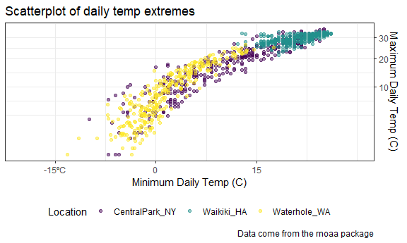
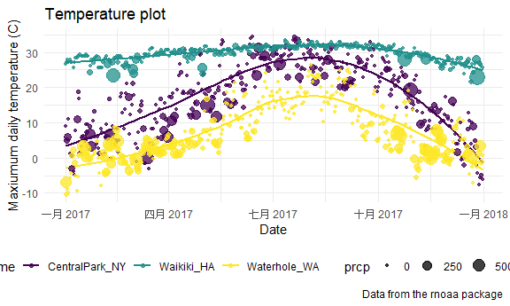
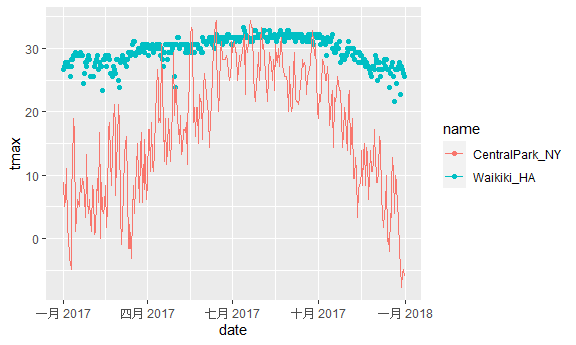
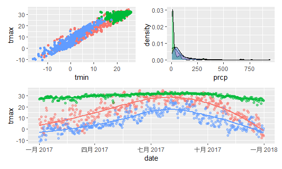
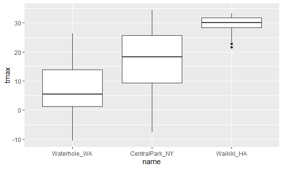
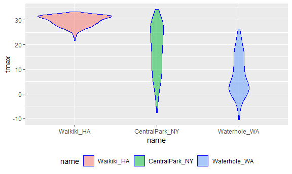
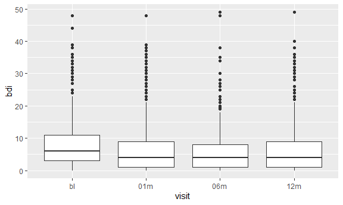

viz_part_02
================
Jasmine Niu

## Let’s import data

``` r
library(tidyverse)
```

    ## ── Attaching packages ─────────────────────────────────────── tidyverse 1.3.2 ──
    ## ✔ ggplot2 3.3.6      ✔ purrr   0.3.4 
    ## ✔ tibble  3.1.8      ✔ dplyr   1.0.10
    ## ✔ tidyr   1.2.0      ✔ stringr 1.4.1 
    ## ✔ readr   2.1.2      ✔ forcats 0.5.2 
    ## ── Conflicts ────────────────────────────────────────── tidyverse_conflicts() ──
    ## ✖ dplyr::filter() masks stats::filter()
    ## ✖ dplyr::lag()    masks stats::lag()

``` r
library(ggridges)
library(patchwork)
```

``` r
weather_df = 
  rnoaa::meteo_pull_monitors(
    c("USW00094728", "USC00519397", "USS0023B17S"),
    var = c("PRCP", "TMIN", "TMAX"), 
    date_min = "2017-01-01",
    date_max = "2017-12-31") %>%
  mutate(
    name = recode(
      id, 
      USW00094728 = "CentralPark_NY", 
      USC00519397 = "Waikiki_HA",
      USS0023B17S = "Waterhole_WA"),
    tmin = tmin / 10,
    tmax = tmax / 10) %>%
  select(name, id, everything())
```

    ## Registered S3 method overwritten by 'hoardr':
    ##   method           from
    ##   print.cache_info httr

    ## using cached file: C:\Users\finij\AppData\Local/Cache/R/noaa_ghcnd/USW00094728.dly

    ## date created (size, mb): 2022-09-29 10:35:09 (8.418)

    ## file min/max dates: 1869-01-01 / 2022-09-30

    ## using cached file: C:\Users\finij\AppData\Local/Cache/R/noaa_ghcnd/USC00519397.dly

    ## date created (size, mb): 2022-09-29 10:35:23 (1.703)

    ## file min/max dates: 1965-01-01 / 2020-03-31

    ## using cached file: C:\Users\finij\AppData\Local/Cache/R/noaa_ghcnd/USS0023B17S.dly

    ## date created (size, mb): 2022-09-29 10:35:29 (0.952)

    ## file min/max dates: 1999-09-01 / 2022-09-30

## scatterplot

``` r
ggp_weather = 
  weather_df %>% 
  ggplot(aes(x = tmin, y = tmax, color = name)) +
  geom_point(alpha = .5) +
  labs(
    x = "Minimum Daily Temp (C)",
    y = "Maximum Daily Temp (C)",
    title = "Scatterplot of daily temp extremes",
    caption = "Data come from the rnoaa package"
    ) +
  scale_x_continuous(
    breaks = c(-15, 0, 15),
    labels = c("-15ºC", "0", "15"),
    limits = c(-20, 30)) +
  scale_y_continuous(
    trans = "sqrt",
    position = "right") +
  #scale_color_hue(name = "Location", h = c(100, 300))
  viridis::scale_color_viridis(
    name = "Location",
    discrete = TRUE) 
```

## Themes

``` r
ggp_weather +
  # theme(legend.position = "bottom") #legend.position = "none"
   theme_bw() +
  # theme_classic() +
  #theme_minimal() +
  theme(legend.position = "bottom") #少了theme_bw()
```

    ## Warning in self$trans$transform(x): 產生了 NaNs

    ## Warning: Transformation introduced infinite values in continuous y-axis

    ## Warning: Removed 90 rows containing missing values (geom_point).



Learning assessment:

``` r
ggp_weather2 =
  weather_df %>% 
  ggplot(aes(x = date, y = tmax)) +
  geom_point(aes(color = name), alpha = .5) +
  labs(
    title = "Scatterplot of Seasonal Trends",
    x = "Date",
    y = "Maximum Daily Temp (C)",
    caption = "Data come from the rnoaa package") +
  scale_y_continuous(
    breaks = c(-10, 0, 10, 20, 30),
    labels = c("-10ºC", "0", "10", "20", "30")) +
  theme_bw() +
  theme(legend.position = "bottom")

# Solution
ggplot(weather_df, aes(x = date, y = tmax, color = name)) + 
  geom_smooth(se = FALSE) + 
  geom_point(aes(size = prcp), alpha = .75) + 
  labs(
    title = "Temperature plot",
    x = "Date",
    y = "Maxiumum daily temperature (C)",
    caption = "Data from the rnoaa package"
  ) + 
  viridis::scale_color_viridis(discrete = TRUE) + 
  theme_minimal() + 
  theme(legend.position = "bottom")
```

    ## `geom_smooth()` using method = 'loess' and formula 'y ~ x'

    ## Warning: Removed 3 rows containing non-finite values (stat_smooth).

    ## Warning: Removed 3 rows containing missing values (geom_point).



## Data in geom()

``` r
central_park_df =
  weather_df %>% 
  filter(name == "CentralPark_NY")

waikiki_df =
  weather_df %>% 
  filter(name == "Waikiki_HA")

ggplot(waikiki_df, aes(x = date, y= tmax, color = name)) +
  geom_point() +
  geom_line(data = central_park_df)
```

    ## Warning: Removed 3 rows containing missing values (geom_point).



## Patchwork …(unfinished)

``` r
tmax_tmin_plot =
  weather_df %>% 
  ggplot(aes(x = tmin, y = tmax, color = name)) +
  geom_point() +
  theme(legend.position = "none")
  

prcp_density_plot =
  weather_df %>% 
  filter(prcp >0) %>% 
  ggplot(aes(x = prcp, fill = name)) +
  geom_density(alpha = .5) +
  theme(legend.position = "none")

tmax_date_plot =
  weather_df %>% 
  ggplot(aes(x = date, y = tmax, color = name)) +
  geom_point(alpha = .5) +
  geom_smooth(se = FALSE) +
  theme(legend.position = "none")

(tmax_tmin_plot + prcp_density_plot) / tmax_date_plot
```

    ## Warning: Removed 15 rows containing missing values (geom_point).

    ## `geom_smooth()` using method = 'loess' and formula 'y ~ x'

    ## Warning: Removed 3 rows containing non-finite values (stat_smooth).

    ## Warning: Removed 3 rows containing missing values (geom_point).



## Data manipulation

``` r
weather_df %>% 
  mutate(name = fct_reorder(name, tmax)) %>% #reorder by tmax's medium
  ggplot(aes(x = name, y = tmax)) +
  geom_boxplot()
```

    ## Warning: Removed 3 rows containing non-finite values (stat_boxplot).



``` r
weather_df %>%
  mutate(name = forcats::fct_relevel(name, c("Waikiki_HA", "CentralPark_NY", "Waterhole_WA"))) %>% 
  ggplot(aes(x = name, y = tmax)) + 
  geom_violin(aes(fill = name), color = "blue", alpha = .5) + 
  theme(legend.position = "bottom")
```

    ## Warning: Removed 3 rows containing non-finite values (stat_ydensity).



``` r
pulse_df =
  haven::read_sas("data/public_pulse_data.sas7bdat") %>% 
  janitor::clean_names() %>% 
  pivot_longer(
    bdi_score_bl:bdi_score_12m,
    names_to = "visit",
    values_to = "bdi",
    names_prefix = "bdi_score_"
  ) %>% 
  select(id, visit, everything()) %>% 
  mutate(
    visit = fct_relevel(visit, "bl")
  )

pulse_df %>% 
  ggplot(aes(x = visit, y= bdi)) +
  geom_boxplot()
```

    ## Warning: Removed 879 rows containing non-finite values (stat_boxplot).


